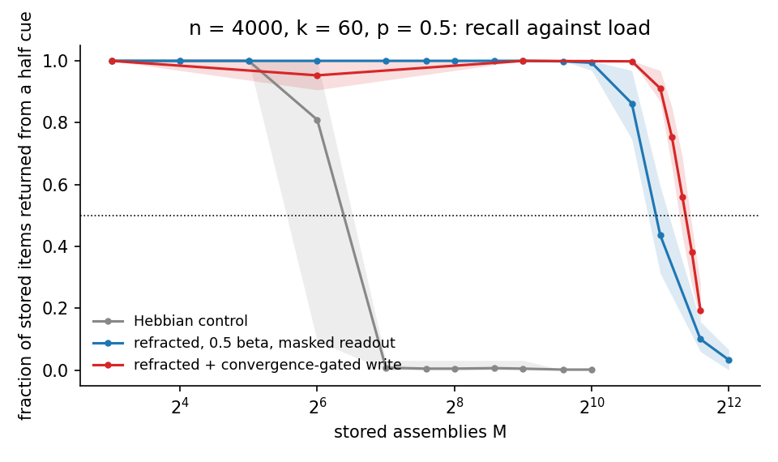
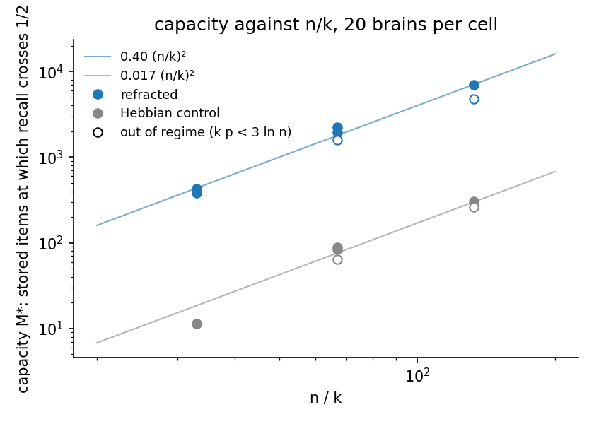
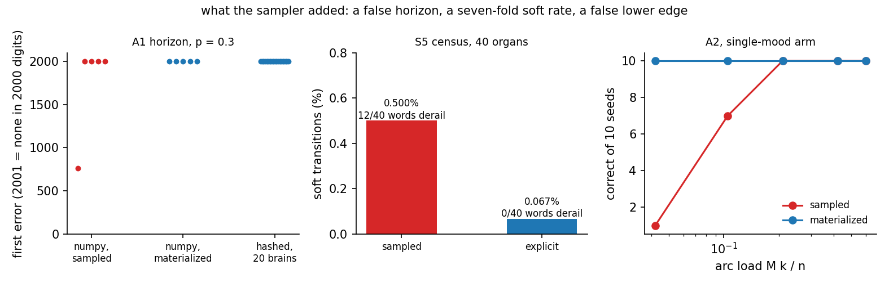
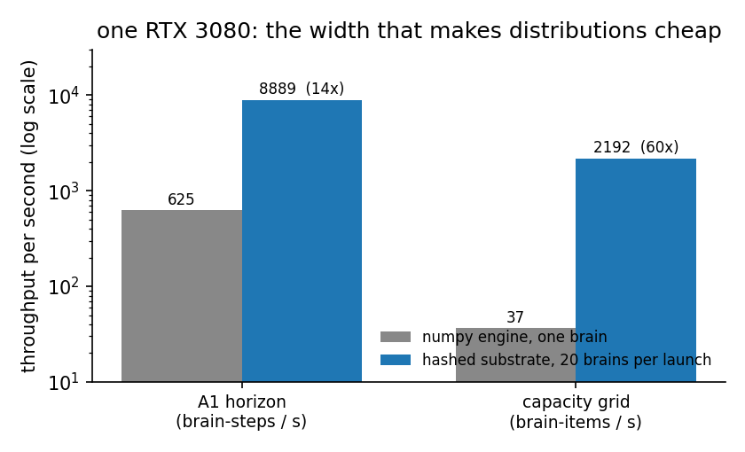

# Assemblies

Assemblies is a Python package and research workspace for the neural assembly
calculus: sparse groups of neurons, Hebbian plasticity, projection,
association, merge, sequence memory, inhibition, and language-oriented
experiments.

The installable package is published as `neural-assemblies` and imported as
`neural_assemblies`. The rest of the repository keeps research records,
accelerator work, and archived prototypes close to the code without treating
all of them as package guarantees.

The package is alpha software. The core APIs are tested, but research-facing
modules and accelerator paths may move as experiments clarify what belongs in
the library.

Assemblies is developed by Alif Jakir. Daniel Mitropolsky wrote the original
library (2018 to 2019) that this repository grew out of; the package, the GPU
substrate, and the research record as they stand are Alif Jakir's work, begun
in MIT's Projects in the Science of Intelligence course and continued in
collaboration with Daniel Mitropolsky (MIT Poggio Lab). For the longer
history, read [docs/project_context.md](docs/project_context.md). To cite the
software, see [Citation](#citation).

## The model in four terms

Everything below uses these, so they come first.

- **Area.** A set of `n` neurons with random sparse connections between them
  and from other areas. At each step the `k` neurons receiving the most input
  fire, and the rest are silent. That rule, `k` winners take all, is the
  whole nonlinearity; typical numbers here are `n` of a few thousand and `k`
  of a few dozen to a few hundred.
- **Assembly.** The set of `k` neurons that fire together in an area once
  its input has settled. Assemblies are the model's representations: a word,
  a state, a stored item are each an assembly, and two assemblies are
  compared by how many neurons they share.
- **Hebbian plasticity.** A synapse between two neurons that fire in
  consecutive steps grows by a factor `1 + beta`, up to a ceiling. Nothing
  else changes a weight. There is no gradient and no separate training
  phase; learning and use are the same operation.
- **Refraction.** Optional per-area inhibition: each time a neuron wins, it
  accumulates a bias proportional to its own input, which is subtracted
  from its input afterwards. It makes a recently used neuron harder to
  reuse. Two of the results below are about what that one rule buys.

Results are measured on a GPU substrate that runs many independent brains
per launch and checks itself against the reference numpy engine on every
projection to a relative 5e-6. Twenty or more brains per cell is the norm,
so every number below is a distribution, not one run.

## Results

### A refracted area is an associative memory with a capacity law

Write assemblies into one area, one after another, each from its own
stimulus, and ask how many it can hold before recall fails. Recall means
presenting half of a stored assembly and letting the area settle: success
is the full assembly coming back rather than some other stored one. A
plain Hebbian area fails early, because later items merge into hubs formed
by earlier ones. A refracted area, read with its bias masked, does not.



How to read it: the horizontal axis is how many assemblies have been
stored, on a log scale; the vertical axis is the fraction of sampled items
that come back correctly from a half cue; bands are the 10th to 90th
percentile across twenty brains. The grey curve is Hebbian plasticity
alone. The blue curve is the same area refracted at half `beta`. The red
curve ends each item's write as soon as its winners stop changing.



How to read it: each point is one `(n, k)` cell's ceiling, the number of
items at which recall crosses one half. Both arms fall on straight lines
of slope two in log-log, so capacity goes close to `(n/k)²` for both
(the measured doubling exponents run from 2.1 to 1.8 across the grid, so
the register records the form as Willshaw-like and declines to call it a
power law), with
refraction multiplying it by a constant near 25. Hollow points are cells
where each neuron receives too few inputs from the assembly for the
theory's regime, and they sit below the line.

Why it matters: this is continual learning with no rehearsal and no
replay, from a local rule, with a capacity you can compute before running.
The mechanism is anti-merging, not orthogonalization: stored items overlap
at chance once the area is full, and they are still distinct. Refraction
strength is a switch, one plateau from 0.3 to 0.6 `beta`. Register entry
`REFRACTION-ANTI-MERGING` in [docs/register.md](docs/register.md); every
bar and verdict in
[the registration](research/notes/memory/PREREG_refraction_memory.md).

### The transition machine is exact, and it remembers sequences of order ten

A refracted arc area conjoins the current symbol with the current state
and drives the next state. On the explicit substrate it runs 2000 random
digits of a modular-arithmetic machine without a single error on 40 of 40
brains. The same organ, used as a transducer, was given two twelve-word
sequences whose middle ten words are identical, so the correct
continuation after those ten depends on the first word alone. Predicting
it requires an order-10 memory.


How to read it: the horizontal axis counts presentations of the two
sequences; the vertical axis is the fraction of brains that pick the right
continuation at the ambiguous positions. The blue curve is the registered
transducer, whose state is induced by the arc: exact from the second
presentation to the thirty-first. The dotted line is where a synapse
potentiated once per presentation reaches the weight ceiling,
`ln(20) / ln(1.1) = 31.4`. The other two curves are the design the
sequence-learning literature converged on, the state as the previous arc
with predicted neurons winning; they add nothing here.

Why it matters: the state is a hash of the whole prefix, so its order is
unbounded for sequences it has seen, and its failure is a formula rather
than a mystery. Training past the ceiling relocates the arc's
best-connected neurons and destroys the memory, a prediction that also
held on 500 word-problem organs: trained just below the edge they show
zero soft transitions in 84,000. What the same state cannot do is carry a
feature across unseen combinations of distractors; that is the open
problem, and it is the same limit every local-rule sequence model in the
literature reports. Registrations:
[the census](research/notes/sequence/PREREG_s5_cliff_anatomy.md),
[the temporal memory](research/notes/sequence/PREREG_temporal_memory.md).

### The reference engine's shortcut had been producing false results

The numpy engine can draw an area's connections lazily, as neurons are
first used. Every earlier sequence result ran that way. Drawing the area
in full, or running on the GPU substrate, removes a short horizon, cuts
the soft-transition rate by seven, removes every derailment, and removes
the lower edge of a load window that a register entry was named for.



How to read it: in each panel red is the lazily drawn engine and blue is
the explicit one. Left, every brain that errs is red. Middle, the bars are
the fraction of transitions that are soft, with the number of test words
that went wrong written above. Right, the red curve's rise with load was
the claim; the blue line is flat at ten of ten.

Why it matters: a five-seed result on a sampled engine is not a
measurement of the model, and the register was corrected accordingly
([the audit](research/notes/sequence/PREREG_sampler_audit.md)). Any
fragility claim about these organs measured on a lazily drawn area,
including some in the literature this work descends from, should be
re-measured.

### The width that makes distributions cheap



Twenty brains through two thousand digits in nine seconds; twenty brains
through a capacity grid of 16,384 items in five minutes. The substrate
regenerates each brain's connectome from a hash inside the kernel instead
of storing it, and batches brains rather than items. This is why the week
that produced the results above ran on distributions, and why four of its
six registered predictions could fail and be replaced by a mechanism
within the hour.

### Operational performance

Performance is reported as a distribution across independent seeds. The
benchmark is a diagnostic of the selected implementation and machine; it is
not a scientific result and should not be compared across engines without
recording the engine, dimensions, rounds, and hardware.

| Goal | Command | Output |
|------|---------|--------|
| Profile maintained operations | `uv run python -m neural_assemblies.benchmarks.profile_operations` | End-to-end and phase timings for sparse and explicit NumPy at its fixed diagnostic sizes |
| Sweep projection throughput | `uv run python -m neural_assemblies.benchmarks.throughput --engine numpy_sparse --sizes 1000 2000 5000 --k 100 --rounds 10 --seeds 42 43 44 --output throughput.json` | Per-seed seconds and min/median/p90/max rounds per second in a new JSON file |
| Run GPU scale studies | `uv run python -m research.runner a1-horizon --tag UNIQUE` | Hashed-substrate run record, source archive, and observations; requires the CUDA developer environment |

Plot a saved sweep without re-running it:

```python
import json
import matplotlib.pyplot as plt

with open("throughput.json", encoding="utf-8") as stream:
    run = json.load(stream)
cells = run["cells"]
plt.plot([c["n"] for c in cells],
         [c["rounds_per_second"]["median"] for c in cells], "o-")
plt.xscale("log")
plt.xlabel("population size n")
plt.ylabel("median projection rounds / second")
plt.title(f"{run['engine']} projection throughput ({len(run['seeds'])} seeds)")
plt.show()
```

The checked-in throughput figure above is a historical measurement with its
own engine and hardware provenance. Generate a fresh JSON sweep when making
performance claims; never infer GPU speed from a CPU smoke run.

### The neural coin

A recurrent area holding two assemblies, seeded at random, settles into one
of them. Its fairness is not a property of any one brain; it is a
finite-size effect that self-averages as the area grows, with the basin
asymmetry falling as `k^-1.01` over a 32× range in `k`.


The full analysis, seven figures and the two engine defects it found are in
[research/notes/coin/neural_coin_fairness.md](research/notes/coin/neural_coin_fairness.md).

## What is stable

The package tests cover the core runtime and the main assembly-calculus
operations: projection, reciprocal projection, association, merge,
separation, pattern completion, sequence memorization, ordered recall,
Long-Range Inhibition, refracted dynamics, FSM and PFA helpers, the CPU
engines with their parity checks, and the GPU substrate's units
(`AssemblyMemory`, `HashedArcFSM`, `HashedTransducer`, `ScheduledAligner`)
behind their drive-replay gates. The exact boundary between package facts,
measured research results, and future work is
[docs/scientific_status.md](docs/scientific_status.md).

## Audience and non-goals

This repo is for computational neuroscience, neuro-inspired ML, and researchers
or students who want to inspect assembly-calculus mechanisms in code.

It is not a transformer library, a hosted chatbot, a biophysical simulator, or
a proof artifact for every theorem in the assembly-calculus literature. It does
not use backprop as its core learning rule, and it is not differentiable
end-to-end.

## Install

```bash
pip install neural-assemblies
```

From a checkout:

```bash
uv sync
uv run pytest neural_assemblies/tests -q
uv run pytest neural_assemblies/tests -q -m "not slow" -n 4 --dist loadfile
uv run python scripts/verify_maintained.py --skip-tests
uv run python -m research.evidence check
```

`scripts/verify_maintained.py` is the single static contract gate. It checks all
maintained runtime packages plus the research runner, evidence, and provenance
infrastructure with Pyright while excluding archived and historical study tests;
omit `--skip-tests` to run the non-slow package tests afterward.

`research.evidence check` is the maintained-surface gate: it validates recorded
run provenance and registration edges, comparison receipts, and every source
docstring link to its semantic specification. Use `research.evidence audit` for
the larger legacy/reference inventory; that report is deliberately advisory.

Optional GPU dependencies:

```bash
uv sync --group gpu
```

The GPU substrate's fused CUDA kernels compile at first import through
PyTorch's inline extension loader. They need a CUDA toolkit on the path
(`CUDA_HOME`) and a host compiler; on Windows that means running from a
Visual Studio developer shell. The first import takes a few minutes, later
ones use the cache. The numpy engine is the specification and needs none of
this.

Optional Rust kernels make `materialize_area` 21-42x faster and are
byte-identical to the numpy path; see
[docs/RUST_KERNELS.md](docs/RUST_KERNELS.md).

The import name is always `neural_assemblies`.

## Quick start

```python
from neural_assemblies.core.brain import Brain
from neural_assemblies.assembly_calculus import project, pattern_complete

def recovery(beta, seed=1):
    b = Brain(p=0.1, seed=seed, engine="numpy_exact", norm_init=False)
    b.add_stimulus("cue", 30)
    b.add_area("memory", n=1000, k=30, beta=beta)
    project(b, "cue", "memory", rounds=12, recurrent=True)
    with b.read_only():
        _, score = pattern_complete(b, "memory", fraction=0.5, rounds=5, seed=seed)
    return score

print("Learning disabled:", recovery(beta=0))
print("Recurrent training:", recovery(beta=0.2))
```

This asks whether learned recurrent connections recover a partial cue. The CPU
engine regenerates a fixed connectome, uses Binomial stimulus counts, and resolves
ties by lowest neuron index. The null disables learning; `read_only()` prevents
the probe from changing the brain. This is an instructional demonstration, not
a preregistered result or a measurement of capacity.

Run the complete example over three paired seeds, with intervals:

```bash
uv run python examples/01_basic_assembly_calculus.py
```

## Operations at a glance

These functions compose schedules over the same mutable `Brain`. Each call
has an explicit contract in the package; read the contract before treating an
output as a measurement. Snapshots contain stable neuron IDs, while engine
areas use compact indices internally.

| Operation | Inputs | Effect and result |
|-----------|--------|------------------|
| `project(brain, stimulus, target, rounds, recurrent=...)` | one stimulus and target area | Forms or updates the target assembly; recurrence and plasticity are explicit schedule choices. |
| `reciprocal_project(brain, source, target, rounds)` | active source assembly and two areas | Copies activity forward, then returns target drive to the source under a scoped clamp. |
| `associate(brain, source_a, source_b, target, ...)` | two source assemblies and a fresh target | Learns a conjunction through separate pathways and optional joint coactivation. |
| `merge(brain, source_a, source_b, target, ...)` | two source assemblies and target | Learns a merged representation; inspect its contract for source protocol and readout. |
| `pattern_complete(brain, area, fraction, rounds, seed)` | stored assembly area and partial-cue fraction | Replaces part of the winners and observes recurrent recovery in a controlled scope. |
| `separate(brain, stimulus_a, stimulus_b, target, rounds)` | two stimuli and target area | Forms two assemblies and reports their overlap against the configured chance baseline. |
| `sequence_memorize` / `ordered_recall` | ordered stimuli and a sequence configuration | Trains and reads a sequence schedule; engine provenance is part of every result. |
| `fuzzy_readout` / `readout_all` | assembly snapshot and lexicon | Decodes overlap with deterministic tie handling; a label is not a probability. |
| `attend` | query assembly plus keyed key/value snapshots | Pure sparse attention readout: exposes compatibility weights, selects top-k keys, and returns a bounded value assembly without mutating the brain. |

The full signatures, plans, and failure conditions are in
[docs/api.md](docs/api.md) and the discoverable
`neural_assemblies.assembly_calculus.OPERATION_CONTRACTS` registry. Operations
mutate by default; use `brain.read_only()` for a seeded, state-restoring
observation.

## Where to read next

- [docs/onboarding.md](docs/onboarding.md): how to work here, for a new
  collaborator: reading order, the rules every result meets, the open
  problems, the process constraints.
- [research/notes/README.md](research/notes/README.md): the reading map for
  the registrations and design notes, what each line concluded, which file
  to open first.
- [docs/register.md](docs/register.md): every adopted result with its
  evidence and caveats, rendered from `neural_assemblies/theory.py`.
- [docs/README.md](docs/README.md): the documentation index, including the
  API guide, architecture, section READMEs, notebooks, and the research
  indexes.
- [research/experiments/README.md](research/experiments/README.md): the
  active scripts by line, with typical runs; results land in
  [research/results/](research/results/README.md).

## Repository layout

```text
.
|-- neural_assemblies/        # Installable package (engines, programs, ir/ schemas, benchmarks/)
|-- docs/                     # API, architecture, status, register, release docs
|-- examples/                 # Runnable examples and notebooks
|-- research/
|   |-- notes/                # Registrations and design notes, by line (README.md is the map)
|   |-- experiments/          # Scripts (README.md lists the active ones)
|   |-- results/              # Evidence files the scripts write, by line
|   `-- claims/, literature/, core_questions/   # Indexes
|-- legacy/                   # Archived root modules, their shims, scripts, artifacts
|-- tests/                    # Legacy compatibility and optional perf tests
|-- cpp/, crates/             # Accelerator kernels
|-- CITATION.cff, LICENSE     # How to cite; MIT
`-- pyproject.toml            # Package metadata (no Python module sits at the root)
```

## Citation

Cite the software as:

```bibtex
@software{jakir2026assemblies,
  author  = {Jakir, Alif and Mitropolsky, Daniel},
  title   = {Assemblies: a Python package and research workspace for the
             neural assembly calculus},
  year    = {2026},
  version = {0.0.1a1},
  url     = {https://github.com/Caerii/assemblies},
  note    = {Alif Jakir (MIT and Superintelligent Group, ORCID
             0009-0000-6337-5174) developed the package from the original
             2018--2019 library by Daniel Mitropolsky (MIT). MIT license.}
}
```

The same record is in [CITATION.cff](CITATION.cff), which GitHub renders
under "Cite this repository".

Cite the papers, not the package, for the theory the package implements:

- Papadimitriou et al. (2020), *Brain Computation by Assemblies of Neurons*
- Dabagia et al. (2024/2025), *Computation with Sequences of Assemblies in a
  Model of the Brain*
- Mitropolsky and Papadimitriou (2023, 2025) on the language organ and
  simulated language acquisition

The complete bibliography with implementation status is
[docs/literature.md](docs/literature.md). Results measured here are cited
by their register ID ([docs/register.md](docs/register.md)); the plan for
the papers those results support is
[research/plans/PAPERS.md](research/plans/PAPERS.md).

## Contributing and license

See [docs/contributing.md](docs/contributing.md) and
[docs/packaging.md](docs/packaging.md). MIT; see [LICENSE](LICENSE).
