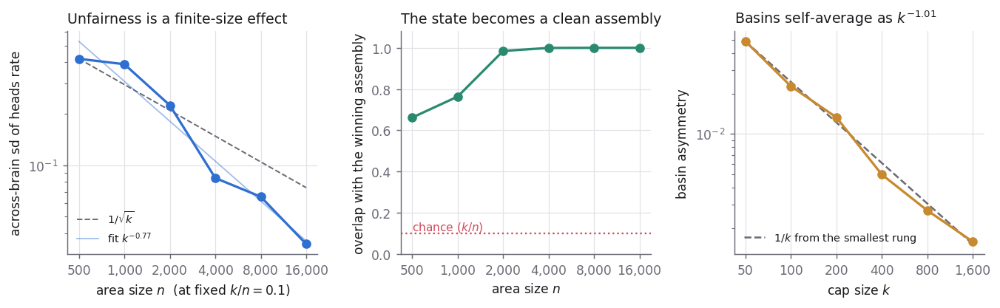

# Assemblies

Assemblies is a Python package and research workspace for the neural assembly
calculus: sparse groups of neurons, Hebbian plasticity, projection,
association, merge, sequence memory, inhibition, and language-oriented
experiments.

The installable package is published as `neural-assemblies` and imported as
`neural_assemblies`. The rest of the repository keeps research records,
accelerator work, and archived prototypes close to the code without treating
all of them as package guarantees.

The package is alpha software. The core APIs are tested, but research-facing
modules and accelerator paths may move as experiments clarify what belongs in
the library.

This repo is maintained by Alif Jakir. It grew out of MIT's Projects in the
Science of Intelligence course and later work extending the assembly-calculus
and language-organ line, including collaboration with Daniel Mitropolsky
(MIT Poggio Lab). For the longer history, read
[docs/project_context.md](docs/project_context.md).

## Core Ideas

Neural assemblies are sparse sets of neurons that fire together and can be
treated as reusable computational objects.

The main operations in this package are:

- `project`: form or copy an assembly into an area
- `associate`: link two assemblies through co-activation
- `merge`: form a conjunctive assembly from two sources
- `sequence_memorize`: train an ordered list of assemblies
- `ordered_recall`: inspect cue-driven recall with Long-Range Inhibition
- `overlap`: compare assemblies against each other or against chance

## What Is Stable

The package tests cover the core runtime and the main assembly-calculus
operations:

- projection, reciprocal projection, association, merge, separation, and
  pattern completion
- sequence memorization, ordered recall, Long-Range Inhibition (LRI), and
  refracted dynamics
- FSM and PFA helpers built on typed transitions
- CPU engines, engine parity checks, and optional accelerator smoke tests
- narrow NEMO and emergent-parser behaviors in controlled synthetic settings

For the exact boundary between package facts, measured research results, and
future work, use [docs/scientific_status.md](docs/scientific_status.md).

## What Is Experimental

The repository also carries active research on language learning, vocabulary
curricula, biological plausibility, scaling behavior, and multimodal or
embodied extensions. Some of that work is promising; some of it is deliberately
unfinished. Research results live under `research/` and are indexed by
question, experiment suite, and claim status; the reading map for the
registrations and design notes is
[research/notes/README.md](research/notes/README.md), and adopted results
are cited by ID from `neural_assemblies/theory.py`.

Historical root scripts, old image-learning artifacts, MATLAB prototypes, and
checkout-era modules have been moved under `legacy/`. The root files that
remain, such as `brain.py` and `parser.py`, are compatibility shims.

## A Worked Result: The Neural Coin

A recurrent area storing two assemblies, seeded with a random cap-sized set,
should settle into one of them — the smallest interesting thing recurrence can
do. Ours returned an answer that came entirely from the seed RNG, because the
`area → area` fiber was never allocated and delivered exactly zero drive.

Two engine fixes later it works, and its behaviour is a scaling law rather than
a capability:



Holding `k/n` fixed and growing the area from `n=500` to `n=16,000`, the settled
state becomes a **clean assembly** (overlap → 1.000, against a chance floor of
`k/n`), the spread across independently seeded brains collapses 12×, and the
underlying basin asymmetry falls as **`k^-1.01`** over a 32× range in `k`, at
log-log `r = -0.997`.

**The coin is not fair at any one size; it becomes fair.** Each brain is its own
slightly-bent coin; the bentness is a finite-size fluctuation in how symmetrically
the two assemblies happen to wire to themselves, and it self-averages away.
Nothing is tuned — the components do not improve with `n`, the fluctuation just
averages down over more of them.

The control that makes this a result rather than a reading: with `β = 0` —
nothing learned — the coin is **six times fairer** than the trained one
(across-brain sd 0.037 vs 0.224), because with nothing stored there is no basin
to be lopsided. Fairness alone cannot distinguish a working coin from a broken
one — it prefers the broken one — which is why both metrics are reported at
every cell.

Run up the ladder, the null's spread stays **flat** (0.055 / 0.037 / 0.035 at
`n` = 500 / 2,000 / 8,000, against binomial sampling floors of 0.025 and 0.035),
so the collapse is not an artifact of area size or flip count. And the two
`decisive` columns move in *opposite* directions — trained 0.662 → 1.000, null
0.123 → 0.106 down toward chance. Two metrics whose arms diverge is a
dissociation, not a trend.

Full analysis, seven figures, and the two defects in
[research/notes/neural_coin_fairness.md](research/notes/neural_coin_fairness.md).
Reproduce with:

```bash
uv run python research/experiments/coin_fairness_study.py

# restyle the figures from recorded data, without re-simulating
uv run python research/experiments/coin_fairness_study.py --replot

# the beta=0 control, up the ladder -- does the UNTRAINED coin trend too?
uv run python research/experiments/coin_fairness_study.py --null-ladder
```

## Audience And Non-Goals

This repo is for computational neuroscience, neuro-inspired ML, and researchers
or students who want to inspect assembly-calculus mechanisms in code.

It is not a transformer library, a hosted chatbot, a biophysical simulator, or
a proof artifact for every theorem in the assembly-calculus literature. It does
not use backprop as its core learning rule, and it is not differentiable
end-to-end.

## Install

```bash
pip install neural-assemblies
```

From a checkout:

```bash
uv sync
uv run pytest neural_assemblies/tests -q
```

Optional GPU dependencies:

```bash
uv sync --group gpu
```

Optional notebook and interactive visualization dependencies:

```bash
uv sync --group notebooks
```

Optional Rust kernels — they make `materialize_area` 21-42x faster (n=32,000
drops from 23.1s to 0.54s) and are byte-identical to the numpy path, which
stays the specification. Needs a Rust toolchain; everything runs without them.

```bash
cargo build --release --manifest-path crates/Cargo.toml -p na-kernels
python scripts/install_rust_kernels.py
```

See [docs/RUST_KERNELS.md](docs/RUST_KERNELS.md), including why bit-identity is
a guarantee here rather than a hope.

The import name is always `neural_assemblies`.

## Quick Start

```python
from neural_assemblies.core.brain import Brain
from neural_assemblies.assembly_calculus import merge, project

b = Brain(p=0.05, save_winners=True, seed=42, engine="numpy_sparse")
b.add_stimulus("s1", 80)
b.add_stimulus("s2", 80)
b.add_area("A1", n=5000, k=80, beta=0.08)
b.add_area("A2", n=5000, k=80, beta=0.08)
b.add_area("B", n=5000, k=80, beta=0.08)

a1 = project(b, "s1", "A1", rounds=8)
a2 = project(b, "s2", "A2", rounds=8)
merged = merge(b, "A1", "A2", "B", rounds=5)

print("Source assembly sizes:", len(a1), len(a2))
print("Merged assembly size:", len(merged))
print("Merged assembly area:", merged.area)
```

Run the packaged example:

```bash
uv run python examples/01_basic_assembly_calculus.py
```

## Reading Path

Start here:

- [docs/api.md](docs/api.md) for imports, modules, and examples
- [docs/architecture.md](docs/architecture.md) for the runtime layout
- [docs/scientific_status.md](docs/scientific_status.md) for claim strength
- [docs/supported_surfaces.md](docs/supported_surfaces.md) for maintained code
  versus legacy code
- [docs/project_context.md](docs/project_context.md) for project history and
  motivation
- [docs/literature.md](docs/literature.md) for the full AC field map and
  implementation parity status
- [docs/references.md](docs/references.md) for the papers behind the project

Section guides:

- [neural_assemblies/core/README.md](neural_assemblies/core/README.md)
- [neural_assemblies/compute/README.md](neural_assemblies/compute/README.md)
- [neural_assemblies/simulation/README.md](neural_assemblies/simulation/README.md)
- [neural_assemblies/language/README.md](neural_assemblies/language/README.md)
- [neural_assemblies/lexicon/README.md](neural_assemblies/lexicon/README.md)
- [neural_assemblies/nemo/README.md](neural_assemblies/nemo/README.md)
- [neural_assemblies/viz/README.md](neural_assemblies/viz/README.md)

Notebooks:

- [examples/notebooks/README.md](examples/notebooks/README.md)
- [examples/notebooks/volume-01-foundations/](examples/notebooks/volume-01-foundations/)
- [examples/notebooks/volume-02-memory-and-computation/](examples/notebooks/volume-02-memory-and-computation/)
- [examples/notebooks/volume-03-language/](examples/notebooks/volume-03-language/)
- [examples/notebooks/volume-04-research-workflow/](examples/notebooks/volume-04-research-workflow/)

Research entry points:

- [research/README.md](research/README.md)
- [research/literature/index.json](research/literature/index.json)
- [research/claims/index.json](research/claims/index.json)
- [research/core_questions/index.json](research/core_questions/index.json)

## Useful Commands

```bash
# Package tests
uv run pytest neural_assemblies/tests -q

# Docs and examples smoke test
uv run pytest neural_assemblies/tests/test_docs_examples_smoke.py -q

# Legacy compatibility and archive layout
uv run pytest tests/test_legacy_root_shims.py tests/test_legacy_archived_layout.py -q

# Research indexes
uv run python research/literature/validate_index.py
uv run python research/experiments/infrastructure/validate_registry.py
uv run python research/claims/validate_index.py
uv run python research/core_questions/validate_index.py
```

## Repository Layout

```text
.
|-- neural_assemblies/        # Installable package
|-- docs/                     # API, architecture, status, release docs
|-- examples/                 # Runnable examples and notebooks
|-- research/                 # Questions, experiments, results, claims
|-- legacy/                   # Archived root modules, scripts, artifacts
|-- tests/                    # Legacy compatibility and optional perf tests
|-- cpp/                      # Accelerator kernels and build tooling
|-- brain.py                  # Root compatibility shim
|-- parser.py                 # Root compatibility shim
|-- simulations.py            # Root compatibility shim
`-- pyproject.toml            # Package metadata
```

## Citation

If you build on this code or the underlying ideas, cite the relevant source
work rather than citing the package as proof of a theoretical result.

Core citations:

- Papadimitriou et al. (2020), *Brain Computation by Assemblies of Neurons*
- Dabagia et al. (2024/2025), *Computation with Sequences of Assemblies in a
  Model of the Brain*
- Mitropolsky and Papadimitriou (2023, 2025) on the language organ and
  simulated language acquisition

For the **complete Assembly Calculus bibliography** (18 papers, 2025–2026
extensions, implementation status), see [docs/literature.md](docs/literature.md)
and [docs/references.md](docs/references.md).

## Contributing

See [docs/contributing.md](docs/contributing.md) for contributor workflow and
[docs/packaging.md](docs/packaging.md) for release steps.

## License

MIT. See [LICENSE](LICENSE).
