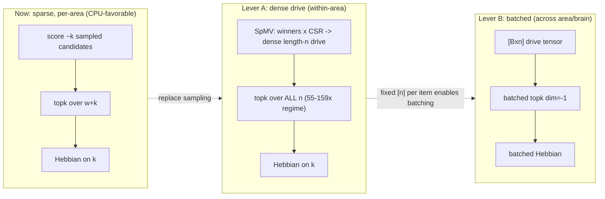

# GPU-driven assembly dynamics at scale — design note

Status: **design sketch** (2026-07-24). No code committed for the batched/dense
model yet; this note scopes it. Prereq work already landed in `torch_engine/`
(on-device `torch.topk` selection, fast `set_winners`, `norm_init` port).

---

## 1. The wall we hit, and why

The `torch_sparse` engine is GPU-native in *storage* (CSR connectomes on device)
but the per-area projection loop cannot beat CPU `numpy_sparse`, even on an
RTX 3080, at any size measured (n up to 10M, k up to 100k). After removing the
two worst anti-patterns (CPU `argpartition` selection; a `uint32` `torch.tensor`
cast in `set_winners` that alone was 91% of runtime), profiling shows **no single
bottleneck left** — the projection is simply sub-millisecond of arithmetic spread
across ~10 kernel launches plus small host syncs. numpy does the same work with
near-zero launch overhead and wins (~0.25 ms vs ~6 ms at k=100k).

This is **fundamental, not a bug**. The sparse-sampling algorithm exists to
*avoid* O(n) work: it materializes only `w` neurons and samples ~`k` candidates,
so per-round work is O(k). GPUs want the opposite — lots of parallel arithmetic
per kernel launch. The two are in tension.

Isolated evidence of the ceiling: GPU-resident `torch.topk` vs the old
copy-to-CPU + `argpartition`, on the drive vector alone:

| drive size W (k) | CPU path | GPU topk | speedup |
|---|---|---|---|
| 200k (100k) | 7.5 ms | 0.50 ms | 15× |
| 1M (100k) | 51 ms | 0.94 ms | **55×** |
| 5M (200k) | 165 ms | 1.03 ms | **159×** |

The GPU win **grows with the amount of parallel work**. To realize it we must
*create* that work. Two levers do so; the first also unlocks the second.

---

## 2. Two levers

### Lever A — dense-drive projection (within-area)

Replace candidate *sampling* with dense *scoring*: compute the drive to **all n**
candidate neurons on the GPU, then a single `torch.topk` over n. This is the
reference NEMO algorithm (score all n, take top-k) — the sparse engine's sampling
is an approximation of exactly this.

Mechanics (per projection):
1. **Drive accumulation** — for each source area, `winners ⊗ CSR → dense[n]`.
   This is a sparse-matrix / sparse-vector product. Options: `torch.sparse` /
   cuSPARSE SpMV, or keep the current `scatter_add` but scatter into a length-**n**
   (not length-`w`) output. Stimulus fibers add their dense contribution directly.
2. **norm_init** — the `1/d_j` scale is now a single dense element-wise divide over
   `[n]` (in-degree is a `bincount` over CSR columns). *No candidate-sampling
   divisor, no un-normalization, no lazy-materialization bookkeeping* — dense mode
   **simplifies** norm_init versus the sparse path.
3. **Selection** — `torch.topk(drive, k)` over n. This is the measured 55–159× win.
4. **Hebbian** — potentiate the k winners' incoming edges (existing CSR update).
5. **Materialization** — winners that were never active before get real neuron ids
   / new CSR columns, same as today, but there is no `neuron_id_pool` exhaustion
   risk because we no longer sample a bounded pool (see the role-clear desync bug
   this would retire).

Cost model: drive vector is O(n) dense = `4·n` bytes (4 MB at n=1e6, 40 MB at
n=1e7). Connectivity stays **sparse** (CSR) — we never materialize an n×n matrix.
Per-projection work becomes O(n) for the topk + O(active-edges) for the SpMV,
which is exactly the arithmetic density GPUs reward. Crossover vs CPU is expected
around n ≳ 10^5–10^6; below that, `numpy_sparse` should remain the default.

Foundation already present: `_dense_area_conns`, `explicit_source`,
`_bootstrap_from_explicit_dense`, `_dense_weights` in
[`torch_engine/_engine.py`](../neural_assemblies/core/torch_engine/_engine.py) and
the `numpy_explicit` engine — dense areas are already a first-class concept to
extend, rather than a green-field build.

### Lever B — batched execution (across area / across brain)

The training bottleneck is not one projection; it is a **curriculum of thousands
of projections** over a corpus (parser training runs minutes–hours). Batch them.

The obstacle has always been **ragged materialization**: each area/brain grows a
different set of `w` materialized neurons, so their state tensors don't align.
**Lever A removes this obstacle**: a dense drive is a fixed `[n]` vector regardless
of what's materialized, so a batch is simply `[B, n]` and `torch.topk(dim=-1)`
selects for all B items in one kernel. Batched Hebbian updates follow.

Two batching granularities:
- **Across areas** within one brain — project independent areas together (e.g. the
  per-word core areas, or ROLE_AGENT/ROLE_PATIENT) in one batched call.
- **Across brains / sentences** — data-parallel curriculum: run B copies of a brain
  (or B sentences through shared connectivity) as a batch dimension. This is the
  big throughput multiplier for training.

Connectivity in a batch is still per-item sparse. Layout options:
- **Block-diagonal CSR** — stack B items' connectomes into one big CSR with disjoint
  index ranges; one SpMM does the whole batch. Cleanest for shared-topology batches.
- **Padded dense-drive** — since the drive is already `[B, n]`, keep B separate CSRs
  and loop the SpMV but batch everything downstream (topk, Hebbian, norm_init).
  Simplest first step; captures the topk/selection win immediately.

---

## 3. Memory budget (RTX 3080, 10 GB; scales linearly with card)

| quantity | formula | n=1e6 | n=1e7 |
|---|---|---|---|
| dense drive `[n]` | 4·n B | 4 MB | 40 MB |
| batched drive `[B,n]`, B=64 | 4·B·n B | 256 MB | 2.5 GB |
| CSR connectivity | ~8 B/edge | grows with training | — |

Dense drive is cheap; the budget is dominated by **CSR edge count**, which grows
with training (each projection adds ≲ k·(fan-in) edges). For large n or large B,
cap with: periodic consolidation (already in `consolidation.py`), edge pruning
below a weight floor, or sharding the batch. B=64 at n=1e6 is comfortable; B=64 at
n=1e7 needs edge budgeting.

---

## 4. Parity & validation strategy

Dense mode is a **different algorithm** (exact top-k over n vs sampled), so it will
not bit-match `numpy_sparse`. The bar is the same as the existing engine-parity
suite: **behavioral** thresholds (assembly size = k, stability > 0.9, recovery,
separation, association/merge overlap vs chance), which
[`test_torch_parity.py`](../neural_assemblies/tests/test_torch_parity.py) already
encodes. Dense mode should if anything match the **reference NEMO** more closely
than the sampled path does — worth a direct golden comparison against
`.reference/mdabagia-nemo`.

Validation ladder:
1. Single dense area matches `numpy_sparse` behaviorally (size/stability/recovery).
2. Dense norm_init reproduces the degree-hub-collapse fix (self-recurrence stays
   non-degenerate; cf. `recurrence-needs-norm-init`).
3. Batched B-item run == B independent single runs (per-item equality up to RNG).
4. End-to-end: a small curriculum trains to the same accuracy floor as the sparse
   engine, faster wall-clock at large n / large B.

---

## 5. Phased roadmap

| phase | scope | result | risk |
|---|---|---|---|
| **0 ✅** | on-device topk, fast set_winners, norm_init port | landed; 43 parity tests green | — |
| **1 ✅** | dense-drive single-area mode (Lever A), engine flag `dense_drive` | landed; behaviorally correct (sep 0.000, recovery 0.96), and *faster* than the sparse GPU sampler (n=5M: 0.43 vs 0.51 ms/round) | SpMV perf; parity vs reference |
| **2 ✅** | batched projection through a **shared** connectome (Lever B, clean case) | landed (`_batched.py`); identical to sequential per item, **7× @ B=8, 21× @ B=32** (RTX 3080) | VRAM (batched [B,n] + SpMM) |
| **3** | block-diagonal CSR / batched SpMM for **independent** connectomes; batched Hebbian | data-parallel training of different brains | index bookkeeping; VRAM (edge count × B) |
| **4** | CUDA-graph capture of the fused projection | kill residual launch overhead | graph re-capture on shape change |

Phases 0–2 are done and measured. The remaining two extend batching from a
*shared* connectome (batch inference/parse — Phase 2) to *independent* per-item
connectomes with learning (data-parallel training — Phase 3), then shave the last
launch overhead (Phase 4).

**Measured so far (RTX 3080):**
- Phase 1 dense-drive is behaviorally correct and, among GPU modes, *faster* than
  the sparse truncated-normal sampler — the dense draw + single topk beat the
  order-statistic machinery. It still loses to CPU `numpy_sparse` for a *single*
  area (more total work), exactly as predicted; its role is to enable batching.
- Phase 2 batched projection through a shared connectome is **numerically
  identical** to sequential and **7–21× faster** (efficiency peaks near B=32 before
  the batched SpMM saturates memory bandwidth). This is the first real wall-clock
  GPU win, and it validates the design's central claim: the throughput comes from
  the batch dimension, not from optimizing a single sparse projection.

---

## 6. Open questions / risks

- **SpMV vs scatter_add** for dense accumulation — benchmark `torch.sparse` SpMV
  against a length-n `scatter_add` at representative (n, k, nnz); the current CSR
  is hand-rolled scatter, so scatter-to-n is the low-friction first cut.
- **Exact-vs-sampled scientific equivalence** — does dense top-k change any
  published result? Gate dense mode behind a flag and keep `numpy_sparse` as the
  reference substrate for literature reproductions (cf.
  `norm-init-substrate-vs-reference`).
- **Small-n regression** — dense mode must *not* become the default at small n
  where CPU wins; wire it into `detect_best_engine` with a measured crossover, and
  fix that heuristic (it currently routes n≥1M to `torch_sparse` on faith, which
  this investigation showed is wrong for the *sparse* path).
- **Determinism** — batched RNG for reproducible curricula (per-item seeds along
  the batch dim).

---

## 7. One-line summary

The sparse per-area loop is CPU-favorable and cannot be optimized into a GPU win.
Going **dense within an area** creates the O(n) arithmetic the GPU rewards (and
simplifies norm_init + retires the pool-exhaustion class of bugs); the fixed `[n]`
drive it produces then makes **batching across areas/brains** trivial, which is
the real throughput multiplier for curriculum training. That is where
GPU-driven assembly dynamics at scale actually lives.
