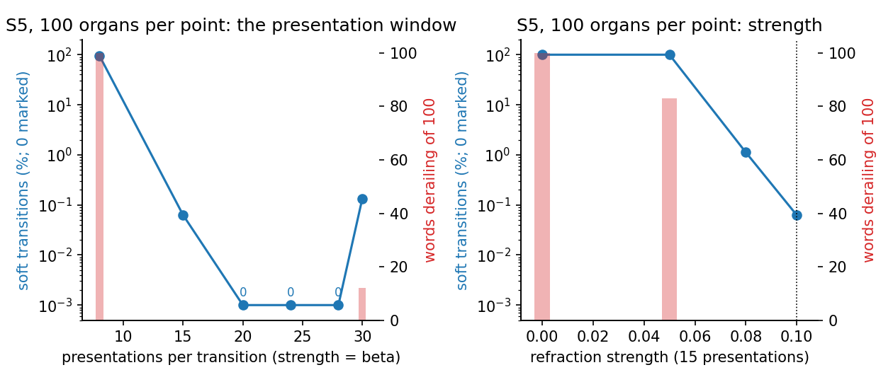
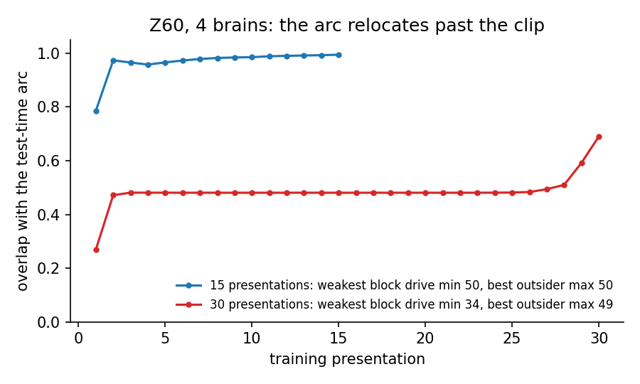

# Research notes

The `PREREG_*` files are registrations: each lists its hypotheses and pass
conditions, then appends the results under the same labels. A change
registered before a run is an amendment; a change decided after seeing data
is marked post hoc and is never adopted on its own. The `DESIGN_*` files
describe substrate work and the gates it passed. Adopted results live in
`neural_assemblies/theory.py` as entries with IDs such as
`REFRACTION-ANTI-MERGING`; other documents cite the ID. The register is
rendered to [../../docs/register.md](../../docs/register.md).

Each long note opens with a quoted Status paragraph. It states the outcome,
the numbers that carry it, what changed from the original registration, and
which sections to read.

## Symbols used below

| Symbol | Meaning |
|--------|---------|
| n, k | neurons in an area, and winners per round (the assembly size) |
| p | connection probability |
| beta | Hebbian gain: a synapse between co-active neurons grows by (1 + beta) |
| strength | refraction: a winner's bias grows by strength × its drive; net drive is drive minus bias |
| in regime | k p ≥ 3 ln n, the recurrent in-degree the theorems assume |
| M* | capacity: the number of stored assemblies at which half-cue recall drops below the bar |
| rounds, presentations | projections per stored item; presentations of each transition to the machine |
| MRR | mean reciprocal rank of the true next word, ties broken at random |

## Terms

One name per concept, used in the Status blocks and in this map; older
sections of the notes use variants.

| Term | Meaning | Variants seen in older text |
|------|---------|-----------------------------|
| hashed substrate | the GPU path that regenerates each brain's connectome from a hash and batches brains | explicit substrate, width |
| materialized engine | the numpy engine with an area's connectome drawn in full | explicit engine |
| sampled engine | the numpy engine drawing an area's connectome lazily as neurons recruit | sampler, lazy |
| transition machine | the assigned-state organ (`NemoArcFSM`, `HashedArcFSM`) | FSM, the machine, the organ |
| transducer | the induced-state organ (`SequenceTransducer`, `HashedTransducer`) | A3 organ |
| soft pair | a transition whose label is correct and whose output assembly has one intruder neuron | soft transition, soft spot, soft defect |
| relocation | an assembly's members leaving it under accumulated refraction bias | churn, drift |
| gate | a pass condition a unit must meet before its numbers are used | bar (used for hypotheses) |

## Index

| Line | Status | Result | Start with |
|------|--------|--------|------------|
| Refracted memory | adopted | 0.35 to 0.50 (n/k)² assemblies, 23 to 38× the Hebbian ceiling | [PREREG_refraction_memory.md](memory/PREREG_refraction_memory.md) |
| Sequence organ | adopted | exact over 2000 steps; soft transitions removed by training below the clip | [DESIGN_sequence_port.md](sequence/DESIGN_sequence_port.md) |
| Transducer | closed, null | the induced state carries no information on this corpus | [PREREG_seq_a3_transducer.md](sequence/PREREG_seq_a3_transducer.md) |
| Aligner | measured | word capacity scales with the lexicon's n | [PREREG_word_capacity.md](aligner/PREREG_word_capacity.md) |
| Substrate | built | two kernel layouts, one per density regime, gated on the drive | [DESIGN_present_only.md](substrate/DESIGN_present_only.md) |
| Sampler audit | measured | two of three audited entries stand materialized; the load window's lower edge was the sampler's | [PREREG_sampler_audit.md](sequence/PREREG_sampler_audit.md) |
| Successor state | running | a state teacher-forced toward its next h words, on a corpus with a 0.21 oracle gap | [PREREG_successor_state.md](sequence/PREREG_successor_state.md) |

## Refracted memory

**Result.** A recurrent k-WTA area refracted at strength 0.5 beta, read
from a half cue with its bias masked, stores 0.35 to 0.50 (n/k)² assemblies
in regime (0.395 at the largest cell). The Hebbian control stores between
one twenty-third and one thirty-eighth of that. Stored
items stay distinct after the area fills and overlap at chance, so
refraction prevents merging during writing and does not orthogonalize the
set. Strength from 0.3 to 0.6 beta gives the same ceiling (1919 to 1993 at
one cell). Ending an item's write when its winner set repeats raises the
ceiling by 24 to 34 percent (two cells).

**Evidence.** Twenty brains per cell, grids to 16,384 items, seven (n, k)
cells; [PREREG_refraction_memory.md](memory/PREREG_refraction_memory.md), Result
and Amendments 4 to 6. The question came from
[PREREG_refraction_capacity.md](memory/PREREG_refraction_capacity.md), whose
first answer was wrong because of a selector bug (commit 1b475fc).

**Code.** `AssemblyMemory` in `core/torch_engine/_memory.py`.

## Sequence organ

**Result, exactness.** The refracted-arc transition machine runs 2000
random digits without an error on 40 of 40 brains at p = 0.3 and p = 0.4.
The earlier five-seed numpy run had one short horizon at p = 0.3; that
seed runs all 2000 steps once its arc area is materialized, so the short
horizon came from the sampler.

**Result, soft transitions.** In the S5 word-problem census a soft
transition is a tie between the target block's least-connected neuron and
the most-connected neuron outside the block. At 15 presentations the rate is
0.039% with a 95% interval of 0.028 to 0.055% over 84,000 pairs; it is the
same across three groups of order 60, rises with the state area's size,
and does not depend on the group's Cayley graph. Training each transition for 20 to 24
presentations instead of 15 removes them: 0 soft pairs in 84,000 across
500 organs. The arc's refraction strength has to stay at beta; lower
values collapse the arc onto the state conjunct, and higher values relocate
its members before training finishes.

**Evidence.** [DESIGN_sequence_port.md](sequence/DESIGN_sequence_port.md) for the
port and its gates; [PREREG_s5_cliff_anatomy.md](sequence/PREREG_s5_cliff_anatomy.md),
Addenda 3 to 8, for the census. The numpy studies these correct:
[PREREG_seq_a1_fsm_parity.md](sequence/PREREG_seq_a1_fsm_parity.md),
[PREREG_s5_word_problem.md](sequence/PREREG_s5_word_problem.md),
[the_arc_is_a_conjunction_and_the_state_drifts.md](sequence/the_arc_is_a_conjunction_and_the_state_drifts.md).

**Code.** `HashedArcFSM` in `core/torch_engine/_hashed_fsm.py`, on
`HashedArcCore` in `_arc_core.py`.

## Transducer

**Result.** The induced-state transducer beats the recurrent accumulator
of study #14 ([PREREG_context_beyond_bigram.md](sequence/PREREG_context_beyond_bigram.md))
by a paired 0.10 MRR, and its state does not collapse. Scoring with the
state area empty gives the same MRR, so the state contributes no
information beyond the current word. Lowering the arc's strength makes
the organ worse (Amendment 2). An oracle state that knew the generating
grammar's phase would add 0.019 MRR over a bigram on this corpus
(Amendment 3), which bounds any state effect measurable here.

**Evidence.** [PREREG_seq_a3_transducer.md](sequence/PREREG_seq_a3_transducer.md),
20 seeds. [PREREG_state_refraction.md](sequence/PREREG_state_refraction.md)
addressed a state collapse that occurs only on the sampled numpy engine;
its own gate closed it.

**What follows.** [PREREG_agreement_corpus.md](sequence/PREREG_agreement_corpus.md)
sets an acceptance criterion for a corpus in which history is worth
something (an oracle state must beat a bigram by 0.10) and accepts a
chain corpus with two distractors between agreeing words (gap 0.21).
[PREREG_successor_state.md](sequence/PREREG_successor_state.md) registers
a construction that teacher-forces the state toward the groundings of the
next h words, so prefixes with the same future share a code, and tests it
on that corpus against the induced state.

**Code.** `HashedTransducer` in `core/torch_engine/_hashed_transducer.py`.

## Aligner

**Result.** Word capacity in the cross-situational learner scales with the
lexicon's n and does not change with k or with the anchor. The lexicon has
no recurrent fiber, so the refracted-memory result does not apply to it.

**Evidence.** [PREREG_word_capacity.md](aligner/PREREG_word_capacity.md). The port:
[DESIGN_hashed_aligner.md](aligner/DESIGN_hashed_aligner.md), then
[DESIGN_present_only.md](substrate/DESIGN_present_only.md).

**Code.** `ScheduledAligner` in `core/torch_engine/_scheduled_aligner.py`.

## Substrate

The masked readout is a mode on both engines
([DESIGN_readout_mode.md](substrate/DESIGN_readout_mode.md)): a refracted
area is read with its bias skipped when its `masked_readout` flag is set
and plasticity is off; writes always see the bias. Two kernel layouts: dense int16 counts for connectivity above about ten
percent ([DESIGN_dense_floor.md](substrate/DESIGN_dense_floor.md)) and present-only
lists below it ([DESIGN_present_only.md](substrate/DESIGN_present_only.md)). Every
unit passes a drive replay against the numpy engine to a relative 5e-6 and
an identity-across-width check before its numbers are used. The regime
conditions the theorems require are measured in
[PREREG_theorem_regime.md](substrate/PREREG_theorem_regime.md),
[PREREG_substrate_c_homeostasis.md](substrate/PREREG_substrate_c_homeostasis.md) and
[PREREG_crosstalk_mechanism.md](memory/PREREG_crosstalk_mechanism.md).

## Working rules

- Materialize an area, or use the hashed substrate, before measuring
  sequence dynamics. The sampled numpy engine produced a false horizon, a
  soft-transition rate five times too high, and every derailment in the
  earlier sequence results.
- Gate a selector on drives that go negative. The k-WTA sign bug passed the
  drive-replay gates, which replay recorded winners.
- Leave refraction strength on a conjunction at beta
  ([PREREG_s5_cliff_anatomy.md](sequence/PREREG_s5_cliff_anatomy.md), Addendum 6).
- Do not cite the load window's lower edge. Materialized, a refracted
  conjunction converges at any load below the ceiling
  ([PREREG_sampler_audit.md](sequence/PREREG_sampler_audit.md)).
- Report at least three seeds. `ensemble_from_values` refuses fewer.
- Record failed bars with their numbers. Four of the six predictions
  registered in the week of 2026-09-05 failed, and each failure identified
  the mechanism that replaced it.
