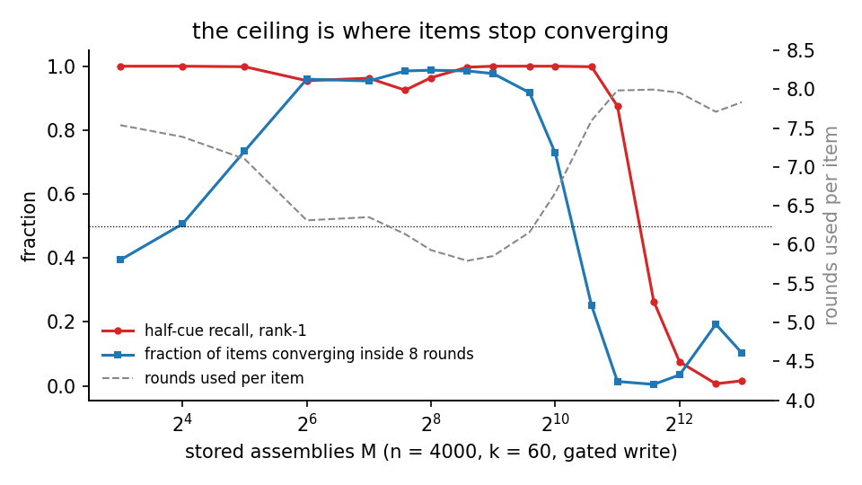

# PREREG: refraction below the transition as an orthogonalizing memory

> **Status (2026-09-09): adopted.**
> **Finding.** A recurrent k-WTA area refracted at 0.5 beta, read from a
> half cue with the bias masked, stores about 0.40 (n/k)² assemblies in
> regime, about 24 times the Hebbian control. Strength from 0.3 to 0.6 beta
> gives one plateau (Amendment 6). Ending each item's write when its
> winner set repeats raises the ceiling by 24 to 34 percent, and the
> ceiling sits where items stop converging within the round budget
> (Amendments 5 and 6).
> **What changed from the registration.** The title's "orthogonalizing"
> is inaccurate: stored items overlap at chance once the area is full, and
> what refraction does is prevent items from merging while they are
> written. The Hebbian control at T = 16 collapses to M* = 8, so its
> rounds window is attractor dominance rather than anything refraction
> adds (post hoc).
> **Read.** The Result section, then Amendments 4, 5 and 6.
> **Reproduce.** `python -m research.runner capacity-scaling
> --registration research/notes/memory/PREREG_refraction_memory.md --nk 4000:60
> --arms B --refracted --refracted-factor 0.5 --readout masked
> --ms 8,16,32,64,128,192,256,384,512,768,1024,1536,2048,3072,4096 --tag X`
> gives the 1961 cell in about 35 s on one GPU; add `--converge` for the
> gated 2645; drop `--refracted` for the control's 83. Results land in
> `research/results/runs/memory.capacity-scaling/TAG/` with a run record;
> the default seed list is 42..61 (20 brains). The fused kernels need the CUDA build
> environment (see `research/experiments/README.md`).
> **Cite.** `[[REFRACTION-ANTI-MERGING]]`.

*Each point is one (n, k) cell's ceiling on log axes; slope two is a
square law; hollow points are cells below k p >= 3 ln n.*

*How to read it (Amendments 5 and 6): with the gate on, an item's write
ends as soon as its winners stop changing, within a budget of eight
rounds. Top: recall from a half cue. Middle: the fraction of items whose
winners did stop changing within the budget. Bottom: the mean number of
rounds a write took, eight meaning it never settled. Recall fails where
the middle curve falls: the ceiling is the load at which items no longer
converge within the budget.*

Registered before running. Owed by PREREG_refraction_capacity.md's
re-measurement (2026-09-04): with the substrate's selector fixed
(1b475fc), a recurrent k-WTA area refracted at 0.5 beta and read with the
bias MASKED held every assembly of a grid to M = 256 (rank-1 1.000 to
M = 32, pairwise 0.00 x chance) where the Hebbian control ceilings at
23.5. That was a post-hoc re-measurement of a post-hoc amendment; nothing
was adopted. This registration asks the question properly.

## Protocol

`seq_capacity_scaling.py` as registered in PREREG_capacity_scaling.md
(inhibit between assemblies; each assembly trained by its own stimulus
alongside recurrence for T rounds; rank-1 recovery of every stored
assembly from its stimulus; M* = the M at which the rank-1 curve crosses
0.9, read from the curve; censored cells reported as bounds), on the
hashed substrate, 20 brains, k = 60, p = 0.5, beta = 0.1, w_max = 20,
M checkpoints (8, 16, 32, 64, 128, 256, 512, 1024). Arm B (norm_init, no
column scaling) is the judged arm; arm G (with scaling) is reported.

    cells   REF   s = 0.5 beta, masked readout, T = 8, n in (2000, 4000, 8000)
            CTL   no refraction (masked = net), T = 8, the same n
            NET   s = 0.5 beta, NET readout, T = 8, n = 4000
            T4    s = 0.5 beta, masked, T = 4,  n = 4000
            T16   s = 0.5 beta, masked, T = 16, n = 4000
            S7    s = 0.7 beta, masked, T = 16, n = 4000

## Bars

    R1  CAPACITY.  M*(REF, n = 4000) >= 4 x M*(CTL, n = 4000).
        FAIL: < 2x.  Between: inconclusive.  A REF cell censored HIGH
        (rank-1 above 0.9 at M = 1024) passes R1 as a bound.
    R2  FILL LAW.  The REF ceiling is fill-limited and scales with n: fill
        at M* >= 0.9 in every REF cell, and M*(REF) k / n within +/- 25%
        across n = 2000, 4000, 8000 (a tiling ceiling, M* proportional to
        n at fixed k). FAIL: M* k / n varies by more than 2x across n.
    R3  ORTHOGONALITY.  Pairwise overlap of the stored assemblies at the
        largest uncensored M below M*(REF) <= 0.1 x chance, against CTL's
        >= 1.0 x chance at its own M*.
    R4  THE VETO.  The NET readout at n = 4000 has M* <= 8 (chance
        recovery): a refracted memory is readable only with the bias
        masked (P0 of PREREG_refraction_capacity.md, re-stated).
        FAIL: NET M* > 16.
    R5  ROUNDS.  Prediction, from the mechanism (each item's T rounds
        visit neurons; fill limits M*): M*(T4) > M*(T8) > M*(T16) at
        n = 4000, each step beyond the pooled CI, PROVIDED the items
        still converge (rank-1 at M = 8 >= 0.9 in every T cell). If T4
        fails to converge (rank-1 at M = 8 < 0.9) the prediction is void
        for that cell and reported.
    S7  reported, not judged: does 0.7 beta converge given T = 16 (rank-1
        at M = 8), and where is its ceiling?

## Interpretation, stated now

* R1-R4 pass -> a recurrent area under refraction at half beta is an
  orthogonalizing memory whose ceiling is TILING (n / k), not
  interference, read through the intrinsic veto: the homeostatic
  mechanism the reference confines to feedforward areas is the lever
  that lifts recurrent capacity by an order of magnitude. Adopt as a
  MEASURED register entry; the numpy engine's refracted mode is then the
  next thing to gate on this claim (its selection has no such defect,
  but its numbers were never read at these M).
* R1 fails -> the re-measurement was a T = 8 / n = 4000 accident; report,
  adopt nothing.
* R2 fails while R1 passes -> the ceiling is not tiling; fit and report.
* R5 inverted (M* rising with T) -> the ceiling is convergence-limited,
  not fill-limited; the mechanism claim is wrong as stated.

## Result (2026-09-04, arm B on the organ fiber, 20 brains, M grid 8..1024)

    cell            n      M*                      fill@M*   M*k/n    distinct@1024   pw/chance near M*
    CTL  T=8     2000     11.3   [8, 16)            0.39      0.34     (0.63 at M=128 for n=4000)   1.8-2.6
    CTL  T=8     4000     83.4   [64, 128)          0.80      1.25                                  1.8 -> 15
    CTL  T=8     8000    306.8   [256, 384)         0.95      2.30                                  1.4 -> 9
    REF  T=8     2000    431.3   [384, 512)         1.00     12.94     1.000 (0.98 at 1024)         0.89 (M=384)
    REF  T=8     4000  >= 1024   censored high      1.00   >= 15.36    1.000 (rank-1 0.994 at 1024) 0.94 (M=1024)
    REF  T=8     8000  >= 1024   censored high      1.00   >=  7.68    1.000 (rank-1 1.000 at 1024) 0.94 (M=1024)
    NET  T=8     4000      8.0   chance (0.125 at M=8)
    T4   T=8->4  4000  does not converge: rank-1 0.225 at M=8, RISING to 1.000 at M >= 768
    T16  T=16    4000    203.2   [192, 256)         1.00      3.05     0.94
    S7   0.7b,16 4000    185.0   [128, 192)         1.00      2.78     0.98     converges: 0.97 at M=8

    R1  CAPACITY     REF(4000) >= 1024 against CTL(4000) 83.4: >= 12x       PASS (as a bound)
                     (n=2000: 431 / 11.3 = 38x, both resolved)
    R2  FILL LAW     fill@M* = 1.00 in every REF cell (first clause holds);
                     M*k/n across n: 12.9 / >=15.4 / >=7.7 -- two cells
                     censored, the ratio cannot be judged                 UNRESOLVED
    R3  ORTHOGONAL   pw/chance 0.89 at the largest uncensored M below
                     M*(2000); 0.94 at M=1024 for the censored cells     FAIL as written
    R4  THE VETO     NET M* = 8, chance at every M                          PASS
    R5  ROUNDS       M*(T8) >= 1024 > M*(T16) = 203, beyond CI              PASS for T8 > T16
                     T4 does not converge (0.225 at M=8): void, reported
    S7  0.7 beta converges given T=16 and holds ~185, above CTL's 83.

**Reading.** R1 and R4 are decisive, R5 holds where it can be judged, R2
is not yet judgeable, and R3 FAILS -- and the failure corrects the
mechanism claim. The stored assemblies are orthogonal (0.00 x chance)
only while the area still has unvisited neurons (M <= 64 at n = 4000);
past fill 1.0 their pairwise overlap returns to chance (0.9 x) -- and
recovery stays perfect anyway. What refraction preserves is not
orthogonality but DISTINCTNESS: `distinct` reads 1.000 through M = 1024
for every REF cell where the control collapses to 0.63 by M = 128 with
pairwise overlap 15 x chance (hub formation, rich-get-richer). Refraction
at half beta is an ANTI-MERGING force, not an orthogonalizer: it stops
repeat winners from becoming hubs, so items overlap at chance like
random subsets yet remain separately recoverable from their cues through
the intrinsic veto. The ceiling that remains is set by something other
than fill or overlap -- at n = 2000 it is 431 = 13 n/k -- and finding it
at n >= 4000 needs the grid extended. Fewer rounds per item raises the
ceiling (T8 > T16) as long as the items still converge; T = 4 does not,
and its curve rising with load says items formed in a fully-visited,
fully-refracted area converge where the first ones did not.

Per the interpretation stated above: R3 failed, so NOTHING IS ADOPTED
from this run; the mechanism claim is rewritten and re-registered below.

## Amendment 1 (2026-09-04, before the extension runs): the grid to 4096, and R3 restated

* R2 needs the censored cells resolved: n = 4000 and 8000 re-run with
  M checkpoints (1024, 1536, 2048, 3072, 4096), 20 brains, T = 8, arm B,
  masked. R2's ratio clause is judged on the resolved values.
* R3 is restated as DISTINCTNESS: `distinct` >= 0.99 at M*(REF) in every
  REF cell, against the control's < 0.7 at its own M*. The orthogonality
  clause is dropped as measured false past fill 1.0.
* Bars R1, R4, R5 stand as read.

### Extension result (2026-09-05, grid to 4096, 20 brains)

    REF  n=4000   M* = 1977.6  [1536, 2048)  resolved   M*k/n 29.7   distinct 1.000 at M*
    REF  n=8000   M* >= 4096   censored high (rank-1 1.000 at 4096)   M*k/n >= 30.7
    R1  at n=4000 resolved: 1978 / 83.4 = 23.7x                                  PASS
    R2  M*k/n = 12.9 / 29.7 / >= 30.7 across n = 2000 / 4000 / 8000: the 2000 -> 4000
        step is 2.3x, outside +/- 25%                                            FAIL as a ratio law at fixed k
    R3' (Amendment 1) distinct >= 0.99 at M*(REF) in every cell (1.000)            PASS
        against the control's 0.63 at its own M* (n=4000)

Neither ceiling is a ratio law at fixed k = 60: the control goes 11 / 83 /
307 and the refracted 431 / 1978 / >= 4096 with n doubling. Whether the
law is in n alone or in n/k is what Amendment 2 asks.

## Amendment 2 (2026-09-05, before running): the k sweep

Cells (n, k), REF (0.5 beta, masked, T = 8) and CTL, 20 brains, arm B,
M grid (8, 16, 32, 64, 128, 192, 256, 384, 512, 768, 1024, 1536, 2048, 3072, 4096):

    (2000, 30)   n/k = 67, same ratio as (4000, 60)
    (4000, 30)   n/k = 133, same ratio as (8000, 60)
    (4000, 120)  n/k = 33, same ratio as (2000, 60)
    (8000, 120)  n/k = 67, same ratio as (4000, 60)

    R6  CONTROL LAW.  If M*(CTL) is a function of n/k alone
        ([[capacity-depends-on-n-over-k]] for assemblies), then
        CTL(8000,120) and CTL(2000,30) are within +/- 25% of CTL(4000,60) = 83,
        and CTL(4000,30) within +/- 25% of CTL(8000,60) = 307, CTL(4000,120)
        of CTL(2000,60) = 11. PREDICTION: PASSES (the assembly law).
        FAIL: any pair outside 2x -> the control ceiling depends on n and k
        separately; report the fit.
    R7  REFRACTED LAW.  The same four equalities for REF against REF(4000,60)
        = 1978, REF(8000,60) >= 4096, REF(2000,60) = 431.
        PREDICTION: uncertain. If R7 passes with R6, one law in n/k sizes
        both memories and refraction multiplies it by a constant (~24x at
        n/k = 67). If R7 fails while R6 passes, refraction changes the
        scaling itself.

## Amendment 3 (2026-09-05, before running): the claim gated on the NUMPY engine

The selector defect was the hashed substrate's; the numpy engine's k-WTA
(`torch.topk` / argpartition on the net drive) has none. Its refracted
mode has never been read at these loads. `refraction_memory_numpy.py`
mirrors the harness on `numpy_sparse`: area n = 2000, k = 60, p = 0.5,
beta = 0.1, w_max = 20, norm_init, no scaling, MATERIALIZED (the explicit
model); items trained by their stimulus alongside recurrence for T = 8
rounds from an inhibited area; the readout is the harness's HALF-CUE
recall -- the first k/2 neurons of the stored assembly set as winners,
T frozen recurrent rounds under `probe()` (no plasticity, no charge), the
bias zeroed for the masked readout and restored after -- ranked against
all stored assemblies; distinctness by exact duplicates. 5 brains, M grid
(8, 16, 32, 64, 128, 256, 512).

    N1  numpy REF M* >= 4 x numpy CTL M*.        FAIL: < 2x.
    N2  distinct >= 0.99 at M*(REF).
    N3  reported, not judged: numpy REF M* against the hashed 431. The two
        substrates differ in the stimulus model (the engine's stimuli into
        a materialized area are zero-or-size, the harness's are Binomial
        counts), so the number is not expected to match; the CLAIM is.

### Amendment 2 -- Result (2026-09-05, 20 brains, arm B, grid to 4096)

    n/k    cell          CTL M*              REF M*                 REF / CTL
     33    (2000,  60)   11.3  [8, 16)        431   [384, 512)        38x
     33    (4000, 120)   11.3  [8, 16)        383   [256, 384)        34x
     67    (4000,  60)   83.4  [64, 128)     1978   [1536, 2048)      24x
     67    (2000,  30)   64.3  [64, 128)     1589   [1536, 2048)      25x
     67    (8000, 120)   88.9  [64, 128)     2230   [2048, 3072)      25x
    133    (8000,  60)  306.8  [256, 384)  >= 4096  censored high   >= 13x
    133    (4000,  30)  262.8  [256, 384)  >= 4096  censored high   >= 16x

    R6  CONTROL LAW.   n/k-matched cells within +/- 25% of each other:
        64 / 83 = 0.77, 89 / 83 = 1.07, 263 / 307 = 0.86, 11.3 / 11.3      PASS
    R7  REFRACTED LAW. 1589 / 1978 = 0.80, 2230 / 1978 = 1.13,
        383 / 431 = 0.89; the n/k = 133 pair both censored at 4096,
        consistent                                                        PASS

**Reading.** BOTH ceilings are functions of n/k alone -- the assembly law
([[capacity-depends-on-n-over-k]]) holds for the refracted memory too --
and refraction multiplies it by a factor that is roughly constant in n/k:
~36x at n/k = 33, ~25x at 67, >= 13-16x at 133 (a bound; the multiplier
may fall slowly with n/k or not, the grid must reach past 4096 to say).
The "superlinearity in n" of the fixed-k sweep was n/k rising: over
n/k = 33 -> 67 -> 133 the control goes 11 -> 83 -> 307 (x7.4, x3.7) and
the refracted 431 -> 1978 -> >= 4096 (x4.6, >= x2.1). Fill is 1.000 at
every REF ceiling and 0.36-0.95 at the control's: the control dies of
merging before the area is full, the refracted memory fills the area and
goes on to a ceiling ~25x higher, distinct 1.000 throughout.

### Amendment 3 -- Result (2026-09-05, numpy_sparse, materialized, 5 brains, M grid to 512)

    numpy REF (0.5 beta, masked)   rank-1 1.000 at EVERY M to 512 on all 5 brains;
                                   distinct 1.000; fill 1.000 from M = 64; pw/chance 0.9-1.0 at 512
                                   M* >= 512 (censored high, all brains)
    numpy CTL                      M* = 34.3 [32, 64) on all 5 brains; distinct 0.55 at 128,
                                   0.14 at 512; pw/chance 10 -> 26 (hub collapse)
    N1  >= 512 / 34 = >= 15x                                                   PASS
    N2  distinct 1.000 at M*(REF)                                             PASS
    N3  reported: numpy REF >= 512 against the hashed 431 (consistent as a
        bound); numpy CTL 34 against the hashed 11 -- the mirror's summed
        stimulus (10 x 6, sd 9.5) is more graded than the harness's
        Binomial(60, 0.5) (sd 3.9), which helps the Hebbian control.

Two things the mirror taught before it passed, both recorded in the script:
the engine's ZERO-OR-SIZE stimulus collapses the control at p = 0.5 (one
tie for every item) and, at p = 0.05, makes the refracted item ROTATE
through its tied connected set (recall 0.5-0.75) -- refraction's benefit
requires GRADED stimulus drive; and a Brain-level projection reads its own
cached winners, so a half-cue recall must drive the engine directly.

## Adopted (2026-09-05)

R1, R4, R5 (where judgeable), R3 as restated (distinctness), R6, R7, N1
and N2 pass; R2 as a ratio law at fixed k fails and is superseded by R6/R7
(the law is in n/k). Register entry `REFRACTION-ANTI-MERGING` (MEASURED):
a recurrent k-WTA area refracted at half beta and read with the bias
masked holds ~25x the Hebbian ceiling; both ceilings are functions of
n/k alone; the mechanism is anti-merging (distinct 1.000 where the
control forms hubs), not orthogonalization (overlap returns to chance past
fill 1.0); the net readout reads chance; fewer rounds per item raise the
ceiling while the items still converge; graded stimulus drive is required.

## Amendment 4 (2026-09-07, before running): the LAW in n/k, and the censored pair

The k sweep established that both ceilings are functions of n/k alone; it
did not say WHAT function. The resolved refracted cells give

    n/k   cell          REF M*    M* / (n/k)^2
     33   (2000,  60)     431       0.40
     33   (4000, 120)     383       0.35
     67   (4000,  60)    1978       0.44
     67   (2000,  30)    1589       0.35
     67   (8000, 120)    2230       0.50

i.e. an exponent of 2.05-2.2 over the doubling 33 -> 67, and a nearly
constant M* / (n/k)^2 of 0.35-0.50. A LINEAR law in n/k (constant
multiplier on a linear assembly law) would put the n/k = 133 cells at
~3,950; both already exceed 4,096, so linear is dead before this run. The
quadratic reading is a Willshaw-type store: a sparse associative memory
over n^2 synapses with k active per pattern holds ~c (n/k)^2 patterns.

Cells: REF (0.5 beta, masked, T = 8), 20 brains, arm B, (8000, 60) and
(4000, 30), M grid (..., 3072, 4096, 6144, 8192, 12288, 16384). CTL at
these cells is already resolved (307, 263).

    Q1  QUADRATIC.  M*(REF) at BOTH n/k = 133 cells lies in
        [0.35, 0.50] x 133^2 = [6,200, 8,850]; equivalently the exponent
        of the doubling 67 -> 133 lies in [1.65, 2.35].
        PREDICTION: PASSES.
        FAIL LOW  (M* < 6,200 but > 4,096): the exponent falls with n/k --
        the multiplier over the control decays, and the law is sub-quadratic
        at scale; report the exponent, do not fit a power law through three
        points as if it were one.
        FAIL HIGH (M* > 8,850): the exponent rises -- fill-limited effects
        at small n/k depressed the low cells; report.
        CENSORED at 16,384: report the bound; the grid was the limit.
    Q2  MULTIPLIER.  REF / CTL at n/k = 133, both cells, reported against
        the 34-38x at n/k = 33 and 24-25x at n/k = 67. If Q1 passes the
        control is the sub-quadratic one (11 -> 83 -> 307 is x7.4, x3.7) and
        the multiplier RISES with n/k; that is stated now as the reading,
        not as a bar.
    Q3  RESOLUTION.  Both ceilings resolved to a bracket <= 1.5x with an
        interior point; a cliff (no interior point) is reported as such.
    Q4  DISTINCTNESS AT THE CEILING (R3 restated) holds at both cells:
        distinct >= 0.99 at the last M below M*.

Nothing is adopted from this amendment alone: if Q1 passes, the register
entry's claim gains the sentence "the refracted ceiling is ~0.4 (n/k)^2"
and the constant is quoted with its range across the seven cells.

## Amendment 5 (2026-09-07, before running): convergence-gated rounds

R5 found the ceiling convergence-limited from above and below: T = 16
holds 203 where T = 8 holds 1978, and T = 4 does not converge at low load
(rank-1 0.225 at M = 8) yet does at high load (1.000 from M = 768). The
mechanism named there -- an item's rounds past convergence only charge
bias and potentiate what is already formed -- suggests the knob is not T
but WHEN TO STOP: run each item until its winner set repeats, T_max = 8.

Built as `stop_when_stable` on `HashedArea.project` (per brain; the
converged brain's rows go to the fibers as -1, the dead-brain convention;
a brain's rounds up to convergence are bit-identical to the ungated run's,
tested). Harness flag `--converge`; `rounds_used` reported per M.

Cells: (4000, 60), n/k = 67, 20 brains, arm B, grid to 4096: REF gated
(0.5 beta, masked) against REF T = 8 (1978, [1536, 2048)); CTL gated
against CTL T = 8 (83).

    G1  NOT WORSE.  M*(REF gated) >= 1536, the lower edge of the T = 8
        bracket, and rank-1 at M = 8 >= 0.9 (the items converge).
        PREDICTION: PASSES.
    G2  BETTER.  M*(REF gated) > 2048 (above the T = 8 bracket).
        PREDICTION: uncertain -- passes only if items converge in fewer
        than 8 rounds at high load; that is exactly what T = 4's late
        success says, and what G3 measures.
    G3  ROUNDS FALL WITH LOAD.  Mean rounds used per item at M <= 64
        exceeds the mean at M >= 1024. Reported with the fraction of items
        that converge before T_max at each M.
        NULL: if items rarely repeat a winner set inside 8 rounds the gate
        never fires, the gated run equals T = 8 EXACTLY, and this
        amendment is a null -- reported as such, nothing adopted.
    G4  CONTROL, reported: M*(CTL gated) against 83.

Adoption if G1 and G2 pass: the register entry's "fewer rounds per item
raise the ceiling" becomes "an item's rounds should end at convergence";
the harness default stays T = 8 (the registered protocol), gating opt-in.

### Amendment 4 -- Result (2026-09-07, 20 brains, arm B, grid to 16384, 299 s)

    cell          regime (k p vs 3 ln n)   REF M*   bracket          M*/(n/k)^2   CTL    REF/CTL
    (8000, 60)    IN  (30.0 vs 27.0)        6995    [6144, 8192)       0.395      307     23x
    (4000, 30)    OUT (15.0 vs 24.9)        4749    [4096, 6144)       0.27       263     18x

    Q1  QUADRATIC.   (8000, 60): 0.395 in [0.35, 0.50]                    PASS
                     (4000, 30): 0.27, below the window                   FAIL LOW
                     As registered ("BOTH cells"): FAIL LOW.
                     Doubling exponents 67 -> 133: 1.82 in regime
                     ((4000,60) -> (8000,60)), 1.58 out of regime
                     ((2000,30) -> (4000,30)); 33 -> 67 they were 2.05-2.2.
    Q2  MULTIPLIER.  23x and 18x at n/k = 133 against 24-25x at 67 and
                     34-38x at 33: the multiplier does NOT rise; the control
                     is ~quadratic too from 67 on (307 / 83 = x3.7, exponent
                     1.9; CTL / (n/k)^2 = 0.018, 0.017). The reading stated
                     in the amendment ("the control is the sub-quadratic
                     one") was wrong and is withdrawn.
    Q3  RESOLUTION.  [6144, 8192) 1.33x, interior 2; [4096, 6144) 1.50x,
                     interior 10 (at the 1.5x edge)                       PASS
    Q4  DISTINCT.    1.000 at the last M below M*, both cells             PASS

**Reading.** The law in n/k has a REGIME PRECONDITION that the k sweep's
+/- 25% criterion could not see while the pair was censored: the k = 30
cells sit below the harness's own in-degree floor (k p = 15 against
3 ln n = 23-25), and they are the low cells at both ratios ((2000, 30)
0.80 of its pair, (4000, 30) 0.68). In regime the refracted ceiling is
~0.40 (n/k)^2 at n/k = 67 and 133 with a doubling exponent of 1.8-2.2 --
Willshaw-like, and NOT adopted as a power law: the exponent is falling
slowly, and three ratios do not fix it. The out-of-regime cell shows the
T = 4 signature (rank-1 0.49 at M = 8 rising to 1.000 by M = 768): the
recurrent in-degree is too small to converge in 8 rounds at low load.
Nothing adopted; the register entry's "~25x" stands (23x in regime here)
and gains the precondition k p >= 3 ln n once G5 below has run.

R7 restated by this: the n/k = 133 pair, both now resolved, disagree by
0.68 -- R7 holds only within the regime; recorded against the Amendment 2
result, which counted the censored pair as consistent.

### Amendment 5, addendum (2026-09-07, before running): G5, the out-of-regime cell under the gate

If the (4000, 30) cell is convergence-limited from below, then rounds
gated on convergence with a higher ceiling should give its items the
rounds they need at low load without the T = 16 damage at high load.

    G5  (4000, 30), REF gated, T_max = 16, grid to 8192:
        rank-1 at M = 8 >= 0.9 (it converges)  AND  M* within +/- 25% of
        6995 (the in-regime pair) -> the n/k law holds with convergence
        as the precondition, stated as such in the register.
        rank-1 at M = 8 >= 0.9 but M* stays near 4749 -> the cell is
        below the law for a reason other than convergence (in-degree
        itself); k p >= 3 ln n becomes the precondition.
        rank-1 at M = 8 < 0.9 -> 16 rounds do not converge it either;
        report, nothing adopted.

### Amendment 5 -- Result (2026-09-07, (4000, 60) unless stated, 20 brains, arm B)

    arm                  M*      bracket           rank-1 @ M=8   rounds/item (M<=64 | M>=1024)   conv < T_max
    REF gated, T_max 8   2645    [2560, 2816) i4      1.000         7.1 | 7.7  (min 5.8 at M~400)   0.4 -> 0.99 -> 0.00 at M >= 2048
    REF T = 8 (R1)       1978    [1536, 2048)         0.994         8 | 8                            --
    CTL gated, T_max 8   (484)   see G4               0.319         4.4 | 4.0                        1.00 everywhere
    CTL T = 8            83      [64, 128)            ~1.0          8 | 8                            --
    G5 (4000, 30) gated, T_max 16
                          362    [256, 384)           0.956        10.1 | 9-12                       0.99 -> 0.6-0.8
    (4000, 30) T = 8     4749    [4096, 6144)         0.494         8 | 8                            --

    G1  NOT WORSE.   2645 >= 1536 and rank-1 1.000 at M = 8                PASS
    G2  BETTER.      2645 > 2048; bracket [2560, 2816) resolved (four
                     interior points, refined post hoc from [2048, 3072))  PASS  (+34%)
    G3  ROUNDS FALL WITH LOAD.  7.1 at M <= 64 against 7.7 at M >= 1024   FAIL
                     -- the shape is a U: rounds fall to 5.8 at M ~ 400
                     (99% of items converge inside 8) and RISE back to 8
                     past M ~ 1500, where the fraction converging inside
                     8 rounds falls to 0.25 at 1536, 0.01 at 2048 and 0
                     at 3072. The ceiling (2645) sits where items STOP
                     converging: past it an item wanders for all 8 rounds.
    G4  CONTROL.     reported: the gated control converges every item in
                     ~4.4 rounds and does NOT form a recallable memory --
                     rank-1 0.32 at M = 8, 0.20-0.25 to M = 128, rising to
                     0.92 at M = 384 and collapsing after; the "M* = 484"
                     is the downward crossing of a curve that only crossed
                     upward at 384, not a ceiling. Winner convergence is
                     not a formed memory: the control needs the rounds
                     after convergence to potentiate the recurrent weights
                     a half cue completes on.
    G5  (4000, 30), T_max = 16 gated: rank-1 0.956 at M = 8 (it converges,
                     10 rounds per item) and M* = 362 -- NEITHER
                     registered branch: converging the low-load items
                     costs the ceiling 13x (4749 -> 362), the T = 16
                     damage in a new form. The k = 30 cell is not
                     convergence-limited in a way rounds can repair;
                     k p >= 3 ln n stands as the precondition of the n/k
                     law. Nothing adopted for that cell.

**Reading.** Rounds per item are the memory's WRITE BUDGET. Under
refraction each round charges bias and potentiates; the rounds after an
item's winners settle buy nothing for that item and spend the area's
budget (the T = 16 result, and G5). Ending an item at convergence returns
that budget: +34% at n/k = 67, resolved. But convergence inside T_max is
itself load-dependent -- a U in load -- and the ceiling is where it is
lost, so the gate cannot move the ceiling past the point where items no
longer settle in 8 rounds. The control is the opposite regime: its
winners settle in 4 rounds and its memory is not yet written; gating
starves it. So "fewer rounds per item raise the ceiling" is replaced by:
end an item's rounds at convergence under a ceiling T_max the memory
still forms under (8 for the refracted memory; the control has no such
gate).

## Adopted (2026-09-07), Amendments 4 and 5

Register entry `REFRACTION-ANTI-MERGING` gains: the regime precondition
k p >= 3 ln n for the n/k law (the k = 30 cells fall 20-32% below their
pairs); in regime the refracted ceiling is ~0.40 (n/k)^2 at n/k = 67 and
133 with doubling exponents 2.1 -> 1.8 (Willshaw-like; NOT a power law
claim); the multiplier over the control is 23-25x at n/k >= 67 (36x at
33), the control being ~quadratic too from 67 on; convergence-gated
rounds with T_max = 8 raise the ceiling +34% (2645 vs 1978, resolved)
and the ceiling is where items stop converging inside T_max; gating
starves the Hebbian control. Harness default stays T = 8 ungated (the
registered protocol); `--converge` is opt-in.

## Amendment 6 (2026-09-09, before running): is the gate's gain a constant, and is strength a lever

Two questions left open by Amendments 4-5, both one cell each.

**The gate at a second n/k.** (8000, 60), n/k = 133, in regime; ungated
T = 8 gives 6995 [6144, 8192). REF gated T_max = 8, 20 brains, grid
(..., 4096, 6144, 8192, 10240, 12288, 16384). A constant +34% predicts
~9,400.

    G6  GAIN IS CONSTANT.  M*(gated) / 6995 in [1.15, 1.55].
        PREDICTION: PASSES (the gate returns the same fraction of the
        write budget at every load scale).
        FAIL LOW  (< 1.15): the gain shrinks with n/k -- the rounds past
        convergence matter less when the area is larger; report the ratio.
        FAIL HIGH (> 1.55): the gain grows; report.
        The convergence-fraction U (G3) is reported at this cell too: if
        the ceiling again sits where items stop converging inside 8, that
        mechanism is stated in the entry as general.

**Strength.** (4000, 60), n/k = 67, ungated T = 8, 20 brains, grid to
4096, masked readout, at 0.3, 0.4, 0.6 beta against the 0.5 beta cell
(1978 [1536, 2048)); 0.7 beta is known not to converge at T = 8 (S7).

    S8  STRENGTH IS A LEVER.  Some strength other than 0.5 has M* >= 1.15
        x 1978 = 2275 with rank-1 at M = 8 >= 0.9.
        PREDICTION: uncertain. 0.5 beta was chosen from a grid of 0.5,
        0.7, 1.0 (PREREG_refraction_capacity); the interior between 0.3
        and 0.7 is unmeasured. Below 0.5 the anti-merging force weakens
        (toward the Hebbian 83); above it the churn transition approaches
        (0.7 does not converge at T = 8). Either monotone shape or an
        interior peak at 0.5 is a FAIL: 0.5 stands, stated as measured.
    S9  CONVERGENCE, reported: rank-1 at M = 8 per strength; the strength
        at which T = 8 stops converging brackets the churn transition
        from below (S7 put it at 0.5-0.7).

Adoption: G6 pass -> the entry's gating sentence gains "constant in n/k
(two cells)". S8 pass -> the entry's strength is restated with the
measured optimum, and the gate is re-run at that strength (post hoc,
labelled). Neither changes the harness default.

### Amendment 6 -- Strength result (2026-09-09, (4000, 60), 20 brains, arm B, T = 8, grid to 4096)

    strength (x beta)   M*      bracket          rank-1 @ M=8   distinct @ M*
    0.3                 1986    [1536, 2048) i3     1.000          1.000
    0.4                 1919    [1536, 2048) i3     1.000          1.000
    0.5 (R1)            1978    [1536, 2048) i3     0.994          1.000
    0.6                 1993    [1536, 2048) i3     0.975          1.000
    0.7 (S7)            does not converge at T = 8; 185 given T = 16

    S8  STRENGTH IS A LEVER.  No strength reaches 2275; the four cells
        agree within 4%                                              FAIL
    S9  CONVERGENCE.  All four converge at M = 8 (0.975-1.000); the
        rank-1 at M = 8 falls with strength (1.000 -> 0.975) and 0.7 is
        past the transition: the churn transition sits in (0.6, 0.7]
        beta at T = 8, one step above S7's bracket.

**Reading.** Refraction is a SWITCH, not a dial. From 0.3 beta to 0.6
beta the ceiling is a plateau at ~1950 -- the same bracket, the same
interior points, the same curves -- while the Hebbian control holds 83.
The ceiling is therefore set by the synaptic memory (the Willshaw-like
~0.40 (n/k)^2 of Amendment 4), and refraction's only job is to keep the
items from merging while it is written; any strength that does that
without crossing the churn transition gives the same memory. 0.5 beta
stands as the protocol's value, now as the middle of a measured plateau
rather than a chosen point. The gate is NOT re-run at another strength
(there is no other strength).

### Amendment 6 -- Gate result (2026-09-09, (8000, 60), 20 brains, arm B, T_max = 8, grid to 16384, 305 s)

    arm                  M*      bracket             ratio    rounds/item (min)   conv < 8: peak -> at M*
    REF gated            8666    [8192, 10240) i2    1.24     5.9 at M ~ 1024     0.98 at 1024 -> 0.00 at 8192
    REF T = 8 (A4)       6995    [6144, 8192)  i2      --     8                   --

    G6  GAIN IS CONSTANT.  8666 / 6995 = 1.24 in [1.15, 1.55]          PASS
        (1.34 at n/k = 67, 1.24 at 133: constant within the bar, and
        the lower of the two at the larger area.)
    The convergence U replicates: 98% of items settle inside 8 rounds at
    M ~ 1024, none at 8192, and the ceiling (8666) sits where they stop
    settling -- as at n/k = 67. Stated in the entry as the mechanism.
    Gated ceilings over (n/k)^2: 0.59 at 67, 0.49 at 133 (doubling
    exponent 1.71); the ungated 0.44, 0.40 (1.82).

## Adopted (2026-09-09), Amendment 6

G6 passes: the gate's gain is constant in n/k (two cells, +35% and +24%;
the first corrected by Amendment 7),
and its ceiling is where items stop converging inside T_max at both.
S8 fails: strength is a switch (0.3-0.6 beta a plateau at ~1950; the
transition in (0.6, 0.7] at T = 8). Both go into the register entry;
the harness default stays T = 8 ungated at 0.5 beta.

What is NOT established, stated now: the gate at n/k = 33 (small areas)
and out of regime; the plateau's lower edge (below 0.3 beta the force
must fail somewhere between 0 and 0.3); and whether the gated ceiling's
exponent (1.71) keeps falling.

### Post hoc (2026-09-09, labelled): the CONTROL at T = 16

To separate the memory's rounds window from the sequence organ's (which
is refraction + clip, PREREG_s5_cliff_anatomy.md Addendum 5), the Hebbian
control was run at T = 16 on (4000, 60), 20 brains, grid to 512:

    CTL T = 8    M* = 83   [64, 128)
    CTL T = 16   M* = 8    (cliff: rank-1 below the bar from the first grid point)

The control collapses far harder than the refracted memory did (1978 ->
203). So the memory's window is NOT refraction's: it is the Hebbian
store's own -- more rounds per item potentiate the item's synapses
further, the hub collapse arrives sooner, and refraction only delays it.
Two windows, two physics: the memory's is synaptic (potentiation per item
against the store's crosstalk, which the convergence gate trims); the
organ's is intrinsic (bias against the clip). The "one mechanism, two
faces" reading offered in conversation is withdrawn in favour of this.

## Scorecard

Every bar in this registration and its amendments, with the number that
decided it. Cells are (n, k); 20 brains unless stated.

| Bar | Registered | Verdict | Deciding number |
|-----|-----------|---------|-----------------|
| R1 capacity | REF >= 4x CTL at (4000, 60) | PASS | 1961 vs 83, 23.5x |
| R2 ratio law at fixed k | M*(n)/n constant | FAIL | superseded by R6/R7: the law is in n/k |
| R3 orthogonalization | pairwise overlap below chance at M* | FAIL as stated, PASS restated | overlap at chance past fill 1.0; distinct 1.000 |
| R4 masked readout | net readout at chance | PASS | net M* = 8 |
| R5 rounds | T = 16 raises the ceiling | FAIL (inverted) | 203 at T = 16 vs 1961 at T = 8 (A7 correction) |
| R6 control law in n/k | matched cells within 25% | PASS | 64/83, 89/83, 263/307, 11.3/11.3 |
| R7 refracted law in n/k | matched cells within 25% | PASS at 33 and 67 | 1589/1961, 2230/1961, 383/431; at 133 the pair disagrees by 0.68 (one cell out of regime) |
| N1 numpy engine | REF >= 3x CTL | PASS | >= 512 vs 34 (5 brains) |
| N2 numpy distinct | distinct 1.000 at M* | PASS | 1.000 |
| Q1 quadratic | M*/(n/k)^2 in [0.35, 0.50] at both n/k = 133 cells | PASS at (8000, 60), FAIL LOW at (4000, 30) | 0.395; 0.27 (out of regime) |
| Q2 multiplier | reported | -- | 23x and 18x at n/k = 133; the control is quadratic too from n/k = 67 |
| Q3 resolution | bracket <= 1.5x | PASS | [6144, 8192); [4096, 6144) |
| Q4 distinct | distinct >= 0.99 below M* | PASS | 1.000 |
| G1 gate not worse | gated M* >= 1536 | PASS | 2645 |
| G2 gate better | gated M* > 2048 | PASS | 2645 [2560, 2816) |
| G3 rounds fall with load | fewer rounds at high load | FAIL | a U: 5.8 rounds at M ~ 400, 8 at M >= 2048 |
| G4 gated control | reported | -- | no memory forms: rank-1 0.32 at M = 8 |
| G5 out-of-regime cell, T_max 16 | converges and reaches the pair | FAIL | converges (0.956) and M* falls 13x to 362 |
| G6 gain constant in n/k | ratio in [1.15, 1.55] at (8000, 60) | PASS | 1.24 (8666 vs 6995) |
| S8 strength a lever | some strength >= 2275 | FAIL | 1986, 1919, 1961, 1993 at 0.3 to 0.6 beta (A7 correction) |
| S9 convergence | reported | -- | all converge; transition in (0.6, 0.7] beta |

## Runner migration reproduction (2026-09-10)

The shared runner reproduced the figure control at (4000,60), B, T8,20 seeds,
all 11 recorded load checkpoints. Its [results](../../results/runs/memory.capacity-scaling/migration-capacity-20260910-v3/results.json)
and [comparison receipt](../../results/runs/memory.capacity-scaling/migration-capacity-20260910-v3/comparison.json)
match all 885 compared scalar values, including per-seed metrics and aggregate
ceiling fields. The bracket remains [64,128), too broad to treat interpolated
83.4 as a resolved ceiling. This is migration evidence, not a new adoption.
The original artifact has no run record; reconstruction inputs and their source
are documented in docs/reviews/whole-codebase/VALIDATION.md.

The subsequent [record-consumption replay](../../results/runs/memory.capacity-scaling/capacity-record-consumed-20260910/results.json)
([comparison](../../results/runs/memory.capacity-scaling/capacity-record-consumed-20260910/comparison-v2.json))
also matched all 885 comparisons after arm settings, device and distinctness bars
were changed from implicit globals to required execution inputs from the run
record. The registered defaults and scientific interpretation are unchanged.

## Amendment 7 (2026-09-11, before running): paired sensitivity provenance

This is a migration and instrument-sensitivity check for the already adopted R1
contrast, not a new scientific claim. Protocol version 3 executes both conditions
inside one run record with the same ordered seeds and restarted measurement-sample
stream. Each condition has its own complete configuration and organ-semantics
profile. They may differ only by refraction: CTL has strength zero; REF has
strength 0.5 beta. Both use arm B, masked ungated readout, `(n,k)=(4000,60)`,
T=8, p=0.5, beta=0.1 and seeds 42..61. The M grid is
8,16,32,64,128,192,256,384,512,768,1024,1536,2048,3072,4096.

    A7-M1  REPRODUCTION. Every retained per-seed metric at common legacy
           checkpoints is exactly equal to the corresponding figure artifact;
           ceiling fields agree under the version-3 implementation. Any changed
           observation is a failed migration and cannot update the register.
    A7-S1  SENSITIVITY. At M=128, every paired brain has
           rank1(REF)-rank1(CTL) >= 0.50. Any seed below 0.50 fails the
           sensitivity check. This bar is frozen before the paired rerun and is
           intentionally below the historical minimum; it tests a live contrast,
           not the 4x aggregate-capacity adoption bar.
    A7-S0  TRUE NEGATIVE. Replacing REF's vector with CTL's vector must fail
           A7-S1. This is a validator control, not another GPU condition.

Reproduce with `python -m research.runner capacity-scaling --registration
research/notes/memory/PREREG_refraction_memory.md --nk 4000:60 --arms B
--compare-refraction --refracted-factor 0.5
--ms 8,16,32,64,128,192,256,384,512,768,1024,1536,2048,3072,4096 --tag X`.
The run remains UNJUDGED until A7-M1 and A7-S1 are evaluated and recorded below.

### Amendment 7 result (2026-09-11)

The immutable paired [run](../../results/runs/memory.capacity-scaling/refraction-paired-sensitivity-20260911/results.json)
and its [comparison receipt](../../results/comparisons/refraction-paired-sensitivity-20260911.json)
pass both bars. A7-M1 compares 2,090 retained scalar observations against the
control and refracted figure artifacts with no differences. A7-S1 passes on all
twenty seeds at M=128: the minimum paired REF-minus-CTL rank-1 difference is
0.96875 (mean 0.9921875), above the frozen 0.50 bar. Substituting CTL for REF
fails the validator's constructed A7-S0 control.

The exact replay also resolves a transcription/estimand inconsistency in the
registration. The retained refracted figure artifact, the version-3 recomputation
and the exact GPU replay all give M*=1961.400398770613, not 1977.6. The control is
83.41525726478883, so the multiplier is 23.51x. This does not change R1, its
[1536,2048) bracket, the ~0.40(n/k)^2 description, the strength plateau or any
adopted verdict. Current summaries and the register use 1961; earlier dated result
paragraphs retain 1978 as the historical report corrected here. Against the
corrected ungated value, the gated 2645 result is about +35%, still inside G6's
registered interval.
