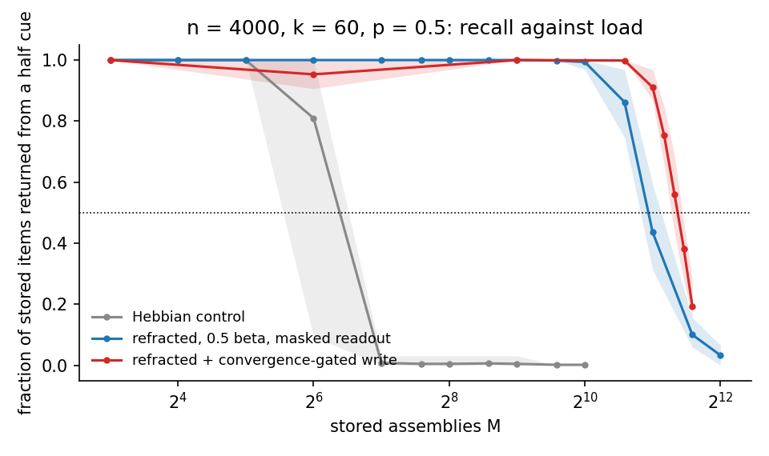
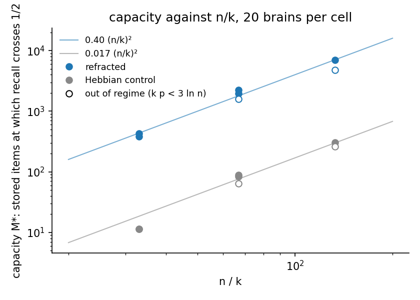
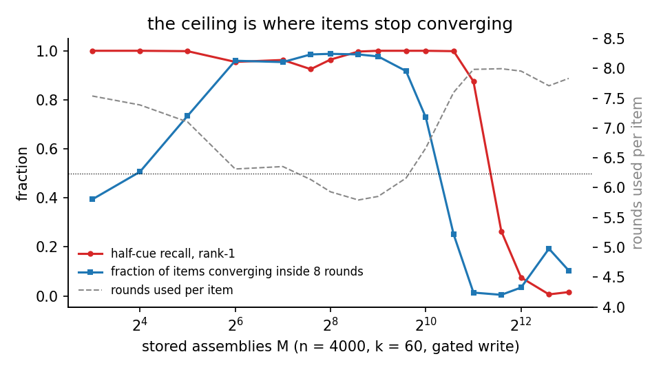

# PREREG: refraction below the transition as an orthogonalizing memory

> **Status (2026-09-09): adopted.**
> **Finding.** A recurrent k-WTA area refracted at 0.5 beta, read from a
> half cue with the bias masked, stores about 0.40 (n/k)² assemblies in
> regime, about 24 times the Hebbian control. Strength from 0.3 to 0.6 beta
> gives one plateau (Amendment 6). Ending each item's write when its
> winner set repeats raises the ceiling by 24 to 34 percent, and the
> ceiling sits where items stop converging within the round budget
> (Amendments 5 and 6).
> **What changed from the registration.** The title's "orthogonalizing"
> is inaccurate: stored items overlap at chance once the area is full, and
> what refraction does is prevent items from merging while they are
> written. The Hebbian control at T = 16 collapses to M* = 8, so its
> rounds window is attractor dominance rather than anything refraction
> adds (post hoc).
> **Read.** The Result section, then Amendments 4, 5 and 6.
> **Reproduce.** `python -m research.runner capacity-scaling
> --registration research/notes/memory/PREREG_refraction_memory.md --nk 4000:60
> --arms B --refracted --refracted-factor 0.5 --readout masked
> --ms 8,16,32,64,128,192,256,384,512,768,1024,1536,2048,3072,4096 --tag X`
> gives the 1961 cell in about 35 s on one GPU; add `--converge` for the
> gated 2645; drop `--refracted` for the control's 83. Results land in
> `research/results/runs/memory.capacity-scaling/TAG/` with a run record;
> the default seed list is 42..61 (20 brains). The fused kernels need the CUDA build
> environment (see `research/experiments/README.md`).
> **Cite.** `[[REFRACTION-ANTI-MERGING]]`.

*Each point is one (n, k) cell's ceiling on log axes; slope two is a
square law; hollow points are cells below k p >= 3 ln n.*

*How to read it (Amendments 5 and 6): with the gate on, an item's write
ends as soon as its winners stop changing, within a budget of eight
rounds. Top: recall from a half cue. Middle: the fraction of items whose
winners did stop changing within the budget. Bottom: the mean number of
rounds a write took, eight meaning it never settled. Recall fails where
the middle curve falls: the ceiling is the load at which items no longer
converge within the budget.*

Registered before running. Owed by PREREG_refraction_capacity.md's
re-measurement (2026-09-04): with the substrate's selector fixed
(1b475fc), a recurrent k-WTA area refracted at 0.5 beta and read with the
bias MASKED held every assembly of a grid to M = 256 (rank-1 1.000 to
M = 32, pairwise 0.00 x chance) where the Hebbian control ceilings at
23.5. That was a post-hoc re-measurement of a post-hoc amendment; nothing
was adopted. This registration asks the question properly.

## Protocol

`seq_capacity_scaling.py` as registered in PREREG_capacity_scaling.md
(inhibit between assemblies; each assembly trained by its own stimulus
alongside recurrence for T rounds; rank-1 recovery of every stored
assembly from its stimulus; M* = the M at which the rank-1 curve crosses
0.9, read from the curve; censored cells reported as bounds), on the
hashed substrate, 20 brains, k = 60, p = 0.5, beta = 0.1, w_max = 20,
M checkpoints (8, 16, 32, 64, 128, 256, 512, 1024). Arm B (norm_init, no
column scaling) is the judged arm; arm G (with scaling) is reported.

    cells   REF   s = 0.5 beta, masked readout, T = 8, n in (2000, 4000, 8000)
            CTL   no refraction (masked = net), T = 8, the same n
            NET   s = 0.5 beta, NET readout, T = 8, n = 4000
            T4    s = 0.5 beta, masked, T = 4,  n = 4000
            T16   s = 0.5 beta, masked, T = 16, n = 4000
            S7    s = 0.7 beta, masked, T = 16, n = 4000

## Bars

    R1  CAPACITY.  M*(REF, n = 4000) >= 4 x M*(CTL, n = 4000).
        FAIL: < 2x.  Between: inconclusive.  A REF cell censored HIGH
        (rank-1 above 0.9 at M = 1024) passes R1 as a bound.
    R2  FILL LAW.  The REF ceiling is fill-limited and scales with n: fill
        at M* >= 0.9 in every REF cell, and M*(REF) k / n within +/- 25%
        across n = 2000, 4000, 8000 (a tiling ceiling, M* proportional to
        n at fixed k). FAIL: M* k / n varies by more than 2x across n.
    R3  ORTHOGONALITY.  Pairwise overlap of the stored assemblies at the
        largest uncensored M below M*(REF) <= 0.1 x chance, against CTL's
        >= 1.0 x chance at its own M*.
    R4  THE VETO.  The NET readout at n = 4000 has M* <= 8 (chance
        recovery): a refracted memory is readable only with the bias
        masked (P0 of PREREG_refraction_capacity.md, re-stated).
        FAIL: NET M* > 16.
    R5  ROUNDS.  Prediction, from the mechanism (each item's T rounds
        visit neurons; fill limits M*): M*(T4) > M*(T8) > M*(T16) at
        n = 4000, each step beyond the pooled CI, PROVIDED the items
        still converge (rank-1 at M = 8 >= 0.9 in every T cell). If T4
        fails to converge (rank-1 at M = 8 < 0.9) the prediction is void
        for that cell and reported.
    S7  reported, not judged: does 0.7 beta converge given T = 16 (rank-1
        at M = 8), and where is its ceiling?

## Interpretation, stated now

* R1-R4 pass -> a recurrent area under refraction at half beta is an
  orthogonalizing memory whose ceiling is TILING (n / k), not
  interference, read through the intrinsic veto: the homeostatic
  mechanism the reference confines to feedforward areas is the lever
  that lifts recurrent capacity by an order of magnitude. Adopt as a
  MEASURED register entry; the numpy engine's refracted mode is then the
  next thing to gate on this claim (its selection has no such defect,
  but its numbers were never read at these M).
* R1 fails -> the re-measurement was a T = 8 / n = 4000 accident; report,
  adopt nothing.
* R2 fails while R1 passes -> the ceiling is not tiling; fit and report.
* R5 inverted (M* rising with T) -> the ceiling is convergence-limited,
  not fill-limited; the mechanism claim is wrong as stated.

## Result (2026-09-04, arm B on the organ fiber, 20 brains, M grid 8..1024)

    cell            n      M*                      fill@M*   M*k/n    distinct@1024   pw/chance near M*
    CTL  T=8     2000     11.3   [8, 16)            0.39      0.34     (0.63 at M=128 for n=4000)   1.8-2.6
    CTL  T=8     4000     83.4   [64, 128)          0.80      1.25                                  1.8 -> 15
    CTL  T=8     8000    306.8   [256, 384)         0.95      2.30                                  1.4 -> 9
    REF  T=8     2000    431.3   [384, 512)         1.00     12.94     1.000 (0.98 at 1024)         0.89 (M=384)
    REF  T=8     4000  >= 1024   censored high      1.00   >= 15.36    1.000 (rank-1 0.994 at 1024) 0.94 (M=1024)
    REF  T=8     8000  >= 1024   censored high      1.00   >=  7.68    1.000 (rank-1 1.000 at 1024) 0.94 (M=1024)
    NET  T=8     4000      8.0   chance (0.125 at M=8)
    T4   T=8->4  4000  does not converge: rank-1 0.225 at M=8, RISING to 1.000 at M >= 768
    T16  T=16    4000    203.2   [192, 256)         1.00      3.05     0.94
    S7   0.7b,16 4000    185.0   [128, 192)         1.00      2.78     0.98     converges: 0.97 at M=8

    R1  CAPACITY     REF(4000) >= 1024 against CTL(4000) 83.4: >= 12x       PASS (as a bound)
                     (n=2000: 431 / 11.3 = 38x, both resolved)
    R2  FILL LAW     fill@M* = 1.00 in every REF cell (first clause holds);
                     M*k/n across n: 12.9 / >=15.4 / >=7.7 -- two cells
                     censored, the ratio cannot be judged                 UNRESOLVED
    R3  ORTHOGONAL   pw/chance 0.89 at the largest uncensored M below
                     M*(2000); 0.94 at M=1024 for the censored cells     FAIL as written
    R4  THE VETO     NET M* = 8, chance at every M                          PASS
    R5  ROUNDS       M*(T8) >= 1024 > M*(T16) = 203, beyond CI              PASS for T8 > T16
                     T4 does not converge (0.225 at M=8): void, reported
    S7  0.7 beta converges given T=16 and holds ~185, above CTL's 83.

**Reading.** R1 and R4 are decisive, R5 holds where it can be judged, R2
is not yet judgeable, and R3 FAILS -- and the failure corrects the
mechanism claim. The stored assemblies are orthogonal (0.00 x chance)
only while the area still has unvisited neurons (M <= 64 at n = 4000);
past fill 1.0 their pairwise overlap returns to chance (0.9 x) -- and
recovery stays perfect anyway. What refraction preserves is not
orthogonality but DISTINCTNESS: `distinct` reads 1.000 through M = 1024
for every REF cell where the control collapses to 0.63 by M = 128 with
pairwise overlap 15 x chance (hub formation, rich-get-richer). Refraction
at half beta is an ANTI-MERGING force, not an orthogonalizer: it stops
repeat winners from becoming hubs, so items overlap at chance like
random subsets yet remain separately recoverable from their cues through
the intrinsic veto. The ceiling that remains is set by something other
than fill or overlap -- at n = 2000 it is 431 = 13 n/k -- and finding it
at n >= 4000 needs the grid extended. Fewer rounds per item raises the
ceiling (T8 > T16) as long as the items still converge; T = 4 does not,
and its curve rising with load says items formed in a fully-visited,
fully-refracted area converge where the first ones did not.

Per the interpretation stated above: R3 failed, so NOTHING IS ADOPTED
from this run; the mechanism claim is rewritten and re-registered below.

## Amendment 1 (2026-09-04, before the extension runs): the grid to 4096, and R3 restated

* R2 needs the censored cells resolved: n = 4000 and 8000 re-run with
  M checkpoints (1024, 1536, 2048, 3072, 4096), 20 brains, T = 8, arm B,
  masked. R2's ratio clause is judged on the resolved values.
* R3 is restated as DISTINCTNESS: `distinct` >= 0.99 at M*(REF) in every
  REF cell, against the control's < 0.7 at its own M*. The orthogonality
  clause is dropped as measured false past fill 1.0.
* Bars R1, R4, R5 stand as read.

### Extension result (2026-09-05, grid to 4096, 20 brains)

    REF  n=4000   M* = 1977.6  [1536, 2048)  resolved   M*k/n 29.7   distinct 1.000 at M*
    REF  n=8000   M* >= 4096   censored high (rank-1 1.000 at 4096)   M*k/n >= 30.7
    R1  at n=4000 resolved: 1978 / 83.4 = 23.7x                                  PASS
    R2  M*k/n = 12.9 / 29.7 / >= 30.7 across n = 2000 / 4000 / 8000: the 2000 -> 4000
        step is 2.3x, outside +/- 25%                                            FAIL as a ratio law at fixed k
    R3' (Amendment 1) distinct >= 0.99 at M*(REF) in every cell (1.000)            PASS
        against the control's 0.63 at its own M* (n=4000)

Neither ceiling is a ratio law at fixed k = 60: the control goes 11 / 83 /
307 and the refracted 431 / 1978 / >= 4096 with n doubling. Whether the
law is in n alone or in n/k is what Amendment 2 asks.

## Amendment 2 (2026-09-05, before running): the k sweep

Cells (n, k), REF (0.5 beta, masked, T = 8) and CTL, 20 brains, arm B,
M grid (8, 16, 32, 64, 128, 192, 256, 384, 512, 768, 1024, 1536, 2048, 3072, 4096):

    (2000, 30)   n/k = 67, same ratio as (4000, 60)
    (4000, 30)   n/k = 133, same ratio as (8000, 60)
    (4000, 120)  n/k = 33, same ratio as (2000, 60)
    (8000, 120)  n/k = 67, same ratio as (4000, 60)

    R6  CONTROL LAW.  If M*(CTL) is a function of n/k alone
        ([[capacity-depends-on-n-over-k]] for assemblies), then
        CTL(8000,120) and CTL(2000,30) are within +/- 25% of CTL(4000,60) = 83,
        and CTL(4000,30) within +/- 25% of CTL(8000,60) = 307, CTL(4000,120)
        of CTL(2000,60) = 11. PREDICTION: PASSES (the assembly law).
        FAIL: any pair outside 2x -> the control ceiling depends on n and k
        separately; report the fit.
    R7  REFRACTED LAW.  The same four equalities for REF against REF(4000,60)
        = 1978, REF(8000,60) >= 4096, REF(2000,60) = 431.
        PREDICTION: uncertain. If R7 passes with R6, one law in n/k sizes
        both memories and refraction multiplies it by a constant (~24x at
        n/k = 67). If R7 fails while R6 passes, refraction changes the
        scaling itself.

## Amendment 3 (2026-09-05, before running): the claim gated on the NUMPY engine

The selector defect was the hashed substrate's; the numpy engine's k-WTA
(`torch.topk` / argpartition on the net drive) has none. Its refracted
mode has never been read at these loads. `refraction_memory_numpy.py`
mirrors the harness on `numpy_sparse`: area n = 2000, k = 60, p = 0.5,
beta = 0.1, w_max = 20, norm_init, no scaling, MATERIALIZED (the explicit
model); items trained by their stimulus alongside recurrence for T = 8
rounds from an inhibited area; the readout is the harness's HALF-CUE
recall -- the first k/2 neurons of the stored assembly set as winners,
T frozen recurrent rounds under `probe()` (no plasticity, no charge), the
bias zeroed for the masked readout and restored after -- ranked against
all stored assemblies; distinctness by exact duplicates. 5 brains, M grid
(8, 16, 32, 64, 128, 256, 512).

    N1  numpy REF M* >= 4 x numpy CTL M*.        FAIL: < 2x.
    N2  distinct >= 0.99 at M*(REF).
    N3  reported, not judged: numpy REF M* against the hashed 431. The two
        substrates differ in the stimulus model (the engine's stimuli into
        a materialized area are zero-or-size, the harness's are Binomial
        counts), so the number is not expected to match; the CLAIM is.

### Amendment 2 -- Result (2026-09-05, 20 brains, arm B, grid to 4096)

    n/k    cell          CTL M*              REF M*                 REF / CTL
     33    (2000,  60)   11.3  [8, 16)        431   [384, 512)        38x
     33    (4000, 120)   11.3  [8, 16)        383   [256, 384)        34x
     67    (4000,  60)   83.4  [64, 128)     1978   [1536, 2048)      24x
     67    (2000,  30)   64.3  [64, 128)     1589   [1536, 2048)      25x
     67    (8000, 120)   88.9  [64, 128)     2230   [2048, 3072)      25x
    133    (8000,  60)  306.8  [256, 384)  >= 4096  censored high   >= 13x
    133    (4000,  30)  262.8  [256, 384)  >= 4096  censored high   >= 16x

    R6  CONTROL LAW.   n/k-matched cells within +/- 25% of each other:
        64 / 83 = 0.77, 89 / 83 = 1.07, 263 / 307 = 0.86, 11.3 / 11.3      PASS
    R7  REFRACTED LAW. 1589 / 1978 = 0.80, 2230 / 1978 = 1.13,
        383 / 431 = 0.89; the n/k = 133 pair both censored at 4096,
        consistent                                                        PASS

**Reading.** BOTH ceilings are functions of n/k alone -- the assembly law
([[capacity-depends-on-n-over-k]]) holds for the refracted memory too --
and refraction multiplies it by a factor that is roughly constant in n/k:
~36x at n/k = 33, ~25x at 67, >= 13-16x at 133 (a bound; the multiplier
may fall slowly with n/k or not, the grid must reach past 4096 to say).
The "superlinearity in n" of the fixed-k sweep was n/k rising: over
n/k = 33 -> 67 -> 133 the control goes 11 -> 83 -> 307 (x7.4, x3.7) and
the refracted 431 -> 1978 -> >= 4096 (x4.6, >= x2.1). Fill is 1.000 at
every REF ceiling and 0.36-0.95 at the control's: the control dies of
merging before the area is full, the refracted memory fills the area and
goes on to a ceiling ~25x higher, distinct 1.000 throughout.

Artifacts of this amendment: [capacity_scaling_results_ksweep_ctl.json](../../results/memory/capacity_scaling_results_ksweep_ctl.json) (the k sweep, cells at n = 2000, 4000, 8000).

### Amendment 3 -- Result (2026-09-05, numpy_sparse, materialized, 5 brains, M grid to 512)

    numpy REF (0.5 beta, masked)   rank-1 1.000 at EVERY M to 512 on all 5 brains;
                                   distinct 1.000; fill 1.000 from M = 64; pw/chance 0.9-1.0 at 512
                                   M* >= 512 (censored high, all brains)
    numpy CTL                      M* = 34.3 [32, 64) on all 5 brains; distinct 0.55 at 128,
                                   0.14 at 512; pw/chance 10 -> 26 (hub collapse)
    N1  >= 512 / 34 = >= 15x                                                   PASS
    N2  distinct 1.000 at M*(REF)                                             PASS
    N3  reported: numpy REF >= 512 against the hashed 431 (consistent as a
        bound); numpy CTL 34 against the hashed 11 -- the mirror's summed
        stimulus (10 x 6, sd 9.5) is more graded than the harness's
        Binomial(60, 0.5) (sd 3.9), which helps the Hebbian control.

Two things the mirror taught before it passed, both recorded in the script:
the engine's ZERO-OR-SIZE stimulus collapses the control at p = 0.5 (one
tie for every item) and, at p = 0.05, makes the refracted item ROTATE
through its tied connected set (recall 0.5-0.75) -- refraction's benefit
requires GRADED stimulus drive; and a Brain-level projection reads its own
cached winners, so a half-cue recall must drive the engine directly.

## Adopted (2026-09-05)

R1, R4, R5 (where judgeable), R3 as restated (distinctness), R6, R7, N1
and N2 pass; R2 as a ratio law at fixed k fails and is superseded by R6/R7
(the law is in n/k). Register entry `REFRACTION-ANTI-MERGING` (MEASURED):
a recurrent k-WTA area refracted at half beta and read with the bias
masked holds ~25x the Hebbian ceiling; both ceilings are functions of
n/k alone; the mechanism is anti-merging (distinct 1.000 where the
control forms hubs), not orthogonalization (overlap returns to chance past
fill 1.0); the net readout reads chance; fewer rounds per item raise the
ceiling while the items still converge; graded stimulus drive is required.

## Amendment 4 (2026-09-07, before running): the LAW in n/k, and the censored pair

The k sweep established that both ceilings are functions of n/k alone; it
did not say WHAT function. The resolved refracted cells give

    n/k   cell          REF M*    M* / (n/k)^2
     33   (2000,  60)     431       0.40
     33   (4000, 120)     383       0.35
     67   (4000,  60)    1978       0.44
     67   (2000,  30)    1589       0.35
     67   (8000, 120)    2230       0.50

i.e. an exponent of 2.05-2.2 over the doubling 33 -> 67, and a nearly
constant M* / (n/k)^2 of 0.35-0.50. A LINEAR law in n/k (constant
multiplier on a linear assembly law) would put the n/k = 133 cells at
~3,950; both already exceed 4,096, so linear is dead before this run. The
quadratic reading is a Willshaw-type store: a sparse associative memory
over n^2 synapses with k active per pattern holds ~c (n/k)^2 patterns.

Cells: REF (0.5 beta, masked, T = 8), 20 brains, arm B, (8000, 60) and
(4000, 30), M grid (..., 3072, 4096, 6144, 8192, 12288, 16384). CTL at
these cells is already resolved (307, 263).

    Q1  QUADRATIC.  M*(REF) at BOTH n/k = 133 cells lies in
        [0.35, 0.50] x 133^2 = [6,200, 8,850]; equivalently the exponent
        of the doubling 67 -> 133 lies in [1.65, 2.35].
        PREDICTION: PASSES.
        FAIL LOW  (M* < 6,200 but > 4,096): the exponent falls with n/k --
        the multiplier over the control decays, and the law is sub-quadratic
        at scale; report the exponent, do not fit a power law through three
        points as if it were one.
        FAIL HIGH (M* > 8,850): the exponent rises -- fill-limited effects
        at small n/k depressed the low cells; report.
        CENSORED at 16,384: report the bound; the grid was the limit.
    Q2  MULTIPLIER.  REF / CTL at n/k = 133, both cells, reported against
        the 34-38x at n/k = 33 and 24-25x at n/k = 67. If Q1 passes the
        control is the sub-quadratic one (11 -> 83 -> 307 is x7.4, x3.7) and
        the multiplier RISES with n/k; that is stated now as the reading,
        not as a bar.
    Q3  RESOLUTION.  Both ceilings resolved to a bracket <= 1.5x with an
        interior point; a cliff (no interior point) is reported as such.
    Q4  DISTINCTNESS AT THE CEILING (R3 restated) holds at both cells:
        distinct >= 0.99 at the last M below M*.

Nothing is adopted from this amendment alone: if Q1 passes, the register
entry's claim gains the sentence "the refracted ceiling is ~0.4 (n/k)^2"
and the constant is quoted with its range across the seven cells.

## Amendment 5 (2026-09-07, before running): convergence-gated rounds

R5 found the ceiling convergence-limited from above and below: T = 16
holds 203 where T = 8 holds 1978, and T = 4 does not converge at low load
(rank-1 0.225 at M = 8) yet does at high load (1.000 from M = 768). The
mechanism named there -- an item's rounds past convergence only charge
bias and potentiate what is already formed -- suggests the knob is not T
but WHEN TO STOP: run each item until its winner set repeats, T_max = 8.

Built as `stop_when_stable` on `HashedArea.project` (per brain; the
converged brain's rows go to the fibers as -1, the dead-brain convention;
a brain's rounds up to convergence are bit-identical to the ungated run's,
tested). Harness flag `--converge`; `rounds_used` reported per M.

Cells: (4000, 60), n/k = 67, 20 brains, arm B, grid to 4096: REF gated
(0.5 beta, masked) against REF T = 8 (1978, [1536, 2048)); CTL gated
against CTL T = 8 (83).

    G1  NOT WORSE.  M*(REF gated) >= 1536, the lower edge of the T = 8
        bracket, and rank-1 at M = 8 >= 0.9 (the items converge).
        PREDICTION: PASSES.
    G2  BETTER.  M*(REF gated) > 2048 (above the T = 8 bracket).
        PREDICTION: uncertain -- passes only if items converge in fewer
        than 8 rounds at high load; that is exactly what T = 4's late
        success says, and what G3 measures.
    G3  ROUNDS FALL WITH LOAD.  Mean rounds used per item at M <= 64
        exceeds the mean at M >= 1024. Reported with the fraction of items
        that converge before T_max at each M.
        NULL: if items rarely repeat a winner set inside 8 rounds the gate
        never fires, the gated run equals T = 8 EXACTLY, and this
        amendment is a null -- reported as such, nothing adopted.
    G4  CONTROL, reported: M*(CTL gated) against 83.

Adoption if G1 and G2 pass: the register entry's "fewer rounds per item
raise the ceiling" becomes "an item's rounds should end at convergence";
the harness default stays T = 8 (the registered protocol), gating opt-in.

### Amendment 4 -- Result (2026-09-07, 20 brains, arm B, grid to 16384, 299 s)

    cell          regime (k p vs 3 ln n)   REF M*   bracket          M*/(n/k)^2   CTL    REF/CTL
    (8000, 60)    IN  (30.0 vs 27.0)        6995    [6144, 8192)       0.395      307     23x
    (4000, 30)    OUT (15.0 vs 24.9)        4749    [4096, 6144)       0.27       263     18x

    Q1  QUADRATIC.   (8000, 60): 0.395 in [0.35, 0.50]                    PASS
                     (4000, 30): 0.27, below the window                   FAIL LOW
                     As registered ("BOTH cells"): FAIL LOW.
                     Doubling exponents 67 -> 133: 1.82 in regime
                     ((4000,60) -> (8000,60)), 1.58 out of regime
                     ((2000,30) -> (4000,30)); 33 -> 67 they were 2.05-2.2.
    Q2  MULTIPLIER.  23x and 18x at n/k = 133 against 24-25x at 67 and
                     34-38x at 33: the multiplier does NOT rise; the control
                     is ~quadratic too from 67 on (307 / 83 = x3.7, exponent
                     1.9; CTL / (n/k)^2 = 0.018, 0.017). The reading stated
                     in the amendment ("the control is the sub-quadratic
                     one") was wrong and is withdrawn.
    Q3  RESOLUTION.  [6144, 8192) 1.33x, interior 2; [4096, 6144) 1.50x,
                     interior 10 (at the 1.5x edge)                       PASS
    Q4  DISTINCT.    1.000 at the last M below M*, both cells             PASS

**Reading.** The law in n/k has a REGIME PRECONDITION that the k sweep's
+/- 25% criterion could not see while the pair was censored: the k = 30
cells sit below the harness's own in-degree floor (k p = 15 against
3 ln n = 23-25), and they are the low cells at both ratios ((2000, 30)
0.80 of its pair, (4000, 30) 0.68). In regime the refracted ceiling is
~0.40 (n/k)^2 at n/k = 67 and 133 with a doubling exponent of 1.8-2.2 --
Willshaw-like, and NOT adopted as a power law: the exponent is falling
slowly, and three ratios do not fix it. The out-of-regime cell shows the
T = 4 signature (rank-1 0.49 at M = 8 rising to 1.000 by M = 768): the
recurrent in-degree is too small to converge in 8 rounds at low load.
Nothing adopted; the register entry's "~25x" stands (23x in regime here)
and gains the precondition k p >= 3 ln n once G5 below has run.

R7 restated by this: the n/k = 133 pair, both now resolved, disagree by
0.68 -- R7 holds only within the regime; recorded against the Amendment 2
result, which counted the censored pair as consistent.

Artifacts of this amendment: [capacity_scaling_results_amend4_ref133.json](../../results/memory/capacity_scaling_results_amend4_ref133.json).

### Amendment 5, addendum (2026-09-07, before running): G5, the out-of-regime cell under the gate

If the (4000, 30) cell is convergence-limited from below, then rounds
gated on convergence with a higher ceiling should give its items the
rounds they need at low load without the T = 16 damage at high load.

    G5  (4000, 30), REF gated, T_max = 16, grid to 8192:
        rank-1 at M = 8 >= 0.9 (it converges)  AND  M* within +/- 25% of
        6995 (the in-regime pair) -> the n/k law holds with convergence
        as the precondition, stated as such in the register.
        rank-1 at M = 8 >= 0.9 but M* stays near 4749 -> the cell is
        below the law for a reason other than convergence (in-degree
        itself); k p >= 3 ln n becomes the precondition.
        rank-1 at M = 8 < 0.9 -> 16 rounds do not converge it either;
        report, nothing adopted.

### Amendment 5 -- Result (2026-09-07, (4000, 60) unless stated, 20 brains, arm B)

    arm                  M*      bracket           rank-1 @ M=8   rounds/item (M<=64 | M>=1024)   conv < T_max
    REF gated, T_max 8   2645    [2560, 2816) i4      1.000         7.1 | 7.7  (min 5.8 at M~400)   0.4 -> 0.99 -> 0.00 at M >= 2048
    REF T = 8 (R1)       1978    [1536, 2048)         0.994         8 | 8                            --
    CTL gated, T_max 8   (484)   see G4               0.319         4.4 | 4.0                        1.00 everywhere
    CTL T = 8            83      [64, 128)            ~1.0          8 | 8                            --
    G5 (4000, 30) gated, T_max 16
                          362    [256, 384)           0.956        10.1 | 9-12                       0.99 -> 0.6-0.8
    (4000, 30) T = 8     4749    [4096, 6144)         0.494         8 | 8                            --

    G1  NOT WORSE.   2645 >= 1536 and rank-1 1.000 at M = 8                PASS
    G2  BETTER.      2645 > 2048; bracket [2560, 2816) resolved (four
                     interior points, refined post hoc from [2048, 3072))  PASS  (+34%)
    G3  ROUNDS FALL WITH LOAD.  7.1 at M <= 64 against 7.7 at M >= 1024   FAIL
                     -- the shape is a U: rounds fall to 5.8 at M ~ 400
                     (99% of items converge inside 8) and RISE back to 8
                     past M ~ 1500, where the fraction converging inside
                     8 rounds falls to 0.25 at 1536, 0.01 at 2048 and 0
                     at 3072. The ceiling (2645) sits where items STOP
                     converging: past it an item wanders for all 8 rounds.
    G4  CONTROL.     reported: the gated control converges every item in
                     ~4.4 rounds and does NOT form a recallable memory --
                     rank-1 0.32 at M = 8, 0.20-0.25 to M = 128, rising to
                     0.92 at M = 384 and collapsing after; the "M* = 484"
                     is the downward crossing of a curve that only crossed
                     upward at 384, not a ceiling. Winner convergence is
                     not a formed memory: the control needs the rounds
                     after convergence to potentiate the recurrent weights
                     a half cue completes on.
    G5  (4000, 30), T_max = 16 gated: rank-1 0.956 at M = 8 (it converges,
                     10 rounds per item) and M* = 362 -- NEITHER
                     registered branch: converging the low-load items
                     costs the ceiling 13x (4749 -> 362), the T = 16
                     damage in a new form. The k = 30 cell is not
                     convergence-limited in a way rounds can repair;
                     k p >= 3 ln n stands as the precondition of the n/k
                     law. Nothing adopted for that cell.

**Reading.** Rounds per item are the memory's WRITE BUDGET. Under
refraction each round charges bias and potentiates; the rounds after an
item's winners settle buy nothing for that item and spend the area's
budget (the T = 16 result, and G5). Ending an item at convergence returns
that budget: +34% at n/k = 67, resolved. But convergence inside T_max is
itself load-dependent -- a U in load -- and the ceiling is where it is
lost, so the gate cannot move the ceiling past the point where items no
longer settle in 8 rounds. The control is the opposite regime: its
winners settle in 4 rounds and its memory is not yet written; gating
starves it. So "fewer rounds per item raise the ceiling" is replaced by:
end an item's rounds at convergence under a ceiling T_max the memory
still forms under (8 for the refracted memory; the control has no such
gate).

Artifacts of this amendment: [capacity_scaling_results_amend5_ref_gated.json](../../results/memory/capacity_scaling_results_amend5_ref_gated.json) (REF gated), [capacity_scaling_results_amend5_ref_gated_refine.json](../../results/memory/capacity_scaling_results_amend5_ref_gated_refine.json) (its bracket refinement), [capacity_scaling_results_amend5_ctl_gated.json](../../results/memory/capacity_scaling_results_amend5_ctl_gated.json) (CTL gated, G4), [capacity_scaling_results_amend5_g5.json](../../results/memory/capacity_scaling_results_amend5_g5.json) (G5).

## Adopted (2026-09-07), Amendments 4 and 5

Register entry `REFRACTION-ANTI-MERGING` gains: the regime precondition
k p >= 3 ln n for the n/k law (the k = 30 cells fall 20-32% below their
pairs); in regime the refracted ceiling is ~0.40 (n/k)^2 at n/k = 67 and
133 with doubling exponents 2.1 -> 1.8 (Willshaw-like; NOT a power law
claim); the multiplier over the control is 23-25x at n/k >= 67 (36x at
33), the control being ~quadratic too from 67 on; convergence-gated
rounds with T_max = 8 raise the ceiling +34% (2645 vs 1978, resolved)
and the ceiling is where items stop converging inside T_max; gating
starves the Hebbian control. Harness default stays T = 8 ungated (the
registered protocol); `--converge` is opt-in.

## Amendment 6 (2026-09-09, before running): is the gate's gain a constant, and is strength a lever

Two questions left open by Amendments 4-5, both one cell each.

**The gate at a second n/k.** (8000, 60), n/k = 133, in regime; ungated
T = 8 gives 6995 [6144, 8192). REF gated T_max = 8, 20 brains, grid
(..., 4096, 6144, 8192, 10240, 12288, 16384). A constant +34% predicts
~9,400.

    G6  GAIN IS CONSTANT.  M*(gated) / 6995 in [1.15, 1.55].
        PREDICTION: PASSES (the gate returns the same fraction of the
        write budget at every load scale).
        FAIL LOW  (< 1.15): the gain shrinks with n/k -- the rounds past
        convergence matter less when the area is larger; report the ratio.
        FAIL HIGH (> 1.55): the gain grows; report.
        The convergence-fraction U (G3) is reported at this cell too: if
        the ceiling again sits where items stop converging inside 8, that
        mechanism is stated in the entry as general.

**Strength.** (4000, 60), n/k = 67, ungated T = 8, 20 brains, grid to
4096, masked readout, at 0.3, 0.4, 0.6 beta against the 0.5 beta cell
(1978 [1536, 2048)); 0.7 beta is known not to converge at T = 8 (S7).

    S8  STRENGTH IS A LEVER.  Some strength other than 0.5 has M* >= 1.15
        x 1978 = 2275 with rank-1 at M = 8 >= 0.9.
        PREDICTION: uncertain. 0.5 beta was chosen from a grid of 0.5,
        0.7, 1.0 (PREREG_refraction_capacity); the interior between 0.3
        and 0.7 is unmeasured. Below 0.5 the anti-merging force weakens
        (toward the Hebbian 83); above it the churn transition approaches
        (0.7 does not converge at T = 8). Either monotone shape or an
        interior peak at 0.5 is a FAIL: 0.5 stands, stated as measured.
    S9  CONVERGENCE, reported: rank-1 at M = 8 per strength; the strength
        at which T = 8 stops converging brackets the churn transition
        from below (S7 put it at 0.5-0.7).

Adoption: G6 pass -> the entry's gating sentence gains "constant in n/k
(two cells)". S8 pass -> the entry's strength is restated with the
measured optimum, and the gate is re-run at that strength (post hoc,
labelled). Neither changes the harness default.

### Amendment 6 -- Strength result (2026-09-09, (4000, 60), 20 brains, arm B, T = 8, grid to 4096)

    strength (x beta)   M*      bracket          rank-1 @ M=8   distinct @ M*
    0.3                 1986    [1536, 2048) i3     1.000          1.000
    0.4                 1919    [1536, 2048) i3     1.000          1.000
    0.5 (R1)            1978    [1536, 2048) i3     0.994          1.000
    0.6                 1993    [1536, 2048) i3     0.975          1.000
    0.7 (S7)            does not converge at T = 8; 185 given T = 16

    S8  STRENGTH IS A LEVER.  No strength reaches 2275; the four cells
        agree within 4%                                              FAIL
    S9  CONVERGENCE.  All four converge at M = 8 (0.975-1.000); the
        rank-1 at M = 8 falls with strength (1.000 -> 0.975) and 0.7 is
        past the transition: the churn transition sits in (0.6, 0.7]
        beta at T = 8, one step above S7's bracket.

**Reading.** Refraction is a SWITCH, not a dial. From 0.3 beta to 0.6
beta the ceiling is a plateau at ~1950 -- the same bracket, the same
interior points, the same curves -- while the Hebbian control holds 83.
The ceiling is therefore set by the synaptic memory (the Willshaw-like
~0.40 (n/k)^2 of Amendment 4), and refraction's only job is to keep the
items from merging while it is written; any strength that does that
without crossing the churn transition gives the same memory. 0.5 beta
stands as the protocol's value, now as the middle of a measured plateau
rather than a chosen point. The gate is NOT re-run at another strength
(there is no other strength).

Artifacts of this result: [capacity_scaling_results_amend6_s0.3.json](../../results/memory/capacity_scaling_results_amend6_s0.3.json), [capacity_scaling_results_amend6_s0.4.json](../../results/memory/capacity_scaling_results_amend6_s0.4.json), [capacity_scaling_results_amend6_s0.6.json](../../results/memory/capacity_scaling_results_amend6_s0.6.json) (the 0.5 beta row is R1's cell).

### Amendment 6 -- Gate result (2026-09-09, (8000, 60), 20 brains, arm B, T_max = 8, grid to 16384, 305 s)

    arm                  M*      bracket             ratio    rounds/item (min)   conv < 8: peak -> at M*
    REF gated            8666    [8192, 10240) i2    1.24     5.9 at M ~ 1024     0.98 at 1024 -> 0.00 at 8192
    REF T = 8 (A4)       6995    [6144, 8192)  i2      --     8                   --

    G6  GAIN IS CONSTANT.  8666 / 6995 = 1.24 in [1.15, 1.55]          PASS
        (1.34 at n/k = 67, 1.24 at 133: constant within the bar, and
        the lower of the two at the larger area.)
    The convergence U replicates: 98% of items settle inside 8 rounds at
    M ~ 1024, none at 8192, and the ceiling (8666) sits where they stop
    settling -- as at n/k = 67. Stated in the entry as the mechanism.
    Gated ceilings over (n/k)^2: 0.59 at 67, 0.49 at 133 (doubling
    exponent 1.71); the ungated 0.44, 0.40 (1.82).

Artifacts of this result: [capacity_scaling_results_amend6_g6_gated133.json](../../results/memory/capacity_scaling_results_amend6_g6_gated133.json).

## Adopted (2026-09-09), Amendment 6

G6 passes: the gate's gain is constant in n/k (two cells, +35% and +24%;
the first corrected by Amendment 7),
and its ceiling is where items stop converging inside T_max at both.
S8 fails: strength is a switch (0.3-0.6 beta a plateau at ~1950; the
transition in (0.6, 0.7] at T = 8). Both go into the register entry;
the harness default stays T = 8 ungated at 0.5 beta.

What is NOT established, stated now: the gate at n/k = 33 (small areas)
and out of regime; the plateau's lower edge (below 0.3 beta the force
must fail somewhere between 0 and 0.3); and whether the gated ceiling's
exponent (1.71) keeps falling.

### Post hoc (2026-09-09, labelled): the CONTROL at T = 16

To separate the memory's rounds window from the sequence organ's (which
is refraction + clip, PREREG_s5_cliff_anatomy.md Addendum 5), the Hebbian
control was run at T = 16 on (4000, 60), 20 brains, grid to 512:

    CTL T = 8    M* = 83   [64, 128)
    CTL T = 16   M* = 8    (cliff: rank-1 below the bar from the first grid point)

The control collapses far harder than the refracted memory did (1978 ->
203). So the memory's window is NOT refraction's: it is the Hebbian
store's own -- more rounds per item potentiate the item's synapses
further, the hub collapse arrives sooner, and refraction only delays it.
Two windows, two physics: the memory's is synaptic (potentiation per item
against the store's crosstalk, which the convergence gate trims); the
organ's is intrinsic (bias against the clip). The "one mechanism, two
faces" reading offered in conversation is withdrawn in favour of this.

Artifacts of this post hoc run: [capacity_scaling_results_ctl_T16.json](../../results/memory/capacity_scaling_results_ctl_T16.json).

## Scorecard

Every bar in this registration and its amendments, with the number that
decided it. Cells are (n, k); 20 brains unless stated.

| Bar | Registered | Verdict | Deciding number |
|-----|-----------|---------|-----------------|
| R1 capacity | REF >= 4x CTL at (4000, 60) | PASS | 1961 vs 83, 23.5x |
| R2 ratio law at fixed k | M*(n)/n constant | FAIL | superseded by R6/R7: the law is in n/k |
| R3 orthogonalization | pairwise overlap below chance at M* | FAIL as stated, PASS restated | overlap at chance past fill 1.0; distinct 1.000 |
| R4 masked readout | net readout at chance | PASS | net M* = 8 |
| R5 rounds | T = 16 raises the ceiling | FAIL (inverted) | 203 at T = 16 vs 1961 at T = 8 (A7 correction) |
| R6 control law in n/k | matched cells within 25% | PASS | 64/83, 89/83, 263/307, 11.3/11.3 |
| R7 refracted law in n/k | matched cells within 25% | PASS at 33 and 67 | 1589/1961, 2230/1961, 383/431; at 133 the pair disagrees by 0.68 (one cell out of regime) |
| N1 numpy engine | REF >= 3x CTL | PASS | >= 512 vs 34 (5 brains) |
| N2 numpy distinct | distinct 1.000 at M* | PASS | 1.000 |
| Q1 quadratic | M*/(n/k)^2 in [0.35, 0.50] at both n/k = 133 cells | PASS at (8000, 60), FAIL LOW at (4000, 30) | 0.395; 0.27 (out of regime) |
| Q2 multiplier | reported | -- | 23x and 18x at n/k = 133; the control is quadratic too from n/k = 67 |
| Q3 resolution | bracket <= 1.5x | PASS | [6144, 8192); [4096, 6144) |
| Q4 distinct | distinct >= 0.99 below M* | PASS | 1.000 |
| G1 gate not worse | gated M* >= 1536 | PASS | 2645 |
| G2 gate better | gated M* > 2048 | PASS | 2645 [2560, 2816) |
| G3 rounds fall with load | fewer rounds at high load | FAIL | a U: 5.8 rounds at M ~ 400, 8 at M >= 2048 |
| G4 gated control | reported | -- | no memory forms: rank-1 0.32 at M = 8 |
| G5 out-of-regime cell, T_max 16 | converges and reaches the pair | FAIL | converges (0.956) and M* falls 13x to 362 |
| G6 gain constant in n/k | ratio in [1.15, 1.55] at (8000, 60) | PASS | 1.24 (8666 vs 6995) |
| S8 strength a lever | some strength >= 2275 | FAIL | 1986, 1919, 1961, 1993 at 0.3 to 0.6 beta (A7 correction) |
| S9 convergence | reported | -- | all converge; transition in (0.6, 0.7] beta |
| RP-1 exact reproduction (A8) | surviving legacy values equal | PASS | 3,615 + 3,050 per-seed values equal |
| RP-2 lost ceilings (A8) | inside the reported brackets | PASS | all seven, within 0.1% of the reports |
| RP-3 law as cited (A8) | in-regime M*/(n/k)^2 in [0.35, 0.50] | FAIL | 0.345 and 0.502: the quoted range was rounded inward |
| RP-4 live contrast (A8) | every brain >= 0.50 at M_s, six cells | PASS | minimum 0.938 |
| PE-V instrument (A9) | recall agreement 0.03; M*_real within 10% of A8 | PASS | gap 0.000; 0.979-1.040 |
| PE-0 calibration (A9) | random pair-sharing excess in [0.9, 1.1] | PASS | 0.998-1.001 |
| PE-1 substrate is Willshaw (A9) | M*_random in [0.5, 1.0] (n/k)^2, potentiated [0.40, 0.60] | PASS | 0.69-0.92; 0.49-0.60 |
| PE-2 constant efficiency (A9) | eta in [0.35, 0.70], max/min <= 1.5 | PASS | 0.47-0.56; 1.19 |
| PE-3 pair reuse is the gap (A9) | excess >= 1.5, failure pair load within [0.75, 1.33] of random's | FAIL | 1.43 at (4000, 120) |
| PE-4 transients help (A9) | M*_real > M*_clean | PASS | 1.17-1.47x |
| PE-5 balanced headroom (A9) | M*_balanced >= 1.5 M*_random | FAIL | 1.36 at (8000, 60) |
| PE-S weight sensitivity (A9) | c +- 2 within 30% | FAIL | +66 to +89% at k = 60 |
| PE-R gate replayed (A9) | within 10% of 2645 and 8666 | PASS | 0.980, 1.048 |
| PE-6 gate lowers pair reuse (A9) | eta_gated > eta, lower sharing, failure load within [0.75, 1.33] | FAIL | 1.39 at (8000, 60) |
| WS-V instrument (A10) | own-c ceiling replays A9 within 10% at every cell | FAIL | 16 vs 5043 and 20741 at k = 30 |
| WS-1 .. WS-5 (A10) | -- | VOID | adaptive search assumed one crossing |
| XV instrument (A11) | own-c upper edge within 10% of A9, all cells | PASS | 0.978-1.012 |
| X1 completion needs a strong write (A11) | c = 32 >= 1.5x own c | PASS | 1.9x to 37x; own c 0 at two cells |
| X2 binary completes what it identifies (A11) | ratio >= 0.85 | PASS | 0.88-0.99 |
| X3 separable law at binary write (A11) | within-k 15%, k = 120 >= 1.25x k = 60 | PASS | 0.560-0.563 vs 0.798; 1.42x |
| X4 n/k law belongs to the operating write (A11) | own-c pairs in [0.8, 1.25], c = 32 pairs <= 0.8 | PASS | 1.11, 0.89; 0.68, 0.69 |
| X5 weak writes have a load window (A11) | c = 3 lower edge, capacity above own c | PASS | 213-801 lower; 1.6-1.8x |
| X6 smallest completing write falls with k p (A11) | strictly decreasing in k per n/k level | PASS | 11 / 6 / 4 |
| TV instrument (A12) | beta = 0.1 rank-1 within 10% of A7/A8 | PASS | 0.979-1.040 |
| T1 interior optimum (A12) | completion peaks inside the beta grid | FAIL | (2000, 60): merged recall at the top |
| T2 beta* falls with k p (A12) | strictly decreasing per n/k level | FAIL | 0.209 at (8000, 240), merged recall |
| T3 gamma* within 25% (A12) | all five cells | FAIL | undefined; 1.47 |
| T4 wider is better at the optimum (A12) | best completion / (n/k)^2 rises with k p | PASS | 0.66 / 1.12 / 2.79; 0.34 / 0.94 |
| UV instrument (A13) | beta = 0.1 rank-1 within 10% of A7/A8, new brains | PASS | 0.968-1.058 |
| U1 interior optimum (A13) | distinct completion peaks inside the grid, 7 cells | PASS | all seven |
| U2 the law (A13) | gamma* within 15% of 0.29, 7 cells incl. 2 unseen | PASS | 0.257-0.303 |
| U3 the exponent (A13) | 1/2 collapses best, CV < 0.10 | PASS | 0.052 (raw beta 0.213) |
| U4 wider is better (A13) | best distinct completion / (n/k)^2 rises with k p | PASS | 0.41 to 2.46; 0.34, 0.94 |
| WV instrument (A14) | A13 capacities within 15% on new brains | PASS | 0.970-1.077 |
| W1 recall multiplier (A14) | refracted >= 10x control, each at its best beta | PASS | 14.0-57.3 at ten cells |
| W2 synapse-count form (A14) | C within 15% and tighter than (n/k)^2, per block | FAIL | block B: CV 0.10 vs 0.07 |
| W3 connectivity only as k p (A14) | capacity within 15% and same best beta | FAIL | capacity within 8%; best beta differs |
| W4 learning-rate law at sparse p (A14) | best beta interior at p < 0.5 | FAIL | two at the sweep's top |

## Runner migration reproduction (2026-09-10)

The shared runner reproduced the figure control at (4000,60), B, T8,20 seeds,
all 11 recorded load checkpoints. Its [results](../../results/runs/memory.capacity-scaling/migration-capacity-20260910-v3/results.json)
and [comparison receipt](../../results/runs/memory.capacity-scaling/migration-capacity-20260910-v3/comparison.json)
match all 885 compared scalar values, including per-seed metrics and aggregate
ceiling fields. The bracket remains [64,128), too broad to treat interpolated
83.4 as a resolved ceiling. This is migration evidence, not a new adoption.
The original artifact has no run record; reconstruction inputs and their source
are documented in docs/reviews/whole-codebase/VALIDATION.md.

The subsequent [record-consumption replay](../../results/runs/memory.capacity-scaling/capacity-record-consumed-20260910/results.json)
([comparison](../../results/runs/memory.capacity-scaling/capacity-record-consumed-20260910/comparison-v2.json))
also matched all 885 comparisons after arm settings, device and distinctness bars
were changed from implicit globals to required execution inputs from the run
record. The registered defaults and scientific interpretation are unchanged.

## Amendment 7 (2026-09-11, before running): paired sensitivity provenance

This is a migration and instrument-sensitivity check for the already adopted R1
contrast, not a new scientific claim. Protocol version 3 executes both conditions
inside one run record with the same ordered seeds and restarted measurement-sample
stream. Each condition has its own complete configuration and organ-semantics
profile. They may differ only by refraction: CTL has strength zero; REF has
strength 0.5 beta. Both use arm B, masked ungated readout, `(n,k)=(4000,60)`,
T=8, p=0.5, beta=0.1 and seeds 42..61. The M grid is
8,16,32,64,128,192,256,384,512,768,1024,1536,2048,3072,4096.

    A7-M1  REPRODUCTION. Every retained per-seed metric at common legacy
           checkpoints is exactly equal to the corresponding figure artifact;
           ceiling fields agree under the version-3 implementation. Any changed
           observation is a failed migration and cannot update the register.
    A7-S1  SENSITIVITY. At M=128, every paired brain has
           rank1(REF)-rank1(CTL) >= 0.50. Any seed below 0.50 fails the
           sensitivity check. This bar is frozen before the paired rerun and is
           intentionally below the historical minimum; it tests a live contrast,
           not the 4x aggregate-capacity adoption bar.
    A7-S0  TRUE NEGATIVE. Replacing REF's vector with CTL's vector must fail
           A7-S1. This is a validator control, not another GPU condition.

Reproduce with `python -m research.runner capacity-scaling --registration
research/notes/memory/PREREG_refraction_memory.md --nk 4000:60 --arms B
--compare-refraction --refracted-factor 0.5
--ms 8,16,32,64,128,192,256,384,512,768,1024,1536,2048,3072,4096 --tag X`.
The run remains UNJUDGED until A7-M1 and A7-S1 are evaluated and recorded below.

### Amendment 7 result (2026-09-11)

The immutable paired [run](../../results/runs/memory.capacity-scaling/refraction-paired-sensitivity-20260911/results.json)
and its [comparison receipt](../../results/comparisons/refraction-paired-sensitivity-20260911.json)
pass both bars. A7-M1 compares 2,090 retained scalar observations against the
control and refracted figure artifacts with no differences. A7-S1 passes on all
twenty seeds at M=128: the minimum paired REF-minus-CTL rank-1 difference is
0.96875 (mean 0.9921875), above the frozen 0.50 bar. Substituting CTL for REF
fails the validator's constructed A7-S0 control.

The exact replay also resolves a transcription/estimand inconsistency in the
registration. The retained refracted figure artifact, the version-3 recomputation
and the exact GPU replay all give M*=1961.400398770613, not 1977.6. The control is
83.41525726478883, so the multiplier is 23.51x. This does not change R1, its
[1536,2048) bracket, the ~0.40(n/k)^2 description, the strength plateau or any
adopted verdict. Current summaries and the register use 1961; earlier dated result
paragraphs retain 1978 as the historical report corrected here. Against the
corrected ungated value, the gated 2645 result is about +35%, still inside G6's
registered interval.

## Amendment 8 (2026-09-30, before running): the law's cells replayed with provenance

Registered before any run of this amendment. The register records the gap
this closes: `REFRACTION-ANTI-MERGING` states the ~0.40 (n/k)^2 law, but the
capacity grids it is fitted to predate the shared runner. Their files record
no seeds, no k, no readout and no refraction strength, and they key cells by
n alone, so two cells at one n overwrote each other: the per-seed data of
seven of the law's reported ceilings does not exist (the refracted k sweep
was never written at all). Amendment 7 replayed one cell, (4000, 60), and
reproduced 2,090 retained values exactly, which establishes that the hashed
substrate is deterministic and that the legacy seeds are 42 to 61. This
amendment replays the remaining six cells the same way.

It is a provenance and reproduction check, not a new claim. Nothing is
adopted from it; its outcome decides whether the numbers the register cites
are reproducible, and the register is corrected if they are not.

### Protocol

Protocol version 3 through the shared runner (`--compare-refraction`): the
Hebbian control and the refracted memory (strength 0.5 beta, masked
readout) in one record, same ordered seeds 42 to 61, arm B (norm_init, no
column scaling), T = 8, p = 0.5, beta = 0.1, w_max = 20, the runner's
default measurement sampling. Three runs, shaped by what evidence survives,
because the comparator checks a run against a legacy file only when both
hold the same cells:

    L1  (2000, 30), (4000, 120), (8000, 120)
        M grid 8,16,32,64,128,192,256,384,512,768,1024,1536,2048,3072,4096
        (Amendment 2's grid). Control survives in
        capacity_scaling_results_ksweep_ctl.json; refracted does not.
    L2  (8000, 60), (4000, 30)
        M grid as L1 plus 6144,8192,12288,16384 (Amendment 4's grid).
        Refracted survives in capacity_scaling_results_amend4_ref133.json;
        the control (reported 306.8 and 262.8 in Amendment 2) does not.
    L3  (2000, 60)
        M grid as L1. Neither condition survives (reported 11.3 and 431).

Each run from a worktree pinned at the commit that registers this
amendment, one GPU job at a time.

### Bars

    RP-1  EXACT REPRODUCTION where legacy data survives. Every retained
          per-seed metric at every common checkpoint equals the legacy
          file: L1's control against ksweep_ctl (comparison kind
          capacity-control), L2's refracted memory against amend4_ref133
          (kind capacity-refracted), with the ceiling fields. Receipts are
          retained under research/results/comparisons/. Any differing value
          fails, and that cell's legacy number is then not reproducible.
    RP-2  REPORTED CEILINGS where legacy data was lost. Each replayed M*
          lies inside the bracket this registration reported:
              control   (2000, 60) [8, 16)       (8000, 60) [256, 384)
                        (4000, 30) [256, 384)
              refracted (2000, 60) [384, 512)    (4000, 120) [256, 384)
                        (2000, 30) [1536, 2048)  (8000, 120) [2048, 3072)
          The point values are reported beside the reported ones
          (11.3, 306.8, 262.8; 431, 383, 1589, 2230). A point value
          outside 1% but inside its bracket is a transcription discrepancy,
          corrected in the text and the register, not a failure; Amendment
          7 found one such (1978 against 1961).
    RP-3  THE LAW AS CITED. From the replayed values, M*/(n/k)^2 of the
          refracted memory at the in-regime cells (2000, 60), (4000, 120),
          (8000, 120) and (8000, 60) lies in [0.35, 0.50], with (4000, 60)
          taken from Amendment 7. The out-of-regime cells, (2000, 30) and
          (4000, 30), are reported and not judged, as in Amendment 4.
    RP-4  A LIVE CONTRAST AT EVERY CELL. At M_s, the first grid point at or
          above four times the reported control ceiling, every one of the
          twenty paired brains has rank1(refracted) - rank1(control)
          >= 0.50:
              (2000, 60) and (4000, 120): M_s = 64
              (2000, 30) and (8000, 120): M_s = 384
              (8000, 60) and (4000, 30):  M_s = 1536
          Four times the control's ceiling is past its cliff
          ([[CAP-CLIFF]]) and below every refracted ceiling, so this asks
          whether the treatment still moves the organ at each cell, the
          question A7-S1 asked at one cell.
    RP-0  TRUE NEGATIVE. Substituting each cell's control vector for its
          refracted vector must fail RP-4.

The run is UNJUDGED until RP-1 to RP-4 are evaluated and recorded below.

### Amendment 8 result (2026-09-30)

Three runs from a worktree pinned at 370cc403, 20 paired brains each, seeds
42 to 61: [L1](../../results/runs/memory.capacity-scaling/capacity-law-replay-L1-20260930/results.json),
[L2](../../results/runs/memory.capacity-scaling/capacity-law-replay-L2-20260930/results.json),
[L3](../../results/runs/memory.capacity-scaling/capacity-law-replay-L3-20260930/results.json)
(4, 11 and 2 minutes). Receipts:
[L1 control](../../results/comparisons/capacity-law-replay-L1-20260930.json),
[L2 refracted](../../results/comparisons/capacity-law-replay-L2-20260930.json).

    RP-1  EXACT REPRODUCTION                                        PASS
          L1 control vs ksweep_ctl: 3,615 per-seed values equal;
          L2 refracted vs amend4_ref133: 3,050 equal; ceiling fields
          equal. With Amendment 7's 2,090, every surviving legacy value
          behind the law is reproduced exactly.
    RP-2  REPORTED CEILINGS where the legacy data was lost          PASS
                            replayed   reported   bracket
          control (2000,60)    11.31      11.3    [8, 16)
          control (8000,60)   306.79     306.8    [256, 384)
          control (4000,30)   262.76     262.8    [256, 384)
          REF     (2000,60)   431.32     431      [384, 512)
          REF     (4000,120)  383.15     383      [256, 384)
          REF     (2000,30)  1588.53    1589      [1536, 2048)
          REF     (8000,120) 2229.73    2230      [2048, 3072)
          Every point value within 0.1% of its report.
    RP-3  THE LAW AS CITED, window [0.35, 0.50]                     FAIL
          M*/(n/k)^2 in regime: (2000,60) 0.388, (4000,120) 0.345,
          (4000,60) 0.441 (A7), (8000,120) 0.502, (8000,60) 0.393.
          Two cells fall just outside: 0.345 and 0.502.
    RP-4  LIVE CONTRAST AT EVERY CELL, every brain >= 0.50          PASS
          minimum paired REF - CTL rank-1 at M_s: 0.969, 0.969, 0.938,
          0.969, 1.000, 1.000 (cells in the registered order).
    RP-0  TRUE NEGATIVE (control substituted for refracted)         PASS

**Reading.** Every number the capacity law is fitted to is reproduced under
the shared runner, with source, environment and parameters recorded. Where
legacy per-seed data survives the reproduction is exact, and where it was
lost the replay lands on the reported value. The substrate is deterministic,
so the lost files were a storage failure, not a measurement one. RP-3 fails
as registered because the window was taken from the register's quoted range,
"0.35 to 0.50", whose endpoints were these same two cells ROUNDED inward
(383/33.3^2 = 0.3447, 2230/66.7^2 = 0.5017). The bar is not moved after the
data. The law's in-regime range as measured is 0.345 to 0.502 (n/k)^2, and
the register, the notes map and the papers plan now quote that. Out of
regime, (2000,30) is 0.357 and (4000,30) 0.267, as Amendment 4 reported.
REF/CTL multipliers: 38.1x and 33.9x at n/k = 33, 24.7x and 25.1x at 67,
22.8x and 18.1x at 133.

The register entry's provenance gap is narrowed accordingly, and its
retained sensitivity checks now cover all seven cells. Still without runner
provenance: the gated grid (Amendment 5), the strength grid (Amendment 6),
the T sweep and the numpy mirror.

## Amendment 9 (2026-09-30, before running): how much of the substrate's capacity each code realises

Registered before any run of this amendment. It asks what the law's constant
MEANS. The ceiling is ~0.35 to 0.50 (n/k)^2 assemblies; the classical
associative memory (Willshaw) stores ln 2 (n/k)^2 = 0.69 (n/k)^2 random
patterns at its information optimum, where half its synapses are
potentiated. Whether that resemblance is a coincidence is decidable: write
patterns that are NOT the network's own into the same circuit and read them
the same way.

**What was seen before registering (exploratory, labelled, nothing claimed).**
A scratch diagnostic on 4 brains at (2000, 60), (4000, 120) and (4000, 60),
32 recalls per checkpoint, grids 1.33 to 1.5x apart, gave, in (n/k)^2 units:
the refracted memory 0.375 / 0.355 / 0.43; its own assemblies written
without the transient winners 0.31 / 0.26 / 0.37; independent random
k-subsets 0.75 / 0.65 / 0.83 with about half the synapses potentiated;
usage-balanced subsets 1.66 / > 1.84 / 1.33. The refracted assemblies'
neuron usage was MORE even than random (variance/mean 0.04 to 0.07), their
mean pairwise overlap below chance, yet their pair sharing (below) was 1.9x
random. The windows and bars below were set with these numbers in view;
this amendment is the confirmatory test on 20 brains at every cell of the
law, with the bars fixed now.

### Protocol

`research/experiments/memory_pattern_efficiency.py` through the shared
runner (`python -m research.runner pattern-efficiency`), seeds 42 to 61,
one run, all seven cells of the law, one GPU job, from a worktree pinned at
the commit that registers this amendment. Every variant is read through the
SAME circuit: the hashed presence matrix of the cell's brains, norm_init's
in-degree division, the engine's potentiation table with the w_max = 20
clip, a half cue (the first k/2 stored winners), 8 frozen k-WTA rounds with
the bias masked, and the capacity study's rank-1 (argmax overlap against
every stored item, ties to the lowest index), 32 sampled items per brain
per checkpoint, the sample a function of M alone so variants at one M are
read on the same items. The variants:

    real         the refracted AssemblyMemory (0.5 beta, T = 8, ungated),
                 the capacity study's store and stimuli, read from its own
                 count matrix
    gated        the same with the convergence gate, at (4000, 60) and
                 (8000, 60)
    clean        the real assemblies, synapses rebuilt from them alone
    clean_gated  likewise for the gated assemblies
    random       independent uniformly random k-subsets
    random_cm2   random, with c - 2 counts per pair
    random_cp2   random, with c + 2
    balanced     each item takes the k least-used neurons, random tie-break

A clean write puts c counts on every internal pair of every item, where c
is the rounded mean count on the present internal pairs of the condition's
first stored item across brains (what one item's write puts on its own
assembly; 5 at k = 60 and 6 at k = 120 in the exploration). Checkpoints are
the geometric grid 16, 24, 32, 48, ... restricted to a window in multiples
of Amendment 8's ceiling (A7 for (4000, 60); Amendments 5 and 6's 2645 and
8666 for the gated cells): real, gated and clean [0.25, 3], random
[0.5, 8], balanced [1, 12]. M*_v is where the ensemble-mean rank-1 of
variant v crosses 0.5 (`ceiling_from_curve`). Statistics, from the
unclipped count matrix N = X^T X of each variant's patterns:

    potentiated   fraction of present synapses with a nonzero count (the
                  real and gated variants read their actual count matrix)
    pair sharing  sum_{i != j} N_ij (N_ij - 1) / (M k (k - 1)): the mean
                  number of other items sharing an internal synapse pair
                  with an item; independent subsets expect
                  (M - 1) k (k - 1) / (n (n - 1)); "excess" is the ratio
    eta           M*_real / M*_random, the PATTERN EFFICIENCY

Both statistics are interpolated at a variant's M* linearly in log2 M. A
ceiling is RESOLVED when its curve starts above 0.5 and crosses inside the
window. The in-regime cells (2000, 60), (4000, 120), (4000, 60),
(8000, 120), (8000, 60) are judged; (2000, 30) and (4000, 30) are reported
and not judged, as in Amendment 4. `evaluate()` in the module applies the
bars below; it is tested to fail when the random memory is substituted for
the real one.

### Bars

    PE-V  THE INSTRUMENT (gates every other bar). (a) At every real
          checkpoint the module's own recall and this study's dense recall
          give ensemble-mean rank-1 within 0.03. (b) M*_real is within 10%
          of Amendment 8's value (A7's at (4000, 60)) at every cell. A
          failure VOIDS the study; nothing below is judged.
    PE-0  CALIBRATION AND TRUE NEGATIVE. Pair-sharing excess of the random
          variant lies in [0.9, 1.1] at every cell and checkpoint, and the
          random curve substituted for the real one fails PE-2.
    PE-1  THE SUBSTRATE IS A WILLSHAW MEMORY. At every judged cell M*_random
          is resolved, M*_random / (n/k)^2 lies in [0.5, 1.0] (ln 2 = 0.69),
          and the potentiated fraction at M*_random lies in [0.40, 0.60].
    PE-2  CONSTANT PATTERN EFFICIENCY. At every judged cell eta lies in
          [0.35, 0.70], both ceilings resolved, and the largest eta is at
          most 1.5 times the smallest.
    PE-3  PAIR REUSE ACCOUNTS FOR THE GAP. At every judged cell the real
          assemblies' pair-sharing excess at M*_real is at least 1.5, and
          their absolute pair sharing at M*_real is within [0.75, 1.33] of
          the random patterns' at M*_random -- both memories fail at the
          same PAIR-level load.
    PE-4  THE TRANSIENTS HELP. M*_real > M*_clean at every judged cell.
    PE-5  BALANCED HEADROOM. M*_balanced >= 1.5 M*_random at every judged
          cell (a balanced curve still above 0.5 at its last checkpoint
          counts as that lower bound).
    PE-S  WEIGHT SENSITIVITY. M*_random at c - 2 and at c + 2 each lie
          within 30% of M*_random at c, at every judged cell.
    PE-R  THE GATE REPLAYED. M*_gated within 10% of 2645 at (4000, 60) and
          of 8666 at (8000, 60) (Amendments 5 and 6, legacy records).
    PE-6  THE GATE LOWERS PAIR REUSE. At both gated cells: eta_gated > eta;
          at the grid point both conditions share nearest M*_real, the
          gated assemblies' pair sharing is below the ungated ones'; and
          the gated pair sharing at M*_gated is within [0.75, 1.33] of the
          random patterns' at M*_random.

### Interpretation, stated now

* PE-1 and PE-2 pass: the law is the substrate's Willshaw capacity times a
  constant pattern efficiency, and P1 states it that way: random patterns
  on this circuit store ~ln 2 (n/k)^2, the refracted memory realises eta
  of it, the Hebbian control ~0.02 (Amendment 8's control ceilings over
  this study's M*_random, reported, not judged).
* PE-1 fails: the resemblance to Willshaw is not established on this
  circuit; report M*_random and the potentiated fraction as measured.
* PE-2 fails on range or constancy: no efficiency constant is quoted;
  report eta per cell.
* PE-3 passes: the residual gap is pair reuse, a second-order correlation
  refraction's per-neuron penalty cannot see; a write-side mechanism that
  penalises co-recruitment is the registered next question. PE-3 fails:
  the gap is not explained by pair sharing and stays open.
* PE-5 passes: an allocation that equalises usage stores beyond the
  random-pattern figure on this circuit; the real memory already equalises
  usage, so its headroom is the pair reuse.
* PE-6 passes: the gate's +24 to 34% is reduced pair reuse. PE-R alone
  passing moves the gated grids into runner provenance.
* A failed bar is recorded as failed and not moved after the data.

The run is UNJUDGED until PE-V to PE-6 are evaluated and recorded below.

    python -m research.runner pattern-efficiency \
        --registration research/notes/memory/PREREG_refraction_memory.md \
        --tag pattern-efficiency-20260930

### Amendment 9 result (2026-09-30)

One run from a worktree pinned at 6b58b1df, 20 brains, seeds 42 to 61,
all seven cells, 27 minutes:
[record](../../results/runs/memory.pattern-efficiency/pattern-efficiency-20260930/results.json),
[log](../../results/logs/pattern-efficiency-20260930.log). Write strength c
measured from the first item: 5 at k = 60, 6 at k = 120, 4 at k = 30, and 5
for the gated memory too. M* / (n/k)^2:

    cell        real   clean  random  c-2     c+2     balanced  gated  eta   eta_gated
    (2000, 60)  0.394  0.320  0.736   1.393   0.531   1.629            0.536
    (4000,120)  0.359  0.244  0.686   0.887   0.635   3.078            0.523
    (4000, 60)  0.432  0.371  0.806   1.463   0.613   1.384     0.583  0.536  0.724
    (8000,120)  0.512  0.357  0.920   1.075   0.974   2.296            0.557
    (8000, 60)  0.403  0.322  0.860   1.424   0.661   1.167     0.511  0.469  0.594
    out of regime, reported:
    (2000, 30)  0.354  0.335  1.135  >2.765   0.644   1.427            0.312
    (4000, 30)  0.283  0.261  1.167  >1.843   0.637   1.335            0.243

    PE-V  THE INSTRUMENT                                              PASS
          (a) dense and module recall agree EXACTLY at every real
          checkpoint (largest gap 0.000); (b) M*_real / Amendment 8:
          1.016, 1.040, 0.979, 1.021, 1.025 (0.991, 1.059 out of regime).
    PE-0  CALIBRATION AND TRUE NEGATIVE                               PASS
          random pair-sharing excess 0.998 to 1.001 at every checkpoint.
    PE-1  THE SUBSTRATE IS A WILLSHAW MEMORY                          PASS
          M*_random 0.736, 0.686, 0.806, 0.920, 0.860 (n/k)^2; the
          potentiated fraction there 0.516, 0.494, 0.548, 0.598, 0.571.
    PE-2  CONSTANT PATTERN EFFICIENCY                                 PASS
          eta 0.536, 0.523, 0.536, 0.557, 0.469; largest / smallest 1.19.
    PE-3  PAIR REUSE ACCOUNTS FOR THE GAP                             FAIL
          real pair-sharing excess at M*_real 2.17, 2.75, 2.14, 2.33,
          2.65 (all >= 1.5); real pair sharing at M*_real over random's
          at M*_random 1.15, 1.43, 1.14, 1.30, 1.23 -- (4000, 120) is
          outside [0.75, 1.33].
    PE-4  THE TRANSIENTS HELP                                         PASS
          M*_real / M*_clean 1.23, 1.47, 1.17, 1.43, 1.25.
    PE-5  BALANCED HEADROOM                                           FAIL
          M*_balanced / M*_random 2.21, 4.49, 1.72, 2.50, 1.36 --
          (8000, 60) is below 1.5.
    PE-S  WEIGHT SENSITIVITY                                          FAIL
          M*_random at c - 2: +89%, +29%, +81%, +17%, +66%; at c + 2:
          -28%, -7%, -24%, +6%, -23%. Every k = 60 cell moves more than
          30% two counts weaker.
    PE-R  THE GATE REPLAYED                                           PASS
          9078 / 8666 = 1.048 and 2593 / 2645 = 0.980.
    PE-6  THE GATE LOWERS PAIR REUSE                                  FAIL
          eta_gated > eta at both cells (0.724 > 0.536, 0.594 > 0.469);
          pair sharing at the common checkpoint lower under the gate
          (0.61 vs 1.00 at M = 2048; 0.73 vs 1.37 at M = 8192); gated
          pair sharing at M*_gated over random's at M*_random 1.22 and
          1.39 -- (8000, 60) is outside [0.75, 1.33].

**Reading.** The law's constant decomposes as registered at every judged
cell. Independent random k-subsets written into the same circuit at the
model's own write strength fail at 0.69 to 0.92 (n/k)^2 with half of the
present synapses potentiated (0.49 to 0.60): the circuit behaves like a
Willshaw memory at its information-optimal load, which is why the ceiling
is a function of n/k (the load is M (k/n)^2). The refracted memory realises
a constant 0.47 to 0.56 of that, the Hebbian control 0.014 to 0.023
(Amendment 8's control ceilings over this study's M*_random, reported):
refraction raises the pattern efficiency from about 2% to about 50%.

Three registered qualifications, all recorded as failures. (1) PE-S: the
random-pattern figure is a property of the circuit AT ITS WRITE STRENGTH,
not of the substrate alone. Potentiation is multiplicative, so a synapse
shared by s items weighs (1 + beta)^(c s); weaker writes amplify shared
pairs less, and at k = 60 two counts weaker raises the random ceiling
66 to 89%. The movement shrinks as each neuron sums more cue synapses
(k p / 2 = 7.5, 15, 30 at k = 30, 60, 120: > +144%, +66 to +89%, +17 to
+29%). "Pattern efficiency" is therefore defined against random patterns
written as hard as the memory writes its own. (2) PE-3: the refracted
assemblies share synapse pairs 2.1 to 2.8 times as much as random subsets,
at every cell, but they fail at 1.14 to 1.43 times the pair sharing that
random patterns fail at, not at the same load: pair reuse accounts for most
of the gap, not all of it, and the real memory tolerates more of it than a
clean write does (consistent with PE-4: its transient writes deepen its own
basins). (3) PE-5 and PE-6 each fail at (8000, 60) only: balanced headroom
is 1.36x there (1.7 to 4.5x elsewhere), and the gated memory fails at 1.39
times random's pair load.

The gate (PE-R) reproduces Amendments 5 and 6 at both cells, so those two
gated ceilings now have runner provenance. Its gain is carried by its
ASSEMBLIES, not a weaker write: the gated memory's first item is written as
hard as the ungated one's (c = 5), its assemblies share fewer pairs at equal
load, and rewritten cleanly at that same c they store 51% and 35% more than
the ungated assemblies rewritten the same way (2493 vs 1648, 7697 vs 5718;
reported, not a registered bar).

What this does not establish: the circuit's capacity at other write
strengths, where the random-pattern reference moves (Amendment 10 sweeps
it); and whether pair reuse is the CAUSE of the residual gap rather than a
correlate (no manipulation of pair reuse alone was made).

## Amendment 10 (2026-09-30, before running): the circuit's capacity across write strength

Registered before any run of this amendment. Amendment 9's PE-S failed: the
random-pattern ceiling that defines pattern efficiency moves +66 to +89% at
k = 60 when each item is written two counts weaker. Potentiation is
multiplicative and clipped, so a synapse shared by s items written c times
each weighs min((1 + beta)^(c s), w_max): with beta = 0.1 and w_max = 20 the
rule is nearly linear in s at c = 1, convex in the middle, and BINARY (1 or
20) from c = 32 on, where one item already reaches the clip. This amendment
traces the ceiling across that range so the reference Amendment 9 used is
placed on its curve.

**Seen before registering.** The bars below were drafted before a smoke run
(VOID: 3 brains, cap 1024, c in {1, 5, 32}, cells (2000, 60) and (4000, 120)).
Its readings, disclosed and not used to change any bar: c = 1 fails at the
first checkpoint (rank-1 below 0.5 at M = 16) at both cells; c = 5 reached
768 and 512, c = 32 679 and 512, both near the smoke cap.

### Protocol

`research/experiments/memory_write_strength.py` through the shared runner
(`python -m research.runner write-strength`), seeds 42 to 61, all seven
cells, one run from a worktree pinned at the commit registering this
amendment. Per cell: the circuit (presence, in-degree, chain table, half-cue
masked 8-round k-WTA recall, 32 sampled items per brain per checkpoint) as
in Amendment 9; each brain's own independent random k-subsets, generated per
(seed, cell) so the same patterns are read at every c (paired across c);
c in {1, 2, 3, 4, 5, 6, 8, 11, 16, 23, 32}; the model's own c measured as in
Amendment 9. Checkpoints per curve: from the power of two at or below
0.05 (n/k)^2, halve while the ensemble mean is at or below 0.5 (to 16 at
least), then double until it is, then add the 1.5x point in the bracket; the
cap is 131072 items (65536 at k = 120). Two ceilings per c, where the
ensemble mean crosses 0.5:

    rank-1      the recall is nearer the cued item than any other stored
                item (Amendment 9's criterion, IDENTIFICATION)
    completion  the fraction of sampled items whose recall recovers at
                least 0.8 of the item (COMPLETION); a curve already at or
                below 0.5 at its first checkpoint counts as zero

The potentiated fraction and pair sharing are recorded at every point.
Judged cells are the five in regime; (2000, 30) and (4000, 30) are reported,
and enter only WS-5.

### Bars

    WS-V  THE INSTRUMENT. At the model's own c the rank-1 ceiling is within
          10% of Amendment 9's random ceiling at every cell (818, 762, 3583,
          4088, 15288; 5043, 20741 out of regime). Fresh patterns and a
          different grid, so agreement is not exact. Failure voids WS-1..5.
    WS-1  THE BINARY END. At every judged cell the c = 32 rank-1 ceiling is
          resolved and at least 1.2 times the ceiling at the model's own c:
          a binary rule stores more than the operating write.
    WS-2  AN INTERIOR MINIMUM. At every judged cell the smallest rank-1
          ceiling over c in {4, 5, 6, 8, 11, 16}, times 1.2, is at most the
          ceiling at c = 2 and at most the ceiling at c = 32: the convex
          middle of the rule stores least.
    WS-3  COMPLETION WANTS A STRONGER WRITE THAN IDENTIFICATION. At every
          judged cell the c maximising the completion ceiling is larger
          than the c maximising the rank-1 ceiling.
    WS-4  THE n/k LAW BELONGS TO THE RULE. Calling the law "held" at c when
          both n/k-matched pairs ((2000, 60) with (4000, 120); (4000, 60)
          with (8000, 120)) have rank-1 ceilings within [0.8, 1.25] of each
          other: it holds at c = 32 and at every model c of the judged
          cells, and fails at c = 1 and c = 2.
    WS-5  SENSITIVITY FALLS WITH k p. The span (largest over smallest rank-1
          ceiling across c) is smaller at (4000, 120) than at (2000, 60),
          smaller at (8000, 120) than at (4000, 60), and larger at
          (2000, 30) than at (4000, 60).

### Interpretation, stated now

* WS-1 and WS-2 pass: the operating write sits in the rule's worst region;
  the "Willshaw" figure of Amendment 9 is the circuit at its own strength,
  and the circuit stores more under a clipped binary rule. Pattern
  efficiency is then quoted against both references.
* WS-1 fails: the binary end does not beat the operating write; the
  operating point is not a disadvantaged one.
* WS-3 passes: identification and completion prefer different write
  strengths, and a capacity quoted from rank-1 alone flatters weak writes.
* WS-4 passes: the n/k law is a property of saturating (clipped or
  strong-enough) plasticity, not of the substrate at any write.
* WS-5 passes: the dependence on write strength is a few-inputs effect
  that fades as each neuron sums more cue synapses, and a write-strength
  parameterisation that scales with k p is the registered next question.
* A failed bar is recorded as failed and not moved after the data.

The run is UNJUDGED until WS-V to WS-5 are evaluated and recorded below.

    python -m research.runner write-strength \
        --registration research/notes/memory/PREREG_refraction_memory.md \
        --tag write-strength-20260930

### Amendment 10 result (2026-10-01): VOID, the instrument failed

One run from a worktree pinned at 5c817ce0, 20 brains, seven cells, 8
minutes: [record](../../results/runs/memory.write-strength/write-strength-20260930/results.json),
[log](../../results/logs/write-strength-20260930.log).

    WS-V  THE INSTRUMENT                                              FAIL
          At the model's own c the rank-1 ceiling replays Amendment 9 at
          (2000, 60) 825 / 818, (4000, 120) 743 / 762, (4000, 60) 3623 /
          3583, (8000, 120) 3997 / 4088, (8000, 60) 15131 / 15288, but
          reads "below the first checkpoint" (16) at (2000, 30) and
          (4000, 30), where Amendment 9 measured 5043 and 20741.
    WS-1 .. WS-5                                                      VOID

**Why.** The adaptive search assumed one downward crossing: it halved
toward 16 whenever its first checkpoint failed. For weak writes the rank-1
curve is NOT monotone in load. It fails at low load and works at moderate
load (Amendment 9's own c - 2 curve at (2000, 60) reads 0.83 at M = 256 and
1.00 at 384 to 768 before falling), so every write that fails at the first
checkpoint was read as failing everywhere: c <= 4 at k = 60, c <= 3 at
k = 120, c <= 5 at k = 30, including the model's own c = 4 at both k = 30
cells. The bars that read those c (WS-2, WS-3, WS-4, WS-5 and WS-V) cannot be
judged, and by the registration a WS-V failure voids them all. Nothing is
adopted.

**What the record still shows (descriptive, from resolved curves only).**
Ceilings per (n/k)^2, rank-1 / completion, at the model's own c and the
binary end:

    cell        own c   rank-1   completion   c = 32 rank-1   completion
    (2000, 60)  5       0.743    0.015        0.610           0.563
    (4000,120)  6       0.669    0.320        0.915           0.798
    (4000, 60)  5       0.815    < 16         0.579           0.562
    (8000,120)  6       0.899    0.420        0.841           0.798
    (8000, 60)  5       0.851    < 16         0.566           0.561
    (2000, 30)  4       VOID     VOID         0.394           0.296
    (4000, 30)  4       VOID     VOID         0.362           0.281

Completion rises with write strength at every cell and the binary write
completes nearly every item it identifies (0.87 to 0.99 in regime, 0.75
and 0.78 out of it). At c = 32 the
completion ceiling is 0.28 to 0.30, 0.56 and 0.80 (n/k)^2 at k = 30, 60 and
120, the same within each k across n: at the binary write the n/k-matched
pairs DISAGREE (k = 120 stores 1.4x its k = 60 pair), so the n/k law of the
operating write does not hold there. The smallest write whose completion
ceiling exceeds 0.05 (n/k)^2 falls with k: c = 11 at k = 30, 6 at k = 60,
4 at k = 120, within every n/k level. These are readings of a void
study; Amendment 11 tests them on fresh patterns with an instrument that
measures both edges of a load window.

## Amendment 11 (2026-10-01, before running): the write-strength sweep with an instrument that sees load windows

Registered before any run of this amendment. It repeats Amendment 10's
question with the instrument corrected. **Every bar below tests a pattern
already SEEN** in Amendment 10's void record or in a smoke run, so a pass is
a REPLICATION on fresh patterns with a sound instrument, not a prediction.
Seen beforehand: the descriptive readings recorded under Amendment 10's
result; Amendment 9's c - 2 curve; an exploratory CPU probe (Bernoulli
presence, one brain) in which c = 3 recall holds 0.40 of the item after one
round at every load but drifts to chance (0.04) by round eight at M <= 128
and stops near 0.25 to 0.32 at M >= 256; and a smoke run of this instrument
(VOID: 3 brains, cap 1024, (2000, 60), c in {1, 5, 32}) whose rank-1 window
was [853, >= 1024) at c = 1, [16, 841) at c = 5 and [16, 685) at c = 32, and
completion window [16, 20) at c = 5 and [16, 626) at c = 32.

### Protocol

As Amendment 10 (`memory_write_strength.py`, `--scan`, protocol version 2),
with fresh patterns (generator salt `ws-scan`) and the instrument replaced:
every power of two from 16 is read for both metrics, doubling stops once a
metric has been above 0.5 and both have then been at or below it at two
consecutive points (or at the cap, 131072 items, 65536 at k = 120, or at the
first power of two at or above 8 (n/k)^2 if neither has yet risen), and the
1.5x point is added inside every doubling where either metric changes side.
Each metric's LOAD WINDOW is where its ensemble mean exceeds 0.5: a lower
edge (absent when it already does at M = 16) and an upper edge (the last
downward crossing; a curve still above 0.5 at its last point is censored and
counted at that point). "Capacity" below is the upper edge; a metric that
never exceeds 0.5 has capacity 0.

    python -m research.runner write-strength --scan \
        --registration research/notes/memory/PREREG_refraction_memory.md \
        --tag write-strength-scan-20261001

### Bars (judged cells: the five in regime unless stated)

    XV  THE INSTRUMENT. At the model's own c the rank-1 upper edge is
        resolved and within 10% of Amendment 9's random ceiling at all
        seven cells (818, 762, 3583, 4088, 15288; 5043, 20741). Failure
        voids X1..X6.
    X1  COMPLETION NEEDS A STRONG WRITE. The completion capacity at c = 32
        is positive and at least 1.5 times that at the model's own c.
    X2  THE BINARY WRITE COMPLETES WHAT IT IDENTIFIES. At c = 32 completion
        capacity over rank-1 capacity is at least 0.85.
    X3  A SEPARABLE LAW AT THE BINARY WRITE. Completion capacity at c = 32
        over (n/k)^2 is within 15% of its mean across the three k = 60
        cells and across the two k = 120 cells, and the k = 120 mean is at
        least 1.25 times the k = 60 mean.
    X4  THE n/k LAW BELONGS TO THE OPERATING WRITE. At each cell's own c the
        n/k-matched pairs ((2000, 60) with (4000, 120); (4000, 60) with
        (8000, 120)) have rank-1 capacities within [0.8, 1.25] of each
        other; at c = 32 both ratios (k = 60 over k = 120) are at most 0.8.
    X5  WEAK WRITES HAVE A LOAD WINDOW. At the three k = 60 cells, c = 3
        has a rank-1 lower edge (it fails at M = 16) and a rank-1 capacity
        above that of the model's own c.
    X6  THE SMALLEST COMPLETING WRITE FALLS WITH k p. Within each n/k level
        ((2000, 60), (4000, 120); (2000, 30), (4000, 60), (8000, 120);
        (4000, 30), (8000, 60)), the smallest c whose completion capacity
        exceeds 0.05 (n/k)^2 strictly decreases as k rises. All seven cells.

### Interpretation, stated now

* X1 and X2: capacity quoted from identification alone flatters weak
  writes; a memory that must COMPLETE wants the clipped, binary end.
* X3 and X4: the n/k law is a property of the operating write strength,
  not of the circuit; at the binary write capacity is g(k p) (n/k)^2.
* X5: identification by a weak write is a load window, not a ceiling.
* X6: the write a memory needs scales down with how many cue synapses each
  neuron sums -- the quantity a per-fiber, fan-in-scaled learning rate
  would hold fixed. A pass makes that parameterisation the next
  registration.
* A failed bar is recorded as failed and not moved after the data.

The run is UNJUDGED until XV to X6 are evaluated and recorded below.

### Amendment 11 result (2026-10-01)

One run from a worktree pinned at 8921c957, 20 brains, seven cells, 14
minutes: [record](../../results/runs/memory.write-strength/write-strength-scan-20261001/results.json),
[log](../../results/logs/write-strength-scan-20261001.log). Load windows
[lower, upper) in stored items; a lower edge of 0 means the metric already
exceeds 0.5 at M = 16, and an upper edge of 0 means it never does:

    cell        own c  rank-1 at c = 1 / 3 / own / 32          completion at own / 32
    (2000, 60)  5      [842, 4982) [213, 1519) [0, 828) [0, 684)       17 / 624
    (4000,120)  6      [885, 3117) [155, 1242) [0, 745) [0, 1009)      380 / 887
    (4000, 60)  5      [1666, 19348) [407, 6328) [0, 3567) [0, 2572)    0 / 2500
    (8000,120)  6      [1773, 10750) [339, 5135) [0, 4023) [0, 3723)    1887 / 3547
    (8000, 60)  5      [3310, 76028) [801, 25420) [0, 15455) [0, 10069) 0 / 9964
    out of regime:
    (2000, 30)  4      [1569, 27004) [439, 7577) [284, 5010) [0, 1761)  0 / 1315
    (4000, 30)  4      [2986, 106610) [840, 30135) [545, 20397) [0, 6503) 0 / 4965

    XV  THE INSTRUMENT                                                PASS
        own-c rank-1 upper edge over Amendment 9: 1.012, 0.978, 0.996,
        0.984, 1.011; 0.993 and 0.983 out of regime.
    X1  COMPLETION NEEDS A STRONG WRITE                               PASS
        c = 32 over own c: 624 vs 17, 887 vs 380, 2500 vs 0, 3547 vs
        1887, 9964 vs 0.
    X2  THE BINARY WRITE COMPLETES WHAT IT IDENTIFIES                 PASS
        0.91, 0.88, 0.97, 0.95, 0.99.
    X3  A SEPARABLE LAW AT THE BINARY WRITE                           PASS
        completion / (n/k)^2: 0.562, 0.563, 0.560 at k = 60; 0.798,
        0.798 at k = 120; ratio 1.42.
    X4  THE n/k LAW BELONGS TO THE OPERATING WRITE                    PASS
        n/k-matched rank-1 ratios at own c 1.11 and 0.89; at c = 32 0.68
        and 0.69.
    X5  WEAK WRITES HAVE A LOAD WINDOW                                PASS
        c = 3 lower edges 213, 407, 801; upper edges 1519, 6328, 25420
        against own c's 828, 3567, 15455.
    X6  THE SMALLEST COMPLETING WRITE FALLS WITH k p                  PASS
        c = 11 at k = 30, 6 at k = 60, 4 at k = 120, in every n/k level.

**Reading.** Amendment 10's descriptive readings replicate on fresh patterns
with an instrument that sees both window edges; every bar passes. A
recurrent area written with this multiplicative, clipped rule has two
capacities that want opposite write strengths. COMPLETION (recovering at
least 0.8 of an item from half of it) needs a strong write and is largest
at the clipped, binary end, where it follows a separable law, ~g(k p)
(n/k)^2 with g = 0.29, 0.56, 0.80 at k p = 15, 30, 60: there the n/k law
fails, and k = 120 stores 1.42 times its n/k pair. IDENTIFICATION (the
recall nearer the cued item than any other) grows as the write weakens, to
4.3 to 4.5 (n/k)^2 at c = 1 and k = 60, but inside a load window whose
lower edge also rises, and with almost no completion below c = 6 at
k = 60 (17 items at most). The model's operating write (c = 5 or 6) sits between: its
rank-1 ceiling obeys the n/k law (X4) and its completion is small. The
write that completes at all falls with the cue synapses each neuron sums
(X6). Amendment 9's "Willshaw" reference is the identification ceiling at
the operating write; it is neither the circuit's recall capacity nor its
identification capacity at other writes.

**Seen in the record, not registered.** The lower edge of the
identification window sits at a near-constant number of stored items PER
NEURON, M k / n, across n and k at each write: ~22 to 27 at c = 1, ~10 to
11 at c = 2, ~4.7 to 6.6 at c = 3, ~3 to 4.3 at c = 4 (e.g. at c = 2: 364, 673,
1331 items at n = 2000, 4000, 8000 with k = 60 are 10.9, 10.1, 10.0 per
neuron). A weak write's recall drifts off its item unless enough
potentiation has accumulated on every neuron; this is a candidate for its
own registration.

**What this does not establish.** Identification and completion here are
measured with independent random patterns on the memory's circuit, not
with the refracted memory's own assemblies at other write strengths; and
nothing here changes the write a model uses -- that is the per-fiber,
fan-in-scaled learning rate X6 motivates, the registered next question.

## Amendment 12 (2026-10-01, before running): does the best learning rate transfer across scale when scaled with fan-in?

Registered before any run of this amendment. Amendment 11's X6 found that
the weakest write that completes falls as each neuron sums more cue synapses
(11 / 6 / 4 counts at k p = 15 / 30 / 60). In muP terms the memory already
has a fan-in-scaled initialisation (norm_init divides by in-degree) and a
scale-free readout (k-WTA keeps only relative drive); what it lacks is a
learning rate that scales with fan-in. This asks the transfer question on
the REAL refracted memory: if beta is tuned for completion at one scale, is
the tuned value right at another? A signal-to-noise argument predicts it is
not, and that ln(1 + beta*) sqrt(k p / 2) is: the learned signal per item,
(1 + beta)^c - 1 summed over k p / 2 cue synapses, has to clear connectivity
noise that grows as sqrt(k p / 2).

**Seen before registering.** A first smoke run (VOID, 3 brains, cap 64) held
the refraction CHARGE fixed at 0.05; at beta = 0.05 that is 1.0 beta, past
the churn transition (Amendment 6, (0.6, 0.7] beta), and the first item
never settled (0 counts on its final set). The design was changed before
registering to keep refraction at the adopted 0.5 beta, so it scales with
the learning rate. A second smoke run (VOID, same size) then gave first-item
counts 3 / 5 / 6 at (2000, 60) and 5 / 6 / 7 at (8000, 240) for beta =
0.05 / 0.1 / 0.2, with recall still above 0.5 at the 64-item cap everywhere.

### Protocol

`research/experiments/memory_learning_rate.py` through the shared runner
(`python -m research.runner learning-rate`), seeds 42 to 61, one run from a
worktree pinned at the commit registering this amendment. The refracted
AssemblyMemory as in Amendment 8 (arm B, T = 8, w_max = 20, refraction 0.5
beta, ungated, the capacity study's stimuli), with beta, for both of its
fibers (recurrent and stimulus, whose fan-ins are equal here: k p), on the
grid 0.025, 0.0354, 0.05, 0.0707, 0.1, 0.1414, 0.2, 0.2828 (ratio sqrt 2).
Cells, two n/k levels with k p doubling within each:

    n/k = 33:  (2000, 60), (4000, 120), (8000, 240)    k p = 30, 60, 120
    n/k = 67:  (4000, 60), (8000, 120)                 k p = 30, 60

At each (cell, beta) items are stored in order and, at every checkpoint of
the geometric grid from 16 (16, 24, 32, 48, ...), the module's own masked
half-cue recall is read on 32 sampled items per brain: rank-1 and
completion (the fraction of items whose recall recovers at least 0.8 of
them). Storing stops once both metrics have been at or below 0.5 at two
consecutive checkpoints after either was above, or at a cap of 16 times the
cell's beta = 0.1 ceiling (0.4 (n/k)^2 for the new (8000, 240) cell, at most
40000). Each metric's load window is read with Amendment 11's `edges`;
capacity is the upper edge (a censored window counts at its last point
above; a metric that never exceeds 0.5 counts 0). beta* is the vertex of a
parabola in log beta through the best grid beta for COMPLETION and its two
neighbours (undefined when the best is a grid end); gamma* = ln(1 + beta*)
sqrt(k p / 2).

### Bars

    TV  THE INSTRUMENT. At beta = 0.1 the rank-1 capacity is within 10% of
        Amendments 7 and 8's ceilings at the four cells that have one
        (431, 383, 1961, 2230). Failure voids T1 to T4.
    T1  AN INTERIOR OPTIMUM. At every cell the completion capacity peaks
        strictly inside the beta grid.
    T2  THE STANDARD PARAMETERISATION DOES NOT TRANSFER. Within each n/k
        level beta* strictly decreases as k p rises.
    T3  THE FAN-IN PARAMETERISATION DOES. gamma* lies within 25% of its
        mean at all five cells.
    T4  WIDER IS BETTER AT THE OPTIMUM. Within each n/k level the best
        completion capacity over beta, per (n/k)^2, strictly increases with
        k p.

Reported, not judged: the rank-1 capacity across beta; first-item counts;
and how well ln(1 + beta*) (k p / 2)^a collapses across cells for
a = 0, 0.25, 0.5, 0.75, 1 (coefficient of variation) -- Amendment 11's X6
counts fall faster than sqrt between k p = 15 and 30, so the exponent is
not assumed.

### Interpretation, stated now

* T1 fails: completion does not have an optimum inside the grid; report the
  direction and do not quote beta*.
* T2 and T3 pass: the memory's learning rate is a per-fiber, fan-in-scaled
  quantity, as muP's is per layer; quote gamma*, not beta. T2 passes and T3
  fails: the optimum moves with scale, but not as sqrt; quote the fitted
  exponent descriptively and register it before using it.
* T2 fails: beta transfers as it stands at these scales.
* T4 passes: at its own optimum a wider area completes more per (n/k)^2,
  as Amendment 11 found for random patterns at the binary write.
* A failed bar is recorded as failed and not moved after the data.

The run is UNJUDGED until TV to T4 are evaluated and recorded below.

    python -m research.runner learning-rate \
        --registration research/notes/memory/PREREG_refraction_memory.md \
        --tag learning-rate-20261001

### Amendment 12 result (2026-10-01)

One run from a worktree pinned at 5fb9e2a7, 20 brains, five cells, eight
learning rates, 43 minutes:
[record](../../results/runs/memory.learning-rate/learning-rate-20261001/results.json),
[log](../../results/logs/learning-rate-20261001.log). Capacities (upper edges
of the load windows) for beta = 0.025, 0.0354, 0.05, 0.0707, 0.1, 0.1414,
0.2, 0.2828:

    (2000, 60)  completion  0     0     0     459   285   201   164   730
                rank-1      4079  2553  1668  954   438   258   180   131
    (4000,120)  completion  0     0     1241  684   342   260   219   1096
                rank-1      4096+ 4096+ 2442  911   398   266   208   114
    (8000,240)  completion  0     2672  1301  497   358   276   3097  1461
                rank-1      4975  3547  1369  511   354   256   201   113
    (4000, 60)  completion  0     0     0     1491  1030  608   492   416
                rank-1      13960 9978  5531  3636  1921  892   628   406
    (8000,120)  completion  0     0     4196  3875  1979  1227  1104  2176
                rank-1      18541 19084 10914 5570  2277  1246  1002  617

    TV  THE INSTRUMENT                                                PASS
        rank-1 at beta = 0.1 over Amendments 7/8: 1.016, 1.040, 0.979, 1.021.
    T1  AN INTERIOR OPTIMUM                                           FAIL
        (2000, 60): the largest completion capacity is at the grid's top
        (730 at 0.2828).
    T2  beta* FALLS WITH k p                                          FAIL
        n/k = 33: undefined, 0.053, 0.209; n/k = 67: 0.077, 0.058.
    T3  gamma* WITHIN 25%                                             FAIL
        undefined at (2000, 60); 1.47 at (8000, 240) against 0.29 elsewhere.
    T4  WIDER IS BETTER AT THE OPTIMUM                                PASS
        best completion / (n/k)^2: 0.657, 1.117, 2.787; 0.336, 0.944.

**Why T1 to T3 fail: completion counted MERGED recall.** At strong
learning rates the completion capacity jumps above the rank-1 capacity
(730 against 131 at (2000, 60), beta = 0.2828), which distinct items cannot
do. An exploratory check (4 brains, (2000, 60), the real memory) confirms
it: at beta = 0.0707 no stored assembly has a near-duplicate and every
completed recall is also rank-1; at beta = 0.2828, 69 to 73% of the stored
assemblies have a near-duplicate (overlap >= 0.8) and 62 of 79 completed
recalls are NOT rank-1 -- the recall recovers an assembly that several items
were merged into. The registered criterion did not require distinct items,
so these readings entered the optimum: they set (2000, 60)'s maximum at the
grid end and (8000, 240)'s at 0.2. T4's pass survives without them (best
completion that is not above the rank-1 capacity: 0.413, 1.117, 2.405;
0.336, 0.944).

**Post hoc, labelled, not adopted.** Dropping completion readings that
exceed the rank-1 capacity at the same beta (a rule chosen after seeing the
data), the optimum is beta* = 0.076, 0.053, 0.037 at n/k = 33 (k p = 30,
60, 120) and 0.078, 0.058 at n/k = 67 (k p = 30, 60), and gamma* =
ln(1 + beta*) sqrt(k p / 2) = 0.285, 0.285, 0.284, 0.289, 0.309. Its
coefficient of variation across the five cells is 0.032 with sqrt(k p),
against 0.242 for beta itself and 0.127, 0.134 and 0.265 for exponents 0.25,
0.75 and 1. The weakest learning rate that completes at all falls one grid
step (sqrt 2) per doubling of k p as well. This is the shape the
registration predicted, with the instrument it should have used;
Amendment 13 tests it on fresh brains, at cells it did not see, with
completion required to be distinct.

## Amendment 13 (2026-10-01, before running): the fan-in-scaled learning rate, confirmed or not, on fresh brains and unseen cells

Registered before any run of this amendment. Amendment 12's T1 to T3 failed
because its completion criterion counted recall of MERGED assemblies; post
hoc, with completion that is not above identification, gamma* =
ln(1 + beta*) sqrt(k p / 2) was 0.285 to 0.309 at all five cells
(coefficient of variation 0.032 at exponent 1/2). A rule chosen after the
data cannot be adopted. This amendment is the confirmatory test: the
completion criterion is fixed so it cannot count merged recall, the brains
are new, and two cells are added that Amendment 12 never saw, where the law
makes a PREDICTION rather than a fit.

**Seen before registering:** Amendment 12's record and its post hoc
analysis (above), the duplicate check, and one smoke run of this mode (VOID:
3 brains, cap 64, (3000, 90), beta 0.05 / 0.1 / 0.1414: first-item counts
4 / 6 / 6, every metric still above 0.5 at the cap).

### Protocol

As Amendment 12 (`memory_learning_rate.py`, now with `--distinct`, protocol
version 2), with four changes:

* DISTINCT COMPLETION: a recall counts as completing its item only if it
  recovers at least 0.8 of it AND is nearer it than any other stored item.
  Storing stops on rank-1 and distinct completion. Capacity is the distinct
  completion window's upper edge.
* FRESH BRAINS: seeds 62 to 81 (Amendments 7 to 12 used 42 to 61).
* A FINER GRID: beta = 0.025 x 2^(i/4), i = 0..10 (0.025 to 0.1414; the
  merged-recall region above it is dropped).
* SEVEN CELLS, five at n/k = 33 with k p = 30, 45, 60, 90, 120 --
  (2000, 60), (3000, 90), (4000, 120), (6000, 180), (8000, 240) -- and two
  at n/k = 67, (4000, 60) and (8000, 120). (3000, 90) and (6000, 180) are
  new; with gamma* = 0.29 the law predicts beta* = 0.063 and 0.044 there
  (and 0.078, 0.054, 0.038, 0.078, 0.054 at the others).

    python -m research.runner learning-rate --distinct \
        --registration research/notes/memory/PREREG_refraction_memory.md \
        --tag learning-rate-distinct-20261001 --seeds 62 63 64 65 66 67 68 69 70 \
        71 72 73 74 75 76 77 78 79 80 81

### Bars

    UV  THE INSTRUMENT. At beta = 0.1 the rank-1 capacity of the new brains
        is within 10% of Amendments 7 and 8's ceilings at the four cells
        that have one. Failure voids U1 to U4.
    U1  AN INTERIOR OPTIMUM of distinct completion at all seven cells.
    U2  THE LAW. gamma* lies within 15% of 0.29 at all seven cells,
        including the two the law has not seen.
    U3  THE EXPONENT. Of the exponents 0, 0.25, 0.5, 0.75 and 1 in
        ln(1 + beta*) (k p / 2)^a, a = 1/2 collapses beta* best across the
        seven cells (smallest coefficient of variation), and below 0.10.
    U4  WIDER IS BETTER AT THE OPTIMUM. Within each n/k level the best
        distinct-completion capacity per (n/k)^2 strictly increases with
        k p.

### Interpretation, stated now

* U1 to U3 pass: the refracted memory's learning rate is a fan-in-scaled
  quantity. The adoptable statement is that the completion-optimal beta
  satisfies ln(1 + beta*) = 0.29 / sqrt(k p / 2) across a fourfold range of
  fan-in, and that the adopted beta = 0.1 is above the optimum everywhere
  measured (the optimum is 0.078 at k p = 30). This is the assemblies
  counterpart of a muP learning-rate rule, for one area and one fiber
  type; transfer to multi-area circuits is not implied.
* U2 fails at the unseen cells only: the post hoc fit does not predict.
* U3 picks another exponent: report it; the law is not sqrt.
* A failed bar is recorded as failed and not moved after the data.

The run is UNJUDGED until UV to U4 are evaluated and recorded below.

### Amendment 13 result (2026-10-01)

One run from a worktree pinned at e17cdd95, 20 new brains (seeds 62 to 81),
seven cells, eleven learning rates, 69 minutes:
[record](../../results/runs/memory.learning-rate/learning-rate-distinct-20261001/results.json),
[log](../../results/logs/learning-rate-distinct-20261001.log). Distinct
completion capacity for beta = 0.025 x 2^(i/4), i = 0..10 (0.025 to 0.1414):

    (2000, 60)  0 0 0 0 0 390 457 385 290 225 197
    (3000, 90)  0 0 0 0 812 845 622 443 326 265 222        unseen
    (4000,120)  0 0 0 0 1245 1042 682 444 337 273 240
    (6000,180)  0 0 0 2149 1641 993 598 432 350 282 249    unseen
    (8000,240)  0 0 2729 2351 1305 846 495 417 336 285 255
    (4000, 60)  0 0 0 0 0 0 1505 1254 1007 771 589
    (8000,120)  0 0 0 0 4048 4157 3820 2905 1844 1312 1181

    cell        k p   beta* measured  predicted  gamma*   best / (n/k)^2
    (2000, 60)  30    0.0705          0.0778     0.264    0.411
    (3000, 90)  45    0.0558          0.0630     0.257    0.760
    (4000,120)  60    0.0532          0.0544     0.284    1.120
    (6000,180)  90    0.0444          0.0442     0.291    1.934
    (8000,240)  120   0.0377          0.0381     0.287    2.456
    (4000, 60)  30    0.0752          0.0778     0.281    0.339
    (8000,120)  60    0.0569          0.0544     0.303    0.935

    UV  THE INSTRUMENT                                                PASS
        rank-1 at beta = 0.1 on the new brains over Amendments 7/8:
        1.032, 1.058, 0.968, 0.985.
    U1  AN INTERIOR OPTIMUM                                           PASS
    U2  THE LAW, gamma* within 15% of 0.29                            PASS
        0.257 to 0.303; the unseen cells 0.257 and 0.291 (beta* 0.0558
        against 0.063 predicted, 0.0444 against 0.044).
    U3  THE EXPONENT                                                  PASS
        coefficient of variation 0.213 / 0.101 / 0.052 / 0.155 / 0.273 at
        exponents 0 / 0.25 / 0.5 / 0.75 / 1.
    U4  WIDER IS BETTER AT THE OPTIMUM                                PASS
        0.411 < 0.760 < 1.120 < 1.934 < 2.456; 0.339 < 0.935.

**Reading.** Amendment 12's post hoc finding replicates on new brains, with
completion that cannot count merged recall, and predicts the two cells it
had not seen. The refracted memory's completion-optimal learning rate obeys
ln(1 + beta*) = 0.29 / sqrt(k p / 2) across a fourfold range of fan-in: the
per-item log-weight change that best serves recall shrinks as the square
root of the number of cue synapses each neuron sums, the scaling a
signal-against-connectivity-noise argument gives. It is a learning-rate rule
in the sense of muP's per-layer rates, for one area and one fiber type.
The adopted beta = 0.1 is above the completion optimum at every cell (by
1.3 to 1.4x at k p = 30 and 2.7x at k p = 120), so the published ceilings are
identification ceilings at an over-strong write. Two features of the curve
matter for using the rule: completion switches on abruptly -- within one
grid step (2^(1/4)) it goes from nothing to near its maximum (0 at 0.042 to
812 at 0.05 at (3000, 90)) -- and from k p = 60 up the optimum sits at or
one step above that onset: the best write is about the weakest one that
completes.

**Seen in the record, not registered.** At its optimum the distinct
completion capacity does not follow (n/k)^2: it grows with k p at fixed
n/k (0.41 to 2.46 (n/k)^2 at n/k = 33). Written as M* = C n^2 p / (k
ln(n/k)), the sparse associative memory's synapse-count form, C is 0.0480
and 0.0475 at k p = 30 and 0.0655 and 0.0654 at k p = 60 across the two n/k
levels, rising to ~0.07 by k p = 90 to 120. If that holds, the refracted
memory at its own best learning rate stores in proportion to its synapses
(n^2 p) per bit of item (k ln(n/k)) -- a stronger and different law from
the (n/k)^2 of the operating write. It needs its own registration, with
cells that separate n^2 p / k from (n/k)^2 k p.

## Amendment 14 (2026-10-01, before running): what the refracted memory recalls against the Hebbian control, and in which variables it scales

Registered before any run of this amendment. P1's central sentence -- 0.345
to 0.502 (n/k)^2 assemblies, 23 to 38 times the Hebbian ceiling, a function
of n/k alone -- rests on rank-1 IDENTIFICATION at beta = 0.1. Amendments 11
to 13 showed identification can grow while completion vanishes, that the
n/k law belongs to the operating write, and that beta = 0.1 is 1.3 to 2.7
times above the completion optimum, ln(1 + beta*) = 0.29 / sqrt(k p / 2). At
that optimum Amendment 13 SAW, without registering it, distinct completion
following the sparse associative memory's synapse-count form, M* = C n^2 p /
(k ln(n/k)), with C matched across n/k at equal k p (0.0480 / 0.0475 at
k p = 30; 0.0655 / 0.0654 at 60). This amendment asks, on the criterion P1
must use, (i) whether the multiplier over the Hebbian control survives, (ii)
whether the synapse-count form holds where it and (n/k)^2 disagree, and
(iii) whether connectivity enters only through k p, including sparse p.

**Seen before registering:** Amendments 11 to 13 and their records, and a
smoke run of this study (VOID: 3 brains, cap 32, (8000, 240, 0.125) and
(1000, 60, 0.5), the refracted memory at its predicted beta and the control
at 0.1): the refracted memory completed above 0.5 to the cap at both; the
control's distinct completion ended near 20 and 5 items.

### Protocol

`research/experiments/memory_recall_law.py` through the shared runner
(`python -m research.runner recall-law`), seeds 82 to 101 (new brains), one
run from a worktree pinned at the commit registering this amendment. Ten
(n, k, p) cells in three blocks:

    A  k p = 30, p = 0.5:   (1000, 60), (2000, 60), (4000, 60), (8000, 60)
                            n/k = 16.7, 33, 67, 133
    B  k p = 60, p = 0.5:   (2000, 120), (4000, 120), (8000, 120)
                            n/k = 16.7, 33, 67
    C  sparse, n/k = 33:    (4000, 120, 0.25), (8000, 240, 0.125)  k p = 30
                            (8000, 240, 0.25)                      k p = 60

Every cell satisfies k p >= 3 ln n. Two memories per cell, each swept over
its own learning rates: the refracted AssemblyMemory (0.5 beta, T = 8,
w_max = 20, arm B, ungated) at beta_pred x 2^(j/4), j = -2..2, with beta_pred
= expm1(0.29 / sqrt(k p / 2)) (0.0778 at k p = 30, 0.0544 at 60); the
Hebbian control (strength 0, otherwise identical) at beta = 0.0125, 0.025,
0.05, 0.1, 0.2, 0.4. Recall is the module's own (masked for the refracted
memory) half-cue recall on 32 sampled items per brain at every checkpoint of
the geometric grid from M = 2. DISTINCT completion: the recall recovers at
least 0.8 of the item AND is nearer it than any other stored item. The
refracted memory stops on distinct completion (or gives up at 4 times the
synapse-count guess 0.06 n^2 p / (k ln(n/k)) if it never rises), the
control on rank-1 and distinct completion. A memory's CAPACITY at a cell is
the largest distinct-completion upper edge over its sweep (a curve that
never exceeds 0.5 is 0; the control's floor in the multiplier is 2, its
first checkpoint). C = capacity / (n^2 p / (k ln(n/k))).

    python -m research.runner recall-law \
        --registration research/notes/memory/PREREG_refraction_memory.md \
        --tag recall-law-20261001 --seeds 82 83 84 85 86 87 88 89 90 91 92 93 \
        94 95 96 97 98 99 100 101

### Bars

    WV  THE INSTRUMENT. The refracted capacity at (2000, 60), (4000, 60),
        (4000, 120), (8000, 120) at p = 0.5 is within 15% of Amendment 13's
        best distinct completion there (457, 1505, 1245, 4157) on new
        brains. Failure voids W1 to W4.
    W1  THE MULTIPLIER ON RECALL. At every cell the refracted capacity is
        at least 10 times the control's (each at its own best learning
        rate).
    W2  THE SYNAPSE-COUNT FORM. In block A and in block B separately, C is
        within 15% of the block's mean at every cell, and C varies less
        across the block (coefficient of variation) than capacity /
        (n/k)^2 does.
    W3  CONNECTIVITY ENTERS ONLY AS k p. Within each group of equal (n/k,
        k p) and different p -- {(2000, 60, 0.5), (4000, 120, 0.25),
        (8000, 240, 0.125)} and {(4000, 120, 0.5), (8000, 240, 0.25)} --
        capacities are within 15% of the group mean and the best
        learning rate is the same or an adjacent grid point.
    W4  THE LEARNING-RATE LAW AT SPARSE p. At the three p < 0.5 cells the
        refracted memory's best learning rate is interior to its sweep
        (the optimum is within one grid step, 2^(1/4), of the law's prediction).

### Interpretation, stated now

* W1 passes: P1's multiplier is restated on recall, each memory at its own
  optimum; the identification multiplier is reported beside it. W1 fails:
  P1 may not claim a recall multiplier of that size.
* W2 passes: at its optimal learning rate the refracted memory is a
  synapse-limited associative memory, M* = C(k p) n^2 p / (k ln(n/k)), and
  P1 quotes that law, with the (n/k)^2 law of the operating write as the
  fixed-beta special case. W2 fails: the law stays (n/k)^2 g(k p) and the
  synapse form is not quoted.
* W3 and W4 pass: the memory and its learning-rate rule depend on
  connectivity only through k p over p = 0.125 to 0.5, so a sparser,
  cortex-like area behaves like a dense one with the same fan-in.
* A failed bar is recorded as failed and not moved after the data.

The run is UNJUDGED until WV to W4 are evaluated and recorded below.

### Amendment 14 result (2026-10-01)

One run from a worktree pinned at be8d44ef, 20 new brains (seeds 82 to
101), ten cells, 27 minutes:
[record](../../results/runs/memory.recall-law/recall-law-20261001/results.json),
[log](../../results/logs/recall-law-20261001.log). Capacity is the best
distinct-completion upper edge over each memory's own learning-rate sweep;
C = capacity / (n^2 p / (k ln(n/k))):

    cell (n, k, p)    block  refracted  best beta (index)  control  multiplier  C       /(n/k)^2
    (1000, 60, .5)    A      133        0.0654 (1)         5        25.6        0.0450  0.479
    (2000, 60, .5)    A      492        0.0654 (1)         16       31.2        0.0517  0.443
    (4000, 60, .5)    A      1616       0.0654 (1)         63       25.5        0.0509  0.364
    (8000, 60, .5)    A      4360       0.0654 (1)         312      14.0        0.0400  0.245
    (2000, 120, .5)   B      303        0.0457 (1)         9        35.0        0.0511  1.090
    (4000, 120, .5)   B      1208       0.0457 (1)         38       31.7        0.0635  1.087
    (8000, 120, .5)   B      4138       0.0544 (2)         158      26.2        0.0652  0.931
    (4000, 120, .25)  C      442        0.0925 (3)         19       23.4        0.0465  0.398
    (8000, 240, .125) C      502        0.1100 (4)         19       26.1        0.0528  0.452
    (8000, 240, .25)  C      1109       0.0769 (4)         19       57.3        0.0583  0.998

    WV  THE INSTRUMENT                                                PASS
        refracted capacity over Amendment 13: 1.077, 1.074, 0.970, 0.995.
    W1  THE MULTIPLIER ON RECALL                                      PASS
        14.0 to 57.3 at every cell (the control at its own best beta,
        0.05 or 0.1).
    W2  THE SYNAPSE-COUNT FORM                                        FAIL
        block A: C within 15% of its mean (0.040 to 0.052) and tighter
        than capacity / (n/k)^2 (CV 0.10 against 0.23); block B: C within
        15% (0.051 to 0.065) but LOOSER than capacity / (n/k)^2 (CV 0.10
        against 0.07).
    W3  CONNECTIVITY ONLY AS k p                                      FAIL
        capacities agree: 492 / 442 / 502 (within 8% of their mean) and
        1208 / 1109 (within 5%); the best learning rates do not: grid
        indices 1 / 3 / 4 and 1 / 4.
    W4  THE LEARNING-RATE LAW AT SPARSE p                             FAIL
        best beta at index 3, 4, 4 of 0..4: two of the three sparse cells
        peak at the top of the sweep.

**Reading.** P1's multiplier survives on the criterion it must use: with
each memory at its own best learning rate, the refracted memory completes
14 to 57 times as many distinct items as the Hebbian control at every one
of ten cells (the smallest, 14x, at (8000, 60), where the control reaches
312). The scaling law is not settled. At k p = 30 the synapse-count form
describes the four cells better than (n/k)^2, but C is not flat -- it peaks
at n/k = 33 to 67 (0.052, 0.051) and is lower at both ends (0.045, 0.040);
at k p = 60, (n/k)^2 is the tighter description over n/k = 17 to 67. The
two forms differ by a factor of ln(n/k), which changes only 1.7-fold over
this range, so ten cells do not separate them; nothing is adopted. The
sparse cells answer half of W3: at equal (n/k, k p) the CAPACITY is the same
at p = 0.125, 0.25 and 0.5 (within 8%), so a sparser area with the same
fan-in stores as much; but its best learning rate is higher.

**Post hoc, labelled, not adopted.** The noise a write must beat is the
spread of the number of cue synapses a neuron receives, k p (1 - p) / 2,
not k p / 2. Scaling the learning-rate law by it predicts a best beta
sqrt((1 - p) / 0.5) times the dense value: 1.22x at p = 0.25 and 1.32x at
p = 0.125, i.e. 0.095 and 0.103 at k p = 30 (observed best 0.0925 and the
grid's top, 0.11) and 0.066 at k p = 60, p = 0.25 (observed the top,
0.077). This fits the direction and roughly the size (though this run's dense
cells also peaked one grid step below the law's 0.078, at 0.0654, which the
sparse optima overshoot by a further one to two steps); it needs its own
registration with a sweep that extends above these optima. Also seen:
judged on identification instead, with each memory at its best rate, the
multiplier is smaller at the largest cell (15429 against 2499 rank-1 at
(8000, 60), 6x), because a weakly written Hebbian control identifies far
more than it completes.

## Amendment 15 (2026-10-01, before running): write rounds as depth -- does the per-round learning rate scale as 1/T?

Registered before any run of this amendment. Each item is written by T
rounds of stimulus plus recurrence, every round multiplying the weights of
pairs that fire together by (1 + beta); the log-weight an item puts on its
own assembly therefore grows with T at a fixed beta. Amendment 13 fixed the
completion-optimal per-item write at T = 8: ln(1 + beta*) = 0.29 /
sqrt(k p / 2). The depth reading of muP is that rounds are depth, and the
per-round rate should shrink with them so the per-item write stays put:
beta_T = expm1(ln(1 + beta*_8) x 8 / T). The earlier record reads the other
way: fewer rounds per item raised the ceiling (R5: T = 8 above T = 16 at
beta = 0.1), and the convergence gate, which stops writing an item once it
has settled, raised it 24 to 34%. If those were OVER-WRITING, one law
explains all three.

**Seen before registering:** the earlier T results above; a smoke run of
this study (VOID: 3 brains, cap 32, (2000, 60), T = 8, beta = 0.1, distinct
completion above 0.5 to the cap); and a direct check of the T path (VOID: 3
brains, cap 32, T = 16 at beta = 0.0381 with 8 recall rounds): first-item
count 10, so the per-item write 10 ln(1.0381) = 0.37 matches T = 8's at its
law rate (about 5 ln(1.0778)); distinct completion 0.83 to 1.00 up to 32
items.

### Protocol

`research/experiments/memory_time_depth.py` through the shared runner
(`python -m research.runner time-depth`), seeds 102 to 121 (new brains), one
run from a worktree pinned at the commit registering this amendment. The
refracted AssemblyMemory (0.5 beta, w_max 20, arm B, ungated, the capacity
study's stimuli) at (2000, 60) and (4000, 60) (k p = 30), write rounds T in
{6, 8, 12, 16}; RECALL held at 8 rounds at every T (`AssemblyMemory.recall`
gains a `rounds` argument, default unchanged), so only the write's depth
varies. At each T, beta over beta_T x 2^(j/4), j = -2..3 (beta_T = 0.105,
0.0778, 0.0512, 0.0381 for T = 6, 8, 12, 16), kept at or above 0.025 --
where the int8 count matrix saturates exactly at the clip -- plus beta =
0.1, which serves D1 only. Distinct completion and capacity as in
Amendments 13 and 14; checkpoints from M = 2. beta*_T is the parabola
vertex in log beta over the regular grid.

    python -m research.runner time-depth \
        --registration research/notes/memory/PREREG_refraction_memory.md \
        --tag time-depth-20261001 --seeds 102 103 104 105 106 107 108 109 110 \
        111 112 113 114 115 116 117 118 119 120 121

### Bars

    DV  THE INSTRUMENT. At T = 8 the best capacity is within 15% of
        Amendment 14's (492 at (2000, 60), 1616 at (4000, 60)) on new
        brains. Failure voids D1 to D4.
    D1  THE OLD EFFECT. At beta = 0.1, the capacity at T = 16 is below
        the capacity at T = 8 at both cells.
    D2  THE RESCALED WRITE TRANSFERS. At the law point beta_T, the capacity
        at T = 6, 12 and 16 is within 15% of T = 8's, at both cells.
    D3  THE BEST RATE SCALES AS 1/T. T ln(1 + beta*_T) is within 20% of its
        mean across the four depths, and its coefficient of variation is
        below that of ln(1 + beta*_T) itself, at both cells.
    D4  DEPTH DOES NOT MATTER AT THE OPTIMUM. The best capacity over beta at
        each T is within 15% of its mean across the four depths, at both
        cells.

### Interpretation, stated now

* D2 to D4 pass: write rounds are depth in the muP sense; the per-round
  rate should be quoted as T ln(1 + beta), and "fewer rounds store more"
  (R5) and the convergence gate's gain are, at least in part, protection
  against over-writing. The learning-rate law is restated per item.
* D3 passes and D4 fails: the per-round rate scales as 1/T but some depths
  store more even at their optimum; report which, and that rounds do more
  than accumulate the write (settling, refraction's per-round charge).
* D3 fails: the per-round optimum does not scale as 1/T; report its
  scaling.
* A failed bar is recorded as failed and not moved after the data.

The run is UNJUDGED until DV to D4 are evaluated and recorded below.
