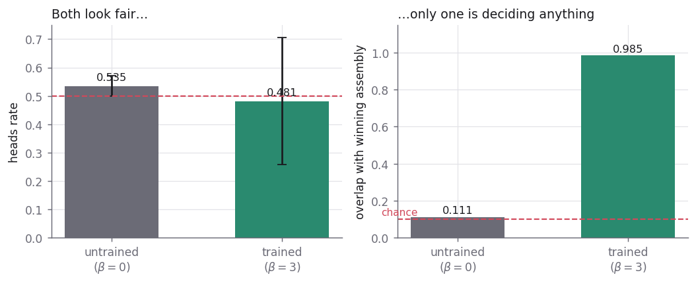
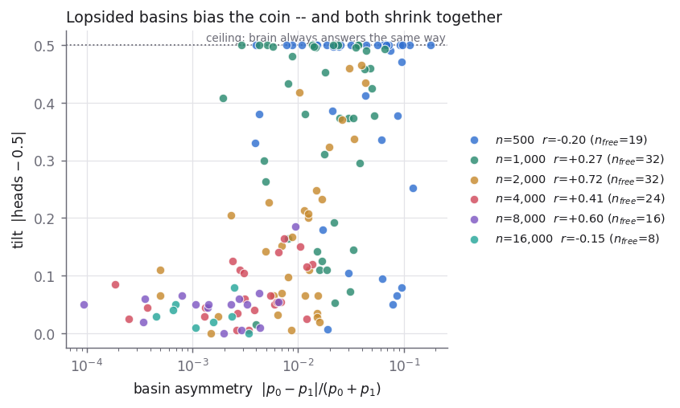
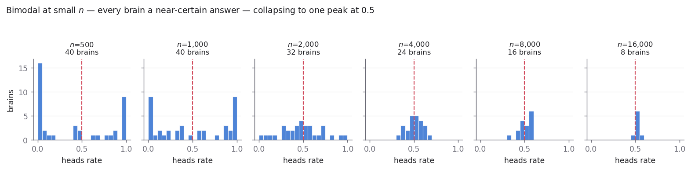
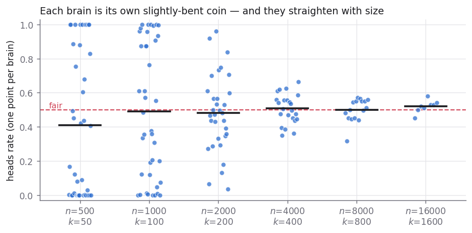
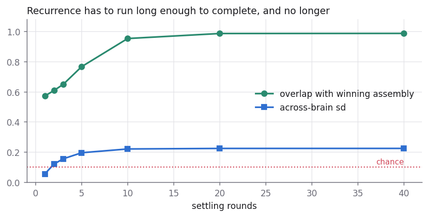
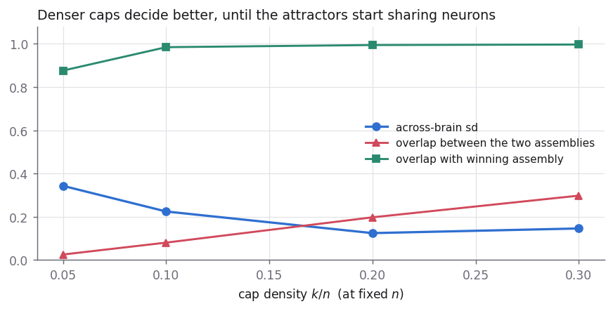

# The neural coin: two engine defects, and a fairness that emerges with scale

*2026-07-30. Reproduce with `uv run python research/experiments/coin_fairness_study.py`.
Data in `research/results/coin_fairness/`, figures in `research/notes/figures/`.*

A **neural coin** ([COIN24], `RandomChoiceArea`) stores two assemblies in one
recurrent area, seeds the area with a random cap-sized set, lets recurrence
settle, and reports which assembly the settled state resembles. It is the
smallest interesting thing a recurrent area can do: turn a diffuse random input
into one of two discrete answers.

Ours did not do it. It returned a number that came entirely from the seed RNG.
This note is what was wrong, what fixed it, and what the working coin's scaling
behaviour turns out to be.

## Two metrics, because one of them is a trap

| | |
|---|---|
| `heads` | fraction of flips answering 0. Fair means ≈ 0.5. |
| `decisive` | mean overlap between the settled state and whichever assembly it landed nearer. Chance is `k/n`. |
| `sd` | spread of `heads` **across brains**. |

**`heads` alone cannot distinguish a working coin from a broken one.** A coin
that returns pure noise scores near 0.5, because the readout's tie-break lands
arbitrarily. Every number below is therefore reported with `decisive` next to
it, and the untrained control is the proof that this matters:

At β=0 — nothing learned, same everything else — the coin looks **six times
fairer** than the trained one: `heads` 0.535 at across-brain `sd` **0.037**,
against the trained area's `sd` 0.224 at the same `n=2000`. On the fairness
metric alone the broken coin wins outright, and it wins for the reason that
makes it broken: with nothing stored, there is no basin to be lopsided.

Its `decisive` is 0.111 against a chance floor of 0.100. It is a random number
generator with extra steps.

This is the single most important number in the study, because `heads` moves
in the *same direction* as the thing being claimed. Without the null, "the coin
gets fairer as `n` grows" reads as a capability, when fairness on its own is
equally consistent with the area having learned nothing.

`sd` matters for the same reason at one level up: a coin that answers 0 in one
brain and 1 in another is not a coin, however good the pooled mean looks.

## What was broken

**1. The settle loop was inert.** Self fibers were excluded from the engine's
deferred-init path (`src_name != target`), so `area → area` was never
allocated, delivered exactly zero drive, and `project_into` took its
"zero signal → preserve current assembly" branch and handed back the incumbent
winners. Measured: `rounds` = 0 / 1 / 10 gave **200/200 identical flips**, and
winners moved in **0 of 10** rounds against a cross-fiber control that moved
them 2/5. Every published coin number was the seed RNG.

**2. The fiber spanned `w`, not `n`.** Even once allocated, lazy
materialization sizes blocks to the `w` neurons that have actually won. The
reference allocates a dense `n × n` recurrent matrix up front and then seeds a
uniform random `k`-subset of **all** `n`. At `n=2000` our area had `w=357`, so
a `k=50` seed contained 9.2 ± 2.6 materialized neurons — **82% of the seed had
no outgoing synapse.** Settling was resolving ~9 neurons of signal.

Neither is a parameter. That is why sweeping β ∈ {0.05 … 5.0}, `rounds_train` ∈
{2 … 40} and `settle` ∈ {0 … 10} found no fair cell before these landed —
about 200 configurations, all of them measuring the same dead fiber.

`NumpySparseEngine.materialize_area` closes the second. The first is staged
behind `ASSEMBLIES_SELF_FIBER_INIT` because repairing it globally moves the
suite from 5 failures to 21 — it is a migration, not a patch.

## Three more things that had to be right

The construction in `coin_fairness_study.py` follows the reference rather than
our shipped `RandomChoiceArea`, in three respects that each turned out to
matter:

- **Separate connectomes per assembly.** Carve each in a reset connectome so
  neither forms inside the other's basin.
- **Exactly symmetric training.** The reference fires each assembly the same
  number of times and stops. Ours ran `3×(10, 10)` and then re-snapshotted
  asm0 *then* asm1, leaving asm1 systematically deeper on every seed measured
  (within-asm1 / within-asm0 = 5.07/4.59, 5.10/4.30, 4.82/4.44).
- **Forced firing.** The reference's `fire(assm)` *forces* activations, so
  plasticity writes `assembly × assembly`. A plain `project` recomputes winners
  from a still-untrained block, gets noise, and potentiates `assembly × noise`.
  Our equivalent is `fix_assembly`.

## The result: fairness is a finite-size effect

Holding `k/n = 0.1` and growing the area over a 32× range in `k`:

| `n` | `k` | brains × flips | heads | sd | decisive | basin asym |
|---|---|---|---|---|---|---|
| 500 | 50 | 40 × 400 | 0.408 | 0.418 ± 0.047 | 0.662 | 0.04875 |
| 1,000 | 100 | 40 × 400 | 0.491 | 0.389 ± 0.044 | 0.764 | 0.02264 |
| 2,000 | 200 | 32 × 400 | 0.481 | 0.224 ± 0.028 | 0.985 | 0.01330 |
| 4,000 | 400 | 24 × 200 | 0.507 | 0.084 ± 0.012 | 0.999 | 0.00500 |
| 8,000 | 800 | 16 × 200 | 0.498 | 0.065 ± 0.012 | 1.000 | 0.00271 |
| 16,000 | 1,600 | 8 × 100 | 0.520 | 0.035 ± 0.009 | 1.000 | 0.00159 |

Three things happen together: the across-brain spread collapses by 12×, the
settled state becomes a **clean assembly** rather than a smear, and the basin
asymmetry falls as `1/k`.

That last one is not a guide line fitted by eye. Over the full 32× range,

> **basin asymmetry ∝ k^−1.009, log-log r = −0.997**

and extrapolating the `k=50` value forward by a naive `1/k` predicts `0.00152`
at `k=1600` against `0.00159` measured — 4.6% error across five doublings.

The across-brain `sd` falls at `k^−0.77`, *faster* than the `1/√k` a
self-averaging fluctuation would give. That exponent is not clean and should
not be quoted as a law: `sd` is bounded above (a fully bimodal rung cannot
exceed 0.5), so the small rungs are compressed against that cap. Restricted to
the unsaturated tail (`k ≥ 400`) it reads `k^−0.64`.

The mechanism is the asymmetry. Perfectly symmetric training still leaves a
residual, because the two assemblies wire to *themselves* slightly differently
by chance; that residual is a fluctuation, so it self-averages.

**This figure has a ceiling and must be read with it in mind.** `tilt` is
`|heads − 0.5|`, so a brain that always answers the same way sits at exactly
0.5 and cannot go higher. At `n=500`, 21 of 40 brains are pinned there, which
*censors* the correlation — a censored series can have a large causal effect
and still report `r ≈ 0`, because the response variable has no room to vary.
Computed on unsaturated brains only, `r` is **+0.27, +0.72, +0.41, +0.60** at
`n` = 1,000 / 2,000 / 4,000 / 8,000. The two negative rungs are the two where
it cannot be measured: `n=500` is censored from above, and by `n=16,000` the
tilt has essentially vanished (sd 0.035 over 8 brains), so `r` there is
reading noise. The claim is supported in the window where it is measurable,
and that window is stated rather than averaged over.

## The distribution, not the error bar

A mean of 0.5 can hide anything. At small `n` the per-brain distribution is
**bimodal** — brains pile up at 0 and 1, each a near-deterministic coin — and
averaging over that produces a fair-looking number describing no brain that
exists.

The transition from *bimodal* to *one peak at 0.5* is the actual result. No
summary statistic shows it — and note that `heads` is near 0.5 at **every**
rung of the ladder, including the ones where every individual brain is a
near-deterministic coin. The pooled mean is the one number that never moves.

## Two knobs, and what they cost

Recurrence has to run long enough to complete an assembly and no longer.
Decisiveness climbs 0.571 → 0.607 → 0.648 → 0.765 → 0.952 → 0.985 over
`settle` = 1, 2, 3, 5, 10, 20 and is then **flat to four decimals at 40**: the
state has reached a fixed point, not merely a slow drift. Running longer buys
nothing and costs spread — across-brain `sd` rises monotonically with settle
(0.055 → 0.224), because a longer settle gives the deeper basin more
opportunity to capture the state regardless of the seed. **Decisiveness and
fairness are traded against each other by this knob**, which is why a study
reporting only one of them can make any settle length look correct.

| `k/n` | heads | sd | decisive | overlap(a0,a1) |
|---|---|---|---|---|
| 0.05 | 0.458 | 0.343 | 0.876 | 0.0247 |
| 0.10 | 0.481 | 0.224 | 0.985 | 0.0798 |
| 0.20 | 0.540 | **0.124** | 0.995 | 0.1970 |
| 0.30 | 0.506 | 0.145 | 0.997 | 0.2973 |

Denser caps decide more sharply, and decisiveness is monotone — but `sd`
is **not**: it bottoms at `k/n = 0.20` and rises again at 0.30, where the two
assemblies already share 30% of their neurons and one basin can annex the
other. There is an interior optimum, and only the fairness metric sees it.

## What this says about the substrate

The working coin demonstrates that a recurrent assembly area performs
**analog-to-discrete conversion**: a diffuse random input over all `n` becomes
one of two clean attractors, with the answer set by which basin the noise
happened to favour. `decisive → 1.000` against a chance floor of `k/n` is that
claim's evidence; the β=0 null at 0.111 is what makes it a claim rather than a
reading.

The fairness result is the more interesting half. **The coin is not fair at any
size; it becomes fair.** Each brain is its own slightly-bent coin, the bentness
is a finite-size fluctuation in how symmetrically the two assemblies happen to
wire to themselves, and it dies as `k^−1.01` over a 32× range at `r = −0.997`.

Two things follow that are worth stating separately from the coin.

**Reliability is bought with size, not precision.** Nothing here was tuned. The
components do not get better as `n` grows — the *same* random connectivity, the
*same* β, the *same* symmetric training. What changes is that a fluctuation
over `k` independent contributions averages down. That is the standard argument
for how a brain can be reliable from unreliable parts, and here it has a
measured exponent rather than a story.

**Discreteness is available without anyone building it.** No thresholding step,
no argmax over stored patterns, no symbolic decision rule appears anywhere in
the settle loop. There is only k-WTA and a recurrent fiber. The two-valued
output is what the dynamics do.

Both of those are substrate properties, not bugs to be tuned out — and they
are the kind of statement this repository should be making more of: a scaling
law with a measured exponent and a mechanism attached, rather than a single
cell reported as a capability.

## What this says about how the repository measures things

The coin was wrong and never looked wrong. That is the
generalizable finding, and it recurs across #68's dormant-mechanism sweep,
the two PNAS artifact tables, and `associate()`:

- **A dead mechanism returns a plausible number.** `project_into` handles zero
  drive by preserving the current assembly, so a fiber delivering nothing is
  indistinguishable at the readout from a fiber that settled correctly — it
  returns exactly the winners you seeded.
- **Failure was shaped like success.** `rounds` = 0 / 1 / 10 gave 200/200
  identical flips. Every published coin number was the seed RNG, and the seed
  RNG produces a fair-looking coin.
- **Parameter search cannot find a structural bug.** ~200 configurations across
  β, `rounds_train` and `settle` all measured the same dead fiber. The sweep
  was not underpowered; it was pointed at a quantity that did not depend on any
  of its axes.

The rule that falls out: **where the null behaviour resembles the success
behaviour, the null must be run, every time.** The β=0 arm here is not a
formality — it is the only thing separating this result from every coin number
that preceded it.

## Caveats

- Single engine (`numpy_sparse`). The torch path has its own open divergence
  (#62) and is not included.
- `materialize_area` is `O(n²)` in memory, which is what bounds the ladder.
- The study uses its own construction, not the shipped `RandomChoiceArea`.
  Migrating the shipped class and re-recording the `coin2024_*` goldens is
  tracked as #70 — and those goldens' flip counts are currently *decorative by
  design*, a decision made when the counts could not move. It needs revisiting
  now that they can.
