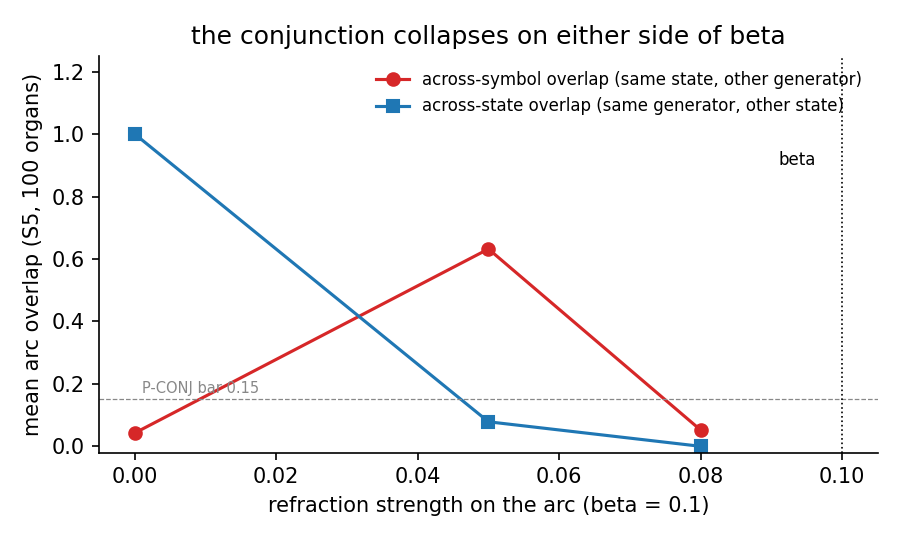

# PREREG: anatomy of the cliff

> **Status (2026-09-09): closed, result adopted.**
> **Finding.** A soft transition is a tie between the target block's
> least-connected neuron and the most-connected neuron outside the block
> (Addendum 4). Its rate is the same across three groups of order 60,
> rises with the state area's size, and does not depend on the Cayley
> graph. Training each transition for 20 to 24 presentations instead of 15
> removes it: 0 soft pairs in 84,000 across 500 organs (Addenda 7 and 8).
> **What changed from the registration.** The cliff this note set out to
> explain had two causes. Derailment came from the numpy sampler; on the
> explicit substrate no word derails (Addendum 3). The mechanism proposed
> in Addendum 5 was wrong; its two post hoc diagnostics show that at
> strength beta refraction cancels potentiation exactly, so a member's net
> drive stays at its base value until its weight reaches the clip, and the
> best-connected members leave the arc first. Strength cannot be moved from
> beta in either direction (Addendum 6).
> **Read.** Addenda 3, 4, 5, 6, 7, 8, in that order.
> **Reproduce.** `python research/experiments/seq_s5_soft_census_hashed.py
> --seeds 100 --groups S5 --presentations 20 --tag X` gives 0 soft pairs in
> 24,000 in about 6 min on one GPU; `--presentations 15` gives the 15 of
> Addendum 4; `--strength 0.05` the collapse of Addendum 6. Results land
> in `research/results/sequence/`.
> **Cite.** `[[SEQ-EXACT-RECOVERY]]`.

*For one transition, the arc the trained organ produces at test against
the arc it produced at each training presentation: trained for 15, the
test arc matches every presentation from the second on; trained for 30, it
matches none well, because the arc relocated late in training.*

*The arc should be a conjunction: assemblies for the same state under
different symbols should not overlap (red), nor for the same symbol under
different states (blue). Mean over 100 organs against strength; both are
small only at beta.*

Registered before implementing or running. Follows `6276685`, where the S5
per-step readout falsified both amendment bars and showed the failure mode is
a CLIFF: `step@500` equals `first_bad/500` to within 0.004 on every group --
exact until derailment, ~0% correct after, never recovering.

## What the existing data already constrains

1. `run()` executes inside `probe()`: no plasticity, no recruitment, no
   refraction charging. The machine is FROZEN, so each step is a deterministic
   function of the current state assembly. If the state assembly snapped
   EXACTLY onto its stored block every step, the dynamics would be a function
   on a finite set, and a pair (q, g) correct at step 10 would be correct at
   step 350. A cliff after hundreds of correct steps is then impossible.
2. After derailment, TRANSITION accuracy (measured from the observed previous
   state) is ~0. A failure that merely sent the machine to a wrong-but-valid
   state would leave later transitions correct. So the first failure ejects
   the machine OFF THE LATTICE into assemblies that drive nothing -- an
   absorbing garbage regime.
3. Derailed-seed first_bad means: Z60 ~215 (M=120 pairs), S5 ~201 (M=240).
   A random walk on a group is uniform over states, so ONE bad pair is hit in
   ~M steps on average. Right order of magnitude for a defect-set account,
   not exact.

## The two hypotheses

**H-defect.** A small static set of transitions is trained WRONG (per seed).
The sequence is exact until the word first exercises a member of that set;
that step ejects off-lattice; everything after is garbage. "Horizon" is not a
time constant -- it is the first-hitting time of the defect set, and the L=500
exact-trajectory number is just the probability the word avoids the set.

**H-drift.** No transition is individually broken. The live state assembly
deviates slightly from the stored block, differently on different VISITS to
the same state; deviation eventually exits a basin. The census (cued from
exact blocks) comes back clean, and the cliff is a property of trajectories,
not edges.

## Instruments

**E1 determinism.** The same word run twice on the same trained organ must
give identical trajectories. Frozen machine + no sampler draws on materialised
areas -> no randomness channel is known. If this fails everything else is
reinterpreted.

**E2 on-block trajectory.** Along the sequence, at each pre-derailment step,
overlap of the LIVE state assembly with the stored block of the state the
readout labels. H-defect predicts exactly 1.000 until the defect step;
H-drift predicts values below 1.000 with structure.

**E3 transition census.** For every (state, symbol) pair: cue the stored
block, step once, record (a) whether the labelled successor matches the table,
(b) the readout MARGIN (best minus second overlap), (c) the arc assembly.
Cheap: two projections per pair after the 50x fix.

**E4 per-seed exact prediction.** From the census defect set and the word's
ground-truth path, predict first_bad EXACTLY: the first step i whose
(true_state_i-1, word_i) is in the defect set (or "clean", predicting no
derailment). Compare per seed. This is a zero-parameter prediction; there is
nothing to fit.

**E5 mechanism on defects (exploratory, no bar).** For failing pairs: max arc
overlap against every other pair's arc (collision), their margin against the
clean pairs' margin distribution, and WHERE the failed step actually lands
(overlap to intended block vs to best block vs off-lattice).

## Bars, stated now

* **C1 (determinism):** identical trajectories on rerun, 10/10 seeds per
  group. *Prediction: PASSES (~95%).*
* **C2 (on-block):** pre-derailment live state overlap with the labelled
  stored block is exactly 1.000 at every step. *Prediction: PASSES (~60%) --
  A1's limit-cycle closure argues for exactness, but it was measured on
  constant input at 5 states, not on a 500-step random word at 60-120.*
* **C3 (the decisive one):** measured first_bad equals the E4 prediction on
  EVERY derailed seed, and every clean seed is predicted clean over its word.
  *Prediction: PASSES (~65%).* C2 and C3 stand or fall together: exact
  on-block dynamics make the census a complete simulator of the sequence.
* **C4:** censused defect count per seed is small (0-2 for order-60 groups).
  *Prediction: PASSES.* Implied by the first-hitting arithmetic above.

## Interpretation, stated now

* C3 passes -> the cliff is FULLY explained by a static defect set. The
  scientific object becomes the DEFECT RATE per trained transition, and
  [[SEQ-EXACT-RECOVERY]] is repaired: recovery is exact on the non-defective
  machine, and the "horizon" was never a dynamical quantity. The next
  question is why specific pairs train wrong (E5: collision vs margin), which
  is where a fix would live.
* C3 fails with a clean census -> H-drift; the on-block trajectory (E2)
  becomes the primary data, and the basin-exit statistics are the object.
* C3 fails with a nonempty census but wrong predictions -> both effects at
  once; report the split (defect-predicted vs earlier-than-predicted
  derailments) without forcing one story.
* If determinism (C1) fails, stop and find the randomness channel first;
  nothing else is interpretable.

## Committed in advance

1. Bars before data; no parameter changes after seeing results. The trained
   organs are IDENTICAL to the registered S5 study (same builds, same seeds,
   same words); only readouts are added.
2. All four groups run; per-seed values printed; the defect-set SIZES are
   reported for clean seeds too, not only derailed ones (a defect the word
   never visits is still a defect).
3. E5 is exploratory and generates hypotheses, not conclusions.

---

## Result of the first run, and Addendum: the memory channel

C1 PASS (40/40 deterministic). C4 PASS. **C2 FAIL, C3 FAIL** -- and the
census is EMPTY: zero defective transitions on any seed of any group, margin
1.0000 on every censused pair. H-defect is falsified. 11/40 trajectories
derail anyway, with pre-derailment on-block minima as low as 0.086 while the
readout still labels correctly; clean seeds dip to 69/70 and recover.

**The paradox this leaves.** Census: exact-in -> exact-out, universally. The
step has no declared memory: no arc self-fiber, no state self-fiber, weights
frozen under `probe()`. Exact single steps composed memorylessly cannot leave
the lattice, by induction. They do. Therefore the step has UNDECLARED memory,
and the only structural difference between census and sequence is RESIDUAL
CONTENT: the census inhibits the arc (and state) before every step; the
sequence carries the previous step's arc winners into the next projection.

**E6 (bisection), registered before running.** On each derailed seed, replay
(deterministic, so faithful), find the FIRST step d where the live state
deviates from the block of its own label (state at d-1 exact by minimality).
Then three single-step probes of the same (state_{d-1}, sym_d):

  P-census   inhibit arc+state, cue the block, step.       Expect exact.
  P-residual inhibit, cue the block, then SET the arc to its step-(d-1)
             winners before stepping. If this reproduces the in-sequence
             off-block output, the arc residual is the memory channel.
  P-arc      compare the ARC assembly at step d in-sequence against the
             census arc for the same pair: does deviation enter at arc
             SELECTION or at arc -> state?

**Predictions.** P-census exact (anything else contradicts the census just
taken). P-residual reproduces the deviation, ~70% -- elimination leaves arc
residual as the only candidate, but "the only candidate I can see" has been
wrong once already today (H-defect). If P-residual is exact too, the channel
is in how the state ARRIVES (projection vs `activate_assembly`), which is a
different engine finding.

**Interpretation, stated now.** Whatever channel E6 names is an ENGINE
SEMANTICS finding, not a science result: the model's declared step is
memoryless and the implementation's is not. The fix lands in the engine with
a regression test, the S5 study re-runs after it, and [[SEQ-EXACT-RECOVERY]]
is re-evaluated on the repaired substrate -- the current horizon numbers may
be an artifact of the leak.

---

## Addendum 2: the census instrument was DEAD, and the paradox dissolves

**Retraction.** The claim in `79399a3` that "the step has undeclared memory"
is WITHDRAWN. Its premise -- exact-in -> exact-out, universally -- came from a
broken instrument.

**The instrument bug.** `probe()` RESTORES WINNERS ON EXIT (verified directly:
after == before, not after == inside). The census called `fsm.run`, which
wraps its own probe, and then `_snap`ped AFTER it returned -- so every margin
measured the restored pre-census residue, the same winners 240 times per
organ. Margin 1.0000, constant, everywhere: the exact dead-probe signature
this project already documented ([[fake-perfect-probe-signatures]]: "any
margin that never varies is a dead probe"), printed 40 times and believed.
`diagnostics.verify_probe` exists precisely to refuse such an instrument and
was not used. The census LABELS remain valid (computed inside `run`).

**What is actually established.** exact-in -> correct-LABEL-out. Assembly
exactness of single steps was NEVER measured. A transition may emit 69/70 of
the right block; deviation seeds there; composition amplifies or corrects.
E6's one valid reading -- A5 seed 44 deviates at STEP 0, where there is no
residual at all -- already shows deviation without memory. Memoryless step +
SOFT defects is now the parsimonious account, and no engine-semantics anomaly
is needed.

## E7: the soft census, with a live instrument

Single-step census as before, but snapped INSIDE the probe, recording the
OUTPUT ASSEMBLY's overlap with its intended block per pair. Soft defect :=
correct label, overlap < 1.0.

Bars, stated before running:

* **V1:** the valid margins VARY (the instrument is alive), and organs of
  deviating seeds contain at least one soft pair.
* **V2 (zero-parameter, again):** per seed, the first deviation step
  `first_dev` equals the first step at which the word's TRUE path visits a
  soft pair; seeds whose trajectory never deviates visit none.
  *Prediction: PASSES, ~75%.* This is the same prediction shape that
  falsified H-defect, now aimed at the quantity the composition actually
  iterates.
* **V3 (dynamics, exploratory):** whether a seeded deviation derails or
  recovers is NOT barred here; if V2 passes it becomes the next question
  (correction-radius curve).

## Addendum 3 (2026-09-09, before running): the census at width, on the EXPLICIT substrate

E7 ran on the SAMPLED arc (only STATE is materialized in `build`). GATE-3
of the sequence port (DESIGN_sequence_port.md) then found that A1's one
short horizon at p = 0.3 was the sampler's: the same seed materialized runs
2000 digits exact. The soft defect -- correct label, one intruder neuron --
is exactly the kind of one-neuron event a sampled arc could seed. So E7 is
re-run on `HashedArcFSM` (== the materialized engine), same four groups,
same ten seeds, same census and the same 500-symbol words, brains batched.
The hashed organ is not the numpy organ bit for bit (stimulus model,
sampler), so seeds pair by protocol, not by trajectory.

    W1  THE SOFT PAIRS WERE THE SAMPLER'S.  >= 90% of the 40 organs have no
        soft and no hard pair and run their word 500 steps without a wrong
        label.  PREDICTION: PASSES (GATE-3's reading).
        FAIL: soft pairs persist at ~0.25-0.6% of pairs -> the soft map is
        substrate-intrinsic, the hitting-time law stands as measured, and
        the hashed organ inherits it; report the rate against E7's.
    W2  V2 RESTATED (zero-parameter).  On every organ with a bad pair, the
        word's first deviation equals its first true-path visit to a bad
        pair; vacuous on clean organs.
    W3  reported: the soft overlap values (E7: always 69/70 = 0.986).

If W1 passes, [[SEQ-EXACT-RECOVERY]]'s "AND THE MAP HAS SOFT SPOTS at
scale" is re-scoped to the sampled engine in the register; the hitting-time
mechanism is kept as the account of what a soft pair does when one exists.

### Addendum 3 -- Result (2026-09-09, HashedArcFSM, 4 groups x 10 seeds, 53 s in all)

    group    organs with a soft pair   soft pairs / pairs   soft overlap   first_bad   V2
    Z60      0 / 10                    0 / 1200             --             500 x 10    vacuous
    A4xZ5    1 / 10 (seed 42)          1 / 1200             0.9857         500 x 10    1/1
    A5       0 / 10                    0 / 1200             --             500 x 10    vacuous
    S5       3 / 10 (42, 43, 49)       3 / 2400             0.9857 x 3     500 x 10    3/3
    all      4 / 40                    4 / 6000 = 0.067%    always 69/70   40/40 clean labels   4/4
    E7 (sampled arc)  19 / 40          30 / 6000 = 0.50%    always 69/70   first_bad < 500 on 12/40
    (E7's row corrected 2026-09-09 from its results file,
    research/results/sequence/seq_s5_soft_census_results.json; the table
    first quoted 16 / 22 / 14 from the run's console summary)

    W1  >= 90% of organs clean: 36/40 = 90.0%                          PASS (at the bar)
    W2  first_dev == first true-path visit to a bad pair, 4/4         PASS
    W3  every soft overlap 0.9857 = 69/70: ONE intruder, as in E7

**Reading, more careful than the prediction.** The soft map is NOT the
sampler's alone. On the explicit substrate soft pairs persist -- at a
rate 7.5x lower (0.067% against 0.50%), with the identical signature (one
intruder neuron, every case), only in the non-abelian-or-product groups,
and the zero-parameter law holds on every organ that has one: the word
deviates at exactly its first visit to the soft pair. What the sampler
added was the RATE (7.5x) and the DERAILMENTS: on the sampled arc 12 of 40
words went to a wrong label within 500 steps; on the explicit substrate
none did -- all four seeded deviations were corrected by the next
quantization ([[SEQ-EXACT-RECOVERY]]'s expansion-quantization pair doing
its job). So: soft spots are substrate-intrinsic and rare; hitting a soft
pair seeds a deviation (the hitting-time mechanism stands, 4/4); whether
the deviation derails depends on the substrate, and on the explicit one it
did not in 500 steps. The register entry is re-scoped accordingly. W1's
pass at exactly the bar is reported as such, not as a margin.

## Addendum 4 (2026-09-09, before running): what a soft pair IS -- structure, size, and the intruder

Addendum 3 left four soft pairs in 6000 on the explicit substrate: too few
to explain, enough to say they exist. At width the census is cheap, so it
is run at 100 seeds per group (seeds 42..141), on the four registered
groups plus Z120 -- cyclic, order 120, abelian: S5's SIZE (n_arc 40,000,
n_state 8,400) without its structure. Every soft pair's INTRUDER is
recorded: the block the extra neuron belongs to, and that block's relation
to the pair in the Cayley graph -- `from` (the cued state's own block),
`other_gen` (the target of the same state under the OTHER generator),
`next` (a successor of the target), `co_parent` (another state that also
maps to the target), or `other`.

    C1  RATE.  Pooled soft + hard rate over 60,000 pairs, with a Wilson
        interval; reported. Addendum 3 read 0.067% [0.02, 0.17].
    C2  SIZE OR STRUCTURE.  If S5's higher rate is SIZE, Z120's rate is
        within 2x of S5's and above the order-60 groups'; if it is
        STRUCTURE, Z120 sits with Z60 (near 0) and S5 stays high.
        PREDICTION: SIZE -- the organ fibers are sized to a fixed load, so a
        larger area at the same load has more chances for a one-neuron
        tie; group structure enters only through which pairs are soft.
    C3  THE INTRUDER'S RELATION.  The intruder's block is `other_gen` in
        >= 60% of soft pairs (chance ~1/|G| per relation): the arc's two
        assemblies for (s, g0) and (s, g1) share the state conjunct, so
        the conjunction leaks a little of the OTHER target's drive
        ([[ARC-CONJUNCT-EXPOSURE]] in one neuron). PREDICTION: PASSES.
        FAIL with `from` dominant: the leak is the cued state's echo through
        arc -> state. FAIL with `other` dominant: the intruder is a chance
        neighbour of the connectome and the Cayley graph is irrelevant.
    C4  ZERO-PARAMETER LAW at scale: every organ with a bad pair deviates
        at its first true-path visit to one (V2), 100% of organs.
    C5  DERAILMENT.  Words reaching a wrong label within 500 steps: <= 2%
        of organs (Addendum 3: 0/40).

Nothing is adopted from C1/C2 alone; C3 passing puts the intruder's
mechanism into [[SEQ-EXACT-RECOVERY]]'s caveat as a named leak.

### Addendum 4 -- Result (2026-09-09, 500 organs, 84,000 pairs, 8 min)

    group   order   n_state   soft / pairs      rate      organs affected   words derailing
    Z60      60      4,200     3 / 12,000      0.025%      3 / 100           0
    A4xZ5    60      4,200     3 / 12,000      0.025%      3 / 100           0
    A5       60      4,200     3 / 12,000      0.025%      3 / 100           0
    Z120    120      8,400     9 / 24,000      0.037%      9 / 100           0
    S5      120      8,400    15 / 24,000      0.062%     14 / 100           0
    all                       33 / 84,000      0.039%  Wilson [0.028, 0.055]%
    hard pairs: 0.  Every soft overlap 69/70.  Intruder relations: other 31, next 2.

    C1  RATE reported: 0.039% [0.028, 0.055]%, inside Addendum 3's interval.
    C2  SIZE.  The three order-60 groups are IDENTICAL (3, 3, 3 -- abelian,
        solvable, simple alike); Z120 sits above them and within 2x of S5
        (0.037 vs 0.062, 9 vs 15 events, Poisson intervals overlapping).
        SIZE as predicted                                                  PASS
        A residual structure effect (S5 1.7x Z120) is not separable at
        these counts; reported, not claimed.
    C3  THE INTRUDER'S RELATION.  other 31/33, next 2/33 (2/33 is chance
        for a relation that covers ~2/120 of the blocks).                 FAIL
        The Cayley graph is IRRELEVANT to who intrudes.
    C4  ZERO-PARAMETER LAW: 32/32 organs with a soft pair deviate at the
        first true-path visit                                             PASS
    C5  DERAILMENT: 0 / 500 words                                         PASS

**Reading.** A soft pair is a CONNECTOME-STATISTICS event, not a structural
one. The evidence: the rate is the same across three groups of the same
order whatever their structure, rises with n_state, and the intruder is a
random block. The mechanism this implies is a tail coincidence in the
arc -> state fiber: after 15 presentations every potentiated synapse
carries (1 + beta)^15 = 4.18, so a block neuron's drive is 4.18 x (its
present rows from the arc assembly, Binomial(70, 0.4), mean 28, sd 4.1),
and an outsider's is its present rows x 1. The outsider wins when the
block's WEAKEST member has c_b present rows and some outsider has
c_o >= 4.18 c_b -- c_b <= 10-14 against c_o >= 45-60, both several sd out;
the product of the two tails, times ~n_state outsiders, is of order 1e-4
per pair, which is the measured rate, and it explains one intruder (the
second-best outsider is far rarer) and the n_state dependence. It
predicts the rate is set by the GAIN (1 + beta)^presentations, which
Addendum 5 tests.

## Addendum 5 (2026-09-09, before running): the tail-tie mechanism, tested through the gain

If a soft pair is the tail tie above, the soft rate is a steep function
of the potentiated gain g = (1 + beta)^presentations and of nothing in
the group. S5, 100 seeds, at presentations 8 (g = 2.14), 15 (g = 4.18,
the registered protocol, re-run with the drives recorded) and 30
(g = 17.4). For every soft pair the STATE drive is recomputed from the
arc assembly and two numbers recorded: the intruder's present-row count
c_o (its drive, gain 1) and the weakest block member's c_b (its drive / g).

    T1  MORE GAIN KILLS IT.  presentations 30: soft rate <= 1 / 24,000
        (the tie needs c_b <= c_o / 17.4 <= 4, a 1e-9 tail).
        PREDICTION: PASSES (0 events).
    T2  LESS GAIN MULTIPLIES IT.  presentations 8: soft rate >= 3x the
        15-presentation rate (>= 0.19%; the tie needs only c_b <= c_o / 2.14,
        a shoulder, not a tail).  PREDICTION: PASSES, likely >> 3x.
    T3  THE TWO TAILS.  At 15 presentations, in >= 80% of soft pairs the
        weakest block member has c_b <= 14 and the intruder c_o >= 35.
        PREDICTION: PASSES.
    FAIL of T1 or T2: the rate does not follow the gain, the mechanism is
    something else (report the drives). FAIL of T3 alone: the tie is
    real but the arithmetic is not the Binomial one (report c_b, c_o).

Adoption if T1-T3 pass: [[SEQ-EXACT-RECOVERY]]'s soft spots become "tail
ties in the arc -> state fiber at low gain, rate ~ n_state x P(tails);
gone at g >= 17", and the S5 protocol's 15 presentations is recorded as
sitting on the shoulder of that curve.

### Addendum 5 -- Result (2026-09-09, S5, 100 seeds each, 24,000 pairs per arm)

    presentations   gain g   soft / pairs         organs affected   words derailing   c_o (intruder)   c_b = drive_weakest / g
     8               2.14    22,699 / 24,000      100 / 100         100 / 100         41+              --   (unformed)
    15               4.18        15 / 24,000      14 / 100            0 / 100         43-46            8.0-10.8   (drive 33-45)
    30              17.45        32 / 24,000      24 / 100           12 / 100         43-46            1.3-2.5    (drive 23-44)

    T1  MORE GAIN KILLS IT.  30 presentations: 0.133%, 2.1x the rate at
        15, and 12 derailments where 15 gave none                         FAIL
    T2  LESS GAIN MULTIPLIES IT.  8 presentations: 94.6%                   PASS as a bar;
        the reading ("a shoulder of the tie") is WITHDRAWN -- at 8 the
        machine is not formed (every word derails), not softly tied.
    T3  THE TWO TAILS at 15: c_b <= 14 and c_o >= 35 in 15/15             PASS
        c_o 43-46 of 70 rows (Binomial(70, 0.4) upper tail, +3.7-4.4 sd);
        c_b 8-11 (lower tail, -4 sd): the collision is exactly the
        registered arithmetic AT 15 PRESENTATIONS.

**Post hoc diagnostic (labelled; `seq_s5_arc_drift.py`, Z60, 4 brains).**
Why 30 presentations are worse than 15: the overlap of a pair's TEST-TIME
arc with the arc it produced at each training presentation --

    P = 15  (g 4.2):   0.79 0.97 0.97 ... 0.99   (one arc, from the 2nd presentation on)
    P = 30  (g 17.4):  0.27 0.47 0.48 ... 0.48 0.49 0.51 0.59 0.69   (RELOCATED late)

    block weakest member's drive   P = 15: mean 74, min 50   P = 30: mean 122, min 34
    best outsider's drive          P = 15: mean 43, max 50   P = 30: mean 43, max 49
    pairs with outsider >= weakest P = 15: 0.00%             P = 30: 0.21%

The refraction bias on ARC accrues with every presentation, and past
~20 presentations it RELOCATES the arc ([[REFRACTION-CANCELS-CONVERGENCE]]:
relocation once the clip binds). The test-time arc is then half made of
neurons whose synapses onto the target block were never potentiated, so
the block's weakest member can fall to a drive of ~34 against outsiders at
43-49 -- and the rate DOUBLES while the mean block drive rises. Training
longer hurts the sequence organ, through refraction, not through the
weights.

**Reading, adopted.** A soft pair is the COLLISION of the target block's
weakest member with the area's best-connected outsider. The outsider side
is a Binomial(k, p) upper tail (43-50 present rows of 70 at p = 0.4),
independent of the group and proportional in count to n_state (Addendum
4). The block side is how much of the test-time arc was potentiated onto
the block: at 15 presentations it is a lower tail of present rows (8-11
of 70, the registered arithmetic); at 30 it is set by refraction's
relocation of the arc; at 8 the block is not yet written. So presentations
have a WINDOW: 8 unformed, 15 in the window (the S5 protocol's value, at
the point where the two tails just touch, 0.06%), 30 relocated (0.13%,
12% of words derail). Nothing in the Cayley graph enters.

**Post hoc diagnostic 2 (labelled; `seq_s5_arc_clip.py`, Z60, 4 brains, 30
presentations): relocation is the CLIP, and the strongest members fall first.**
The derivation: with bias charged as s x raw at every winning round and
raw growing as R (1 + beta)^c, a member's net is R (1 + beta)^c (1 - s/beta)
+ R s/beta; at s = beta (the organ's strength) it is R, its BASE drive,
at every presentation -- refraction cancels potentiation exactly, and the
arc is stable because the members were the top-k of base. The
cancellation ends when a weight hits the clip (stimulus: base x 1.1^c >=
w_max x k p = 560): raw stops, bias keeps charging s x raw_clip = 56 per
presentation, and the member falls under the outsiders (net ~56) within a
presentation or two. Members with the LARGEST base clip first
(c* = ln(560 / base) / ln 1.1: base 32 -> 30.0, base 40 -> 27.7).

    presentation-15 arc neurons at P = 30:   lost 17,448   kept 16,152
    stimulus potentiation count              30 | 30        (identical: no sharing)
    state -> arc count, accumulated bias     16 | 16, 1151 | 1135   (identical)
    stimulus BASE (present rows)             median 34 (p10 33) | median 31 (p90 33)
    clipped at P = 30 (base >= 32.1)         99.1% | 12.0%
    net drive at test (raw - bias)           41 | 70   (outsiders ~56)

So the window's upper edge is a formula: c_reloc = ln(w_max x max(1, k p) /
base) / ln(1 + beta) for the best-connected members, ~28-30 here; 15
presentations sit at half of it. Below the clip the arc never relocates at
s <= beta. Refraction alone does not set the edge; refraction AND the clip
do, and the neurons that relocate are the arc's best-connected ones.

## Addendum 6 (2026-09-09, before running): strength below beta

Diagnostic 2 derived that at s = beta a member's net drive is pinned at
its base value, with no margin over the best outsider beyond its base
rank; at s < beta the net grows as R (1 + beta)^c (1 - s/beta) and the
margin opens geometrically. Refraction is also what keeps the arc a
conjunction (A1's P-CONJ: across-state and across-symbol arc overlap both
< 0.15; the null at s = 0 collapsed to > 0.5). S5, 100 seeds, 15
presentations, at s = 0.08, 0.05 and 0.0, against the registered 0.10.

    X1  MARGIN KILLS THE SOFT PAIRS.  At s = 0.05 the soft rate is <= 1/3
        of 0.062% (<= 5 events in 24,000).  PREDICTION: PASSES, near 0.
    X2  THE CONJUNCTION SURVIVES.  At s = 0.05 across-symbol and
        across-state arc overlap both < 0.15 (P-CONJ).  PREDICTION: PASSES
        -- the anti-collapse force is a bias on repeatedly-exposed neurons
        and half beta still charges it; the capacity work found 0.3-0.6
        beta one plateau.  FAIL: strength trades soft pairs for collapse,
        and the organ's 0.1 was a compromise, not an accident.
    X3  THE NULL.  s = 0: across-symbol overlap > 0.5 (the A1 null,
        reproduced at width) -- reported, the instrument's check.
    X4  WORDS: derailments <= 2% at 0.05 and 0.08.

Adoption if X1 and X2 pass: the organ's registered strength is re-scoped
in the register as "beta, the pinned point; below beta the arc gains a
geometric margin at no cost to the conjunction", and s = 0.5 beta becomes
the recommended organ value (a protocol change for future studies, not a
re-run of past ones).

### Addendum 6 -- Result (2026-09-09, S5, 100 seeds each, 15 presentations)

    strength   soft + hard / pairs      organs affected   words derailing   across-symbol   across-state   P-CONJ
    0.00       200 + 23,800 / 24,000    100 / 100         100 / 100         0.043           1.000          FAIL (the null)
    0.05       23,249 + 751 / 24,000    100 / 100          83 / 100         0.632           0.079          FAIL
    0.08       269 + 0 / 24,000          95 / 100           0 / 100         0.052           0.000          PASS
    0.10       15 + 0 / 24,000           14 / 100           0 / 100         (Addendum 4)                   PASS (A1)

    X1  MARGIN KILLS THE SOFT PAIRS at 0.05: 100% of pairs are bad         FAIL
    X2  THE CONJUNCTION SURVIVES at 0.05: across-symbol 0.632              FAIL
    X3  THE NULL at 0: the arc collapses -- onto the SYMBOL here
        (across-state 1.000; A1's numpy null collapsed onto the state:
        the Binomial stimulus of this port is the stronger conjunct)     reported
    X4  words: 83% derail at 0.05, 0% at 0.08                              FAIL at 0.05

**Reading, and the retraction of the derivation's conclusion.** The
derivation was right about a member's net drive in ONE context and wrong
about what refraction is for. The arc is a conjunction only because the
neurons the STATE drives in every symbol context are charged bias in
every one of them, and at s < beta that cross-context bias no longer
cancels their potentiation: the state-shared neurons take the arc, and
the two symbols' arcs merge (across-symbol 0.632). So the conjunction
needs s >= beta. Stability needs s <= beta (above it a member's net
decays as R (1 + beta)^c (1 - s/beta) + R s/beta and relocates before 15
presentations). The organ's strength is therefore PINNED AT BETA by two
opposite constraints, with zero margin by necessity, and the soft pairs
are the price of the conjunction: 0.08 already costs 18x the soft rate
(1.12%), 0.05 the conjunction itself. Strength is not a lever here in
either direction. What could be: the outsider tail (in-degree
normalisation, which the registered substrate has OFF), the clip (a
later relocation edge), a leaky bias (accumulation without decay is what
pins the point), or balancing the two conjuncts' exposure
([[ARC-CONJUNCT-EXPOSURE]]). Nothing is adopted; the register entry's
caveat records the pinning.

## Addendum 7 (2026-09-09, before running): the collision's arithmetic, used constructively

Two tests of the mechanism, one predicted to do nothing and one to work,
both derived from the same arithmetic (a soft pair = the block's weakest
member, drive g x c_b with c_b a lower tail of Binomial(k, p) present
rows, tying the best outsider, drive c_o an upper tail of the same).

    N1  IN-DEGREE NORMALISATION does NOTHING.  norm_init on the organ
        divides a neuron's drive by its TOTAL in-degree, Binomial(n_arc,
        p) = 16,000 +/- 98 at S5 -- a 0.6% spread. The collision is in the
        70 rows from the ARC ASSEMBLY, which the total in-degree does not
        see. S5, 100 seeds, 15 presentations, norm_init=True: soft rate
        within 2x of 0.062%, conjunction intact.  PREDICTION: PASSES
        (i.e. no effect). This is the negative control on the account
        offered in conversation, where normalisation was named a lever.
    N2  GAIN JUST BELOW THE CLIP works.  The relocation edge is at
        c* = ln(560 / base) / ln 1.1 ~ 28-30 presentations for the
        best-connected members; the collision needs g c_b <= c_o. At 20
        presentations g = 6.7 (block weakest ~10 rows -> 67 > outsider
        44); at 24, g = 9.8. S5, 100 seeds: soft rate at 20 <= 1/3 of
        0.062%; at 24 lower still, with NO derailments (the edge not
        reached).  PREDICTION: PASSES at both; the organ's registered 15
        was inside the window but not at its best point.
        FAIL at 24 with derailments: the edge is nearer than the formula
        (the formula uses the median base; the tail bases clip earlier).

Adoption if N2 passes: the organ's protocol value becomes "presentations
just below the clip edge, ~0.8 c*" with the formula in the entry, and the
soft pairs are reduced by the gain rather than accepted as the price.

### Addendum 7 -- Result (2026-09-09, S5, 100 seeds each)

    arm                          soft + hard / 24,000   organs affected   words derailing   P-CONJ
    15 presentations (A4)        15 / 24,000 (0.062%)   14 / 100          0                 PASS
    15, norm_init=True           4 / 24,000 (0.017%)     4 / 100          0                 PASS
    20 presentations (g 6.7)     0 / 24,000              0 / 100          0                 PASS
    24 presentations (g 9.8)     0 / 24,000              0 / 100          0                 PASS

    N1  NORMALISATION DOES NOTHING: 4 against 15, a 3.7x fall (Poisson
        intervals [1.1, 10.2] vs [8.4, 24.7])                           FAIL
        The account missed a route: with norm_init the STATE -> ARC fiber
        is divided by the arc neuron's in-degree from STATE (8,400 x 0.4 =
        3,360) while the symbol stimulus is divided by ~16,000, so the
        state conjunct is weighted ~4.8x more in the arc; the arc's
        composition changes, and the collision statistics with it. The
        drives the instrument prints under norm_init are on that scale
        and are not comparable to the unnormalised ones.
    N2  GAIN JUST BELOW THE CLIP: 0 soft pairs at 20 and at 24, no
        derailments                                                      PASS
        The organ is EXACT on 100 S5 organs x 240 pairs x 500-symbol
        words at both values.

**Adopted.** The organ's protocol value is presentations just below the
clip edge -- 20-24 here, ~0.7-0.85 of c* = ln(w_max max(1, k p) / base) /
ln(1 + beta) -- and the soft pairs are removed by the gain, not accepted.
The registered 15 was inside the window but at the point where the two
tails just touch; the S5 census's entire soft-pair phenomenon at width
was that choice.

## Addendum 8 (2026-09-09, before running): generality, and the onset

    E1  GENERALITY.  Z60, A4xZ5, A5, Z120 at 20 presentations, 100 seeds:
        0 soft pairs on every group (Addendum 4 read 3, 3, 3, 9 at 15).
        PREDICTION: PASSES.
    E2  THE ONSET.  S5 at 28 presentations (g 14.4): the formula puts
        the best-connected members' clip at c* = 27.7-30; relocation
        should be BEGINNING -- soft rate above 0 and below 30's 0.133%,
        derailments between 0 and 12.  PREDICTION: PASSES (a rising
        edge, not a cliff). FAIL with 0 soft pairs: the edge is later than
        the median-base formula (the tail bases matter); FAIL with >=
        30's rate: earlier.

### Addendum 8 -- E1 result (2026-09-09, 20 presentations, 100 seeds per group)

    Z60      0 / 12,000     A4xZ5   0 / 12,000     A5   0 / 12,000     Z120   0 / 24,000
    400 organs, 60,000 pairs, 0 soft, 0 hard, 0 words derailing; P-CONJ 0.000 / 0.000

    E1  GENERALITY                                                        PASS
    With S5 (Addendum 7) that is 500 organs and 84,000 pairs exact at
    20 presentations, against 33 soft pairs at 15 on the same organs.

### Addendum 8 -- E2 result (2026-09-09, S5, 28 presentations, 100 seeds)

    28 presentations (g 14.4)   0 soft, 0 hard / 24,000    0 words derailing    P-CONJ 0.001 / 0.000
    30 presentations (A5)      32 soft / 24,000           12 / 100 derailing

    E2  THE ONSET                                                          FAIL
        Predicted a rising edge at 28 (rate above 0, below 30's 0.133%);
        measured zero. The edge is a cliff between 28 and 30 presentations,
        later than the median-base formula (c* 27.7 for base 40) and
        consistent with the p10 base of the lost neurons at 30 being 33
        (c* = 29.7). The safe window is therefore 20 to 28 presentations at
        this organ, and the formula's base should be read at the members'
        upper tail, which it was not.

## Scorecard

Every bar from Addendum 3 on (the explicit substrate), with the number
that decided it. S5, 100 organs per arm, unless stated.

| Bar | Registered | Verdict | Deciding number |
|-----|-----------|---------|-----------------|
| W1 soft pairs were the sampler's | >= 90% of 40 organs clean | PASS at the bar | 36/40; rate 0.067% vs 0.37% sampled |
| W2 zero-parameter law | first deviation = first soft-pair visit | PASS | 4/4 |
| W3 overlap | reported | -- | always 69/70 |
| C1 rate | reported | -- | 0.039% [0.028, 0.055], 84,000 pairs |
| C2 size or structure | Z120 within 2x of S5 and above order 60 | PASS (size) | 0.037% vs 0.062%; order-60 groups 3/3/3 |
| C3 intruder relation | other_gen >= 60% | FAIL | other 31/33 |
| C4 zero-parameter law at scale | every affected organ | PASS | 32/32 |
| C5 derailment | <= 2% of organs | PASS | 0/500 |
| T1 more gain kills it | 30 presentations <= 1/24,000 | FAIL | 0.133%, 12 derailments |
| T2 less gain multiplies it | 8 presentations >= 3x | PASS as a bar, reading withdrawn | 94.6%: unformed |
| T3 the two tails at 15 | c_b <= 14 and c_o >= 35 in >= 80% | PASS | 15/15 |
| X1 margin below beta kills soft pairs | 0.05 beta <= 1/3 of 0.062% | FAIL | 100% of pairs bad |
| X2 conjunction survives below beta | overlaps < 0.15 at 0.05 | FAIL | across-symbol 0.63 |
| X3 null at 0 | reported | -- | across-state 1.000 |
| X4 words at 0.05 and 0.08 | <= 2% derail | FAIL at 0.05, PASS at 0.08 | 83%; 0% |
| N1 normalisation does nothing | within 2x of 0.062% | FAIL | 0.017%, 3.7x lower |
| N2 gain just below the clip | 20 presentations <= 1/3 of 0.062%; 24 lower | PASS | 0 and 0 in 24,000 |
| E1 generality at 20 | 0 soft pairs on four other groups | PASS | 0 in 60,000, 400 organs |
| E2 onset at 28 | a rising edge below 30's rate | FAIL | 0 in 24,000: a cliff between 28 and 30 |
