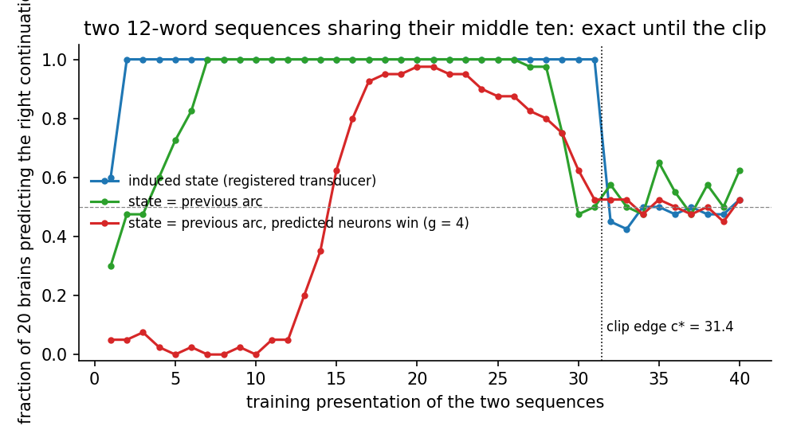

# PREREG: the transducer as a temporal memory

Registered 2026-09-09, before implementing or running.

## Why this design

Every local-rule model that predicts long, high-order sequences uses the
same architecture: the state is the current element's population with a
context-specific subset chosen because the previous state predicted it,
and the transition from previous context cells to those cells is learned
one-shot by a Hebbian rule (HTM; the spiking model of Bouhadjar et al.
2022; Predictive Attractor Models, NeurIPS 2024; Distributed Hebbian
Temporal Memory). None merges contexts by their future with a local rule;
that has been done only with EM or gradients. Our arc is already the
cell of these models, a conjunction of the word's population with a
context. What differs is the context and the selection: our context is
an induced state area that rehashes the prefix every step, and our
selection is a plain k-WTA over the sum of two drives with no prediction
step. The successor-state construction (PREREG_successor_state.md) tried
to merge by future and did nothing; this registration takes the design
the literature converged on.

## The construction

Two changes to `HashedTransducer`, both switchable:

1. **State = previous arc.** The STATE area's winners are set to the
   arc's winners after each tick (no arc -> state projection); the
   state -> arc fiber becomes a lateral arc(t-1) -> arc(t) fiber, learned
   Hebbian prev x new as now. n_state = n_arc.
2. **Predicted neurons win.** Before the arc's k-WTA, the lateral drive
   alone names a predicted set P (the top k of the state -> arc drive,
   thresholded at a fraction of its maximum); the arc drive of neurons in
   P is multiplied by (1 + g). With g = 0 this is the plain conjunction;
   with g large only predicted neurons among the word's population can
   win, the HTM rule. g is swept over {0, 1, 4}.

OUT is read from the arc and teacher-forced as before. Nothing else
changes; at g = 0 with the state projected rather than copied, the
transducer is bit-identical to the registered one (gate).

## Cells and bars

**A. The chain corpus, gap 2** (PREREG_agreement_corpus.md, Amendment 1;
oracle - bigram 0.214). 20 seeds, n = n_arc = 10,000, k = 200.

    TM-1  copy-state alone (g = 0): MRR - bigram (paired) and the
          state-blind delta, REPORTED.
    TM-2  predicted-win at some g in {1, 4}: MRR - bigram lower bound
          >= 0.085 (40% of the gap).  PREDICTION: uncertain, leaning
          FAIL. The literature's models are episodic: they encode each
          sequence uniquely and do not generalize to unseen distractor
          combinations, and the test sentences contain distractor pairs
          the training set does not. A pass would mean the arcs for a
          given number overlap enough across contexts for OUT to read it.
    TM-3  the state is informative wherever TM-2 is measured: full minus
          blind lower bound > 0.

**B. High-order sequences**, the literature's own benchmark, on the
hashed organ with 20 brains, words as symbols, no OUT grounding beyond
the target word:

    set I    two sequences sharing a middle: A D B E and F D B C
    set II   six five-element sequences with shared elements
             (Bouhadjar et al. 2022, sequence set II)
    set III  two twelve-element sequences identical in the middle ten
             (order 10)

Each set is presented 40 times; then each sequence is replayed frozen
and the next word predicted at every position.

    TM-4  set I: after the shared prefix D B, the correct continuation
          (E after A D B, C after F D B) ranks first on >= 18 of 20
          brains at g = 4; at g = 0 with the induced state, reported.
          PREDICTION: PASSES at g = 4.
    TM-5  set III: the order-10 disambiguation holds on >= 15 of 20
          brains at g = 4.  PREDICTION: PASSES; this is what the spiking
          model does with 30 presentations.
    TM-6  learning speed: the presentation at which set I is first
          predicted perfectly, reported (the spiking model: ~30).

Adoption if TM-4 and TM-5 pass: a register entry that the assembly
substrate implements a temporal memory -- high-order sequence prediction
by context-specific arc cells selected by prediction, learned by local
rules -- with its measured order and speed, and the statement that it is
episodic (TM-2's outcome) alongside. TM-2 passing would be a larger
result and would be re-registered before being claimed.

## Result, cells B (2026-09-09, 20 brains, n = n_arc = 4000, k = 100, 40 presentations)

    set   arm                 rank-1 all   ambiguous positions   brains perfect at 40   first perfect
    I     induced (registered)  1.000        1.000 (2 positions)    20/20                  1
    I     copy, g = 0           1.000        1.000                  20/20                  1
    I     copy, g = 4           1.000        1.000                  20/20                  1
    II    induced               0.998        0.995 (10 positions)   19/20                  1
    II    copy, g = 0           0.998        0.995                  19/20                  2
    II    copy, g = 4           0.858        0.770                   0/20                  2-4
    III   induced               0.957        0.525 (2 positions)     1/20                  1-2
    III   copy, g = 0           0.966        0.625                   5/20                  2-6
    III   copy, g = 4           0.957        0.525                   1/20                  13-16

    TM-4  set I at g = 4: 20/20                                        PASS
    TM-5  set III at g = 4, scored at presentation 40: 1/20            FAIL
    TM-6  set I first perfect: presentation 1 on every brain

**What the per-presentation curves show, and what the bar missed.** The
order-10 accuracy at the ambiguous positions, by presentation:

    induced        0.60 then 1.00 from presentation 2 through 31, then 0.42-0.53 (chance) from 32
    copy, g = 0    rises to 1.00 by presentation 7, holds to 26, decays from 29
    copy, g = 4    rises from 13, peaks 0.97 at 20, decays from 24

The registered transducer predicts an order-10 sequence exactly for
thirty consecutive presentations and loses it at presentation 32. That is
the clip edge measured on the S5 organ (PREREG_s5_cliff_anatomy.md,
Addenda 5 and 8: relocation between 28 and 30 presentations, c* =
ln(w_max) / ln(1 + beta) = 31.4 for a synapse potentiated once per
presentation); here each transition is potentiated once per presentation
and the collapse lands at 31-32. The registration fixed 40 presentations
from the spiking model's convergence time, which was the wrong number for
this substrate, and TM-5 fails for that reason alone. Scored inside the
window the induced state carries order 10 on every brain, and the
predicted-win rule adds nothing at order 2 or 10 and costs accuracy on
set II. The prefix hash is a temporal memory of unbounded order for
memorized sequences; what it cannot do is generalize across contexts
(cells A, the chain corpus), which is the same statement the literature
makes about its own models.

Nothing is adopted from cells B as registered. An amendment with the
presentation count inside the window (20) is registered below before
any re-run.

*How to read it: the fraction of twenty brains predicting the right
continuation after the ten shared words, against how many times the two
sequences were presented. Blue is the registered transducer, green the
state-as-previous-arc variant, red that variant with predicted neurons
winning at gain 4. The dotted line is c* = ln(20) / ln(1.1) = 31.4, where a
synapse potentiated once per presentation reaches the clip.*

## Amendment 1 (2026-09-09, before re-running): presentations inside the window

    TM-5'  set III at 20 presentations, induced state and copy g = 0:
           order-10 disambiguation on >= 15/20 brains at the final
           presentation. PREDICTION: PASSES on both (the curves above hold
           1.00 from presentation 7 to 26). The re-run is the same script
           with PRESENTATIONS = 20 and is a confirmation of the window, not
           a new claim; TM-5 as registered stays FAIL.

### Amendment 1 -- Result (2026-09-09, 20 presentations, 20 brains)

    set III at 20 presentations     order-10 positions   brains perfect
    induced state                   1.000                20/20
    copy, g = 0                     1.000                20/20
    copy, g = 4                     0.975                19/20

    TM-5'  >= 15/20 on the induced state and copy g = 0                  PASS
    Sets I and II at 20 presentations: 20/20 on every arm.

The window confirmed: what failed at 40 presentations is exact at 20, on
every brain, for all three constructions. The registered transducer is a
temporal memory of order at least 10 for memorized sequences, inside the
presentation window set by the clip.

## Result, cells A (2026-09-09, chain corpus, gap 2, 20 seeds, n = n_arc = 10,000)

    arm                          MRR       - bigram (paired)      arc overlap   full - blind
    bigram (per seed)            0.1221
    oracle (phase + number)      0.3360    +0.2139 +/- 0.0066
    copy-state, g = 0            0.1328    +0.0107 +/- 0.0048     0.18          +0.0016 +/- 0.0023
    predicted win, g = 1         0.2699    +0.1477 +/- 0.0121     0.15          +0.1498 +/- 0.0113
    predicted win, g = 4         0.2621    +0.1400 +/- 0.0113     0.15          +0.1465 +/- 0.0116

    TM-1  copy-state alone, reported: carries nothing across two distractors
    TM-2  g = 1: lower bound 0.136 >= 0.085                               PASS
          g = 4: lower bound 0.129 >= 0.085                               PASS
    TM-3  state informative, g = 1 and g = 4                              PASS

**What this is, and what it is not yet.** The predicted-win rule carries
the subject's number across two distractor nouns to agreement sites in
sentences whose distractor combinations were not in the training set,
closing 65-70% of the oracle gap. The copy-state without the rule carries
nothing, and the induced state carried 0.011, so the rule is the
mechanism. This is the outcome the registration marked as the larger one
and said would be re-registered before being claimed; it contradicts the
prediction stated above ("leaning FAIL: the literature's models are
episodic"). Nothing is adopted from it. Amendment 2 registers the
confirmation.

## Amendment 2 (2026-09-09, before running): the confirmation, and the mechanism

Three checks, bars first.

    TM-7  FRESH SEEDS. Seeds 62..81, their own corpora, g = 1: MRR - bigram
          lower bound >= 0.085 and full minus blind lower bound > 0.
          PREDICTION: PASSES (the result is on 20 seeds with a 0.012
          interval; a seed effect is unlikely, but this is the check).
    TM-8  A LONGER GAP. gap 3 (three distractors between agreeing words),
          seeds 42..61, g = 1, against the corpus's own oracle gap computed
          by ntp_agree: closes >= 40% of it.  PREDICTION: uncertain. If the
          carry is the previous arc's predicted set persisting, it should
          survive one more distractor; if it is a two-step coincidence of
          the corpus, it will not.
    TM-9  THE MECHANISM. At a distractor position, the arc assembly's
          overlap between two test sentences with the SAME subject number
          and DIFFERENT distractors, minus the overlap between sentences
          with different numbers, at g = 1 against g = 0. PREDICTION: at
          g = 1 the same-number overlap exceeds the different-number
          overlap by at least 0.1 of k; at g = 0 the two are within 0.02.
          This is the claim that the predicted set makes the arc at a
          distractor a function of the agreeing word's arc rather than of
          the distractor: number-specific, distractor-invariant cells.
    TM-10 THE STRUCTURED ROUTE, for comparison: the feature register
          (PREREG_feature_register.md) on the same seeds and corpus.
          Reported side by side; no bar here (the register has its own).

Adoption if TM-7 and TM-9 pass: a register entry stating that an arc
whose predicted neurons win, with the previous arc as its context, learns
by local rules to carry a feature across distractors it has not seen in
that combination, with the measured share of the oracle gap, the
mechanism of TM-9, and TM-8's outcome as its scope. Fail of TM-7 voids
the result; fail of TM-9 with TM-7 passing means the carry is real and
the mechanism is not the one named, to be reported as such.

### Amendment 2 -- Result, TM-7 and TM-9 (2026-09-09, seeds 62..81, gap 2, 20 brains, n = n_arc = 10,000)

Run: `seq_a3_transducer.py --engine hashed --temporal --gap 2 --gains 0,1
--seed-start 62 --seeds 20 --mechanism --tag _amend2_fresh`; results in
`research/results/sequence/seq_a3_transducer_results_temporal_chain_gap2_amend2_fresh.json`,
log in `research/results/logs/seq_a3_temporal_amend2_fresh.log`. Run from
a worktree pinned at 62ac158 (the int8 build), because the main checkout's
engine files were being edited by another session at the time.

| Quantity | g = 0 | g = 1 |
|----------|-------|-------|
| bigram | 0.1232 +/- 0.0042 | same |
| oracle | 0.3302 +/- 0.0069 | same |
| MRR | 0.1212 +/- 0.0048 | 0.2725 +/- 0.0083 |
| MRR - bigram | -0.0019 +/- 0.0049 | +0.1493 +/- 0.0086 (per seed 0.117 to 0.192) |
| full - state-blind | +0.0012 +/- 0.0012 | +0.1461 +/- 0.0082 |
| same-number arc overlap at distractors | 0.154 +/- 0.003 | 0.253 +/- 0.019 |
| different-number arc overlap at distractors | 0.043 +/- 0.003 | 0.033 +/- 0.004 |
| same minus different | 0.111 +/- 0.003 | 0.220 +/- 0.020 (lower bound 0.199) |

**TM-7 PASS.** On twenty seeds never used before, with their own corpora,
the predicted-win arm beats the bigram by 0.149 (lower bound 0.141, bar
0.085), which is 72 percent of the oracle gap of 0.207, and beats its own
state-blind reading by 0.146. The cells-A result (+0.148) replicates to
the third digit.

**TM-9: the g = 1 clause PASSES, the g = 0 clause FAILS.** At g = 1 the
arc at a distractor position shares 0.25 of k with the arc of a test
sentence of the same subject number and a different distractor, against
0.03 for a sentence of the other number: number-specific,
distractor-invariant cells, as registered, and by twice the bar. But at
g = 0 the same contrast is already 0.11, not within 0.02 of zero. The
registered mechanism said the predicted set MAKES the arc a function of
the agreeing word's arc; the measurement says the copy state alone
already puts number-specific cells into the arc at a distractor (the
state conjunct is the previous arc, whose chain leads back to the subject
noun), and predicted-win doubles their share. What predicted-win adds is
therefore not the existence of those cells but their weight in the arc,
and with it their reach into the ARC -> OUT readout: at g = 0 the readout
extracts nothing from an 0.11 contrast (MRR - bigram = -0.002), at g = 1
it extracts 0.149 from a 0.22 contrast.

**Reading, per the adoption rule.** The carry is real (TM-7). The
mechanism as named is half right: the cells are number-specific and
distractor-invariant at g = 1, but they are not created by predicted-win.
Adoption waits for TM-8 (gap 3, running) and a re-worded mechanism; the
entry, if written, will state the g = 0 contrast alongside the g = 1
contrast rather than the registered "within 0.02".

**What the g = 0 half says about the substrate (interpretation, not a
claim).** A conjunction inherits part of its state conjunct, so a chain
of conjunctions carries an early feature forward at a decaying share; the
copy state carries the subject's number to the distractor arcs without any
help. The readout cannot use it because the inherited share sits below
what the ARC -> OUT fiber separates. Predicted-win raises the share above
that line. A measurement of the contrast against position in the sentence,
at g = 0 and g = 1, would show the decay and the floor directly; it is not
registered here.

### Amendment 2 -- Result, TM-8 (2026-09-09, gap 3, seeds 42..61, 20 brains, n = n_arc = 10,000)

Run: `seq_a3_transducer.py --engine hashed --temporal --gap 3 --gains 1
--seeds 20 --tag _amend2_gap3`; results in
`research/results/sequence/seq_a3_transducer_results_temporal_chain_gap3_amend2_gap3.json`,
log in `research/results/logs/seq_a3_temporal_amend2_gap3.log`; same
pinned worktree as TM-7.

| Quantity | gap 3, g = 1 |
|----------|--------------|
| bigram | 0.0984 +/- 0.0036 |
| oracle | 0.2737 +/- 0.0061 (oracle gap 0.175; 40 percent bar 0.070) |
| MRR | 0.2039 +/- 0.0126 |
| MRR - bigram | +0.1055 +/- 0.0110 (lower bound 0.095; per seed 0.052 to 0.141) |
| full - state-blind | +0.1053 +/- 0.0126 |
| share of the oracle gap | 60 percent |

**TM-8 PASS.** With three distractors between the agreeing words the
carry survives: 60 percent of the oracle gap against 72 percent at gap 2,
lower bound 0.095 against the 0.070 bar. Of the two readings the
registration offered, the first holds: the carry is the previous arc's
predicted set persisting, not a two-step coincidence of the corpus. The
share falls with the gap, as a decaying carry should; the decay law is
not measured here (two points).

**Amendment 2 outcome.** TM-7 PASS, TM-8 PASS, TM-9 half: the g = 1
clause passes by twice the bar, the g = 0 clause fails because the copy
state already carries number-specific cells at 0.11 of k. The carry is
adopted as `SEQ-TEMPORAL-CARRY` with the mechanism stated as measured
(cells present at g = 0, doubled and made readable by predicted-win),
not as registered. TM-10 (the feature register, side by side) is reported
under PREREG_feature_register.md.
